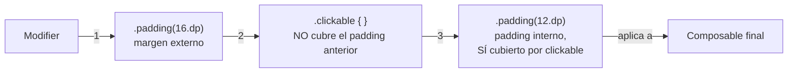

# modifiers_fundamentos.md

## 1. Mapa del flujo



## 2. Qué es y cómo funciona

`Modifier` es un objeto inmutable que decora o transforma un composable: le agrega comportamiento (padding, tamaño, click, scroll, fondo) sin que el composable necesite exponer un parámetro propio para cada una de esas cosas. Se construye encadenando funciones de extensión sobre `Modifier` (`Modifier.padding(8.dp).fillMaxWidth()`), y esa cadena se pasa como parámetro `modifier` al composable que la va a aplicar.

Cada función de la cadena envuelve a la anterior, formando una secuencia ordenada de transformaciones — no una lista de propiedades sin orden, como sería un `style` en CSS. El diagrama muestra por qué el orden es funcional y no solo estético: un `.padding()` colocado *antes* de `.clickable()` queda fuera del área táctil; el mismo `.padding()` colocado *después* queda dentro.

Sin `Modifier`, cada composable (`Text`, `Button`, `Card`) necesitaría exponer decenas de parámetros propios para cubrir cualquier combinación posible de padding, tamaño, click, borde, fondo, etc. — una API inmanejable, y encima cada composable tendría que reimplementar esa lógica por separado.

`Modifier` desacopla "qué es el composable" de "cómo se comporta/luce en este lugar puntual". `Text` solo sabe dibujar texto; el padding, el ancho, o si es clickeable, se lo decide quien lo usa, vía `Modifier` — no el propio `Text`. Esto es, en esencia, el mismo principio de **state hoisting** (`composables_y_state_hoisting.md`) aplicado al styling: elevar la decisión hacia quien llama, no hardcodearla adentro.

## 3. Cómo se ve en distintos contextos

En una **app de notas**, cada nota de la lista es una `Card` reusable que recibe `modifier: Modifier = Modifier` — la pantalla de "todas las notas" le pasa un padding horizontal de 16dp, mientras que la misma `Card` reusada dentro de una pantalla de "notas archivadas" (con un layout más compacto) le pasa un padding distinto, sin tocar el código interno de la `Card`.

En una **app de fitness**, el botón de "Empezar entrenamiento" usa `Modifier.fillMaxWidth().padding(horizontal = 24.dp).clickable { }.padding(16.dp)` — el orden importa exactamente igual que en el ejemplo canónico: el margen externo de 24dp queda fuera del área clickeable, mientras que el padding interno de 16dp sí forma parte de la zona que responde al toque, dándole al botón un área táctil generosa sin que el margen externo "robe" parte de esa superficie.

## 4. Implementación real

**El PO pide:** en la card de cada `Order` del historial, la card completa debe ser clickeable para ver el detalle, pero el margen externo entre cards no debe formar parte del área táctil.

```kotlin
@Composable
fun OrderCard(
    order: Order,
    onClick: (String) -> Unit,
    modifier: Modifier = Modifier // convención: siempre con default vacío
) {
    Card(
        modifier = modifier
            .fillMaxWidth()               // 1. ocupa todo el ancho disponible
            .padding(horizontal = 16.dp)  // 2. margen externo, respecto al padre — FUERA del área clickeable
            .clickable { onClick(order.id) } // 3. hace clickeable TODO lo anterior a este punto
            .padding(12.dp)               // 4. padding interno, respecto al contenido — DENTRO del área clickeable
    ) {
        Column {
            Text("Pedido #${order.id}")
            Text("$${order.total}", style = MaterialTheme.typography.bodySmall)
        }
    }
}
```

El orden importa: el `padding(horizontal = 16.dp)` del paso 2 se aplica *antes* de que la card sea clickeable, así que ese margen queda fuera del área clickeable — el usuario puede tocar entre dos cards consecutivas sin disparar el click de ninguna de las dos. El `padding(12.dp)` del paso 4 se aplica *después* de `clickable`, así que ese espacio interno sí es parte del área que responde al click, dándole a la card un área táctil cómoda alrededor del texto. Invertir el orden de estos modifiers cambia el comportamiento real, no solo el resultado visual.

## 5. Buenas prácticas y errores comunes — checklist de auditoría de código de IA

Si una IA generó o modificó una cadena de `Modifier`, revisar:

- **¿El orden de la cadena tiene sentido de afuera hacia adentro?** El primer modifier afecta cómo el composable se posiciona respecto a su padre; los últimos afectan su contenido interno. Un `Modifier` mal ordenado no tira warning ni error — produce un bug visual/funcional silencioso (área clickeable incorrecta, tamaño final distinto al esperado).
- **¿Hay un `.padding()` antes de un `.size()`** en una cadena donde el padre tiene tamaño acotado? El padding reduce el espacio disponible para el `size()` que viene después — el resultado puede no ser el tamaño final "limpio" que la IA asumió al escribirlo. Siempre preguntarse: "¿qué área abarca todo lo que viene antes de este punto en la cadena?"
- **¿Se usa un modifier scope-specific (`weight`, `align` dentro de `Row`/`Column`, `matchParentSize` dentro de `Box`) fuera de su scope?** No compila — pero si el composable es genérico y reusable, tampoco debería *asumir* que ese scope va a estar disponible; esa decisión la toma quien lo llama, no el composable en sí.
- **¿El composable tiene `modifier: Modifier = Modifier` como parámetro con default?** Es la convención oficial de Compose para cualquier composable reusable — su ausencia (salvo una hoja terminal genuinamente sin necesidad de personalización) rompe la componibilidad del composable con el resto del árbol.
- **¿La IA aplicó el modifier recibido por parámetro (`modifier`) directamente al composable raíz, o lo ignoró y usó `Modifier` desde cero dentro del cuerpo?** Ignorar el `modifier` recibido es un error común: el composable deja de ser configurable desde afuera, aunque su firma sugiera que sí lo es.