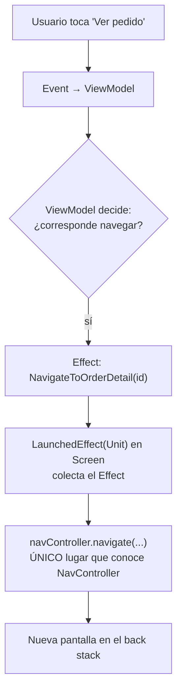

# navegacion.md

## 1. Mapa del flujo



## 2. Qué es y cómo funciona

La navegación en Compose Multiplatform es el mecanismo por el cual la app transiciona entre distintas pantallas (`@Composable` de nivel "screen"), manteniendo un back stack (pila de pantallas visitadas) que permite avanzar y retroceder. `Navigation Compose` (la librería de Jetpack, con soporte multiplatform oficial en versiones recientes) es la opción más común hoy; `Voyager` y `Decompose` son alternativas que nacieron pensadas para KMP desde el principio.

Pero la parte más importante de este archivo no es "qué librería usar" — es **cómo se conecta la navegación con MVI**: un botón nunca debería llamar a `navController.navigate(...)` directamente. La navegación se dispara como reacción a un `Effect` que viene del `ViewModel`, como resume el diagrama: el composable hoja nunca decide a dónde ir, solo emite un `Event`.

Si un composable llamara a `navController.navigate("detail/$id")` directamente dentro de un `onClick`, la decisión de "a dónde navegar" quedaría mezclada con la capa de UI — imposible de testear sin renderizar composables, y rompiendo la separación de MVI donde toda lógica (incluida "qué pasa después de esta acción") debería poder razonarse desde el `ViewModel`, sin depender de un framework de UI específico.

El patrón correcto resuelve esto tratando la navegación como un **Effect** más (documentado en `08_flow/sharedflow_efectos.md`): algo que ocurre una sola vez, no es parte del estado persistente, y se dispara desde el `ViewModel` en respuesta a una regla de negocio o de flujo — el composable solo escucha ese `Effect` y llama al `navController` como reacción, sin decidir nada por su cuenta.

**Criterios adicionales:**

- **`Navigation Compose` vs `Voyager`/`Decompose`**: la elección de librería no afecta el patrón — sea cual sea, la navegación se sigue disparando como reacción a un `Effect`, nunca directo desde el composable.
- **Argumentos de navegación**: pasar solo identificadores livianos (`orderId: String`) como argumento de ruta — la pantalla destino vuelve a pedir los datos completos a su propio `ViewModel`/`UseCase` usando ese id. Nunca pasar el objeto de dominio completo (`Order`) como argumento — implica serialización innecesaria y acopla la navegación a la forma exacta del modelo.

## 3. Cómo se ve en distintos contextos

En una **app de notas**, tocar una nota de la lista dispara un `Event.OnNoteClicked(noteId)` hacia el `ViewModel`, que emite un `Effect.NavigateToNoteEditor(noteId)` — la pantalla de edición vuelve a pedir el contenido completo de la nota a su propio `ViewModel`, en vez de recibirlo como argumento de navegación.

En una **app de reservas de restaurantes**, confirmar una reserva dispara una regla de negocio antes de navegar: el `ViewModel` valida que no haya conflicto de horario, y solo si la validación pasa emite el `Effect` de navegación hacia la pantalla de confirmación — esa validación vive en el `ViewModel`, nunca en el `onClick` del botón, precisamente para que sea testeable sin renderizar UI.

## 4. Implementación real

**El PO pide:** al tocar un pedido en el historial, navegar a su detalle — pero si el pedido todavía está "en preparación", mostrar antes un diálogo de confirmación en vez de navegar directo.

```kotlin
// Contract: la navegación es un caso más del Effect sellado
sealed interface OrdersEffect {
    data class NavigateToOrderDetail(val orderId: String) : OrdersEffect
    data class ShowInPreparationDialog(val orderId: String) : OrdersEffect
}

// ViewModel: decide CUÁNDO navegar (y bajo qué condición), sin saber CÓMO se navega
class OrdersViewModel(
    private val getOrderStatusUseCase: GetOrderStatusUseCase
) : ViewModel() {
    private val _effect = MutableSharedFlow<OrdersEffect>()
    val effect: SharedFlow<OrdersEffect> = _effect.asSharedFlow()

    fun onEvent(event: OrdersEvent) {
        when (event) {
            is OrdersEvent.OnOrderClicked -> {
                viewModelScope.launch {
                    val isInPreparation = getOrderStatusUseCase(event.orderId).isInPreparation
                    if (isInPreparation) {
                        _effect.emit(OrdersEffect.ShowInPreparationDialog(event.orderId))
                    } else {
                        _effect.emit(OrdersEffect.NavigateToOrderDetail(event.orderId))
                    }
                }
            }
        }
    }
}

// Screen: colecta el Effect y ejecuta la navegación real (único lugar que conoce navController)
@Composable
fun OrdersScreen(
    viewModel: OrdersViewModel,
    navController: NavController
) {
    val state by viewModel.state.collectAsStateWithLifecycle()

    LaunchedEffect(Unit) {
        viewModel.effect.collect { effect ->
            when (effect) {
                is OrdersEffect.NavigateToOrderDetail ->
                    navController.navigate("order_detail/${effect.orderId}")
                is OrdersEffect.ShowInPreparationDialog -> { /* mostrar diálogo */ }
            }
        }
    }

    OrdersList(
        orders = state.orders,
        onOrderClick = { id -> viewModel.onEvent(OrdersEvent.OnOrderClicked(id)) }
    )
}
```

El loop completo: click del usuario → `Event` hacia el `ViewModel` → el `ViewModel` resuelve la regla de negocio (¿está en preparación?) y decide qué `Effect` emitir → `LaunchedEffect(Unit)` (documentado en `effects_guia_completa.md`) lo colecta → recién ahí se llama a `navController.navigate()`, solo si corresponde. `OrderRow`/`OrdersList` nunca supieron que existía un `NavController`, ni que había una regla de negocio detrás del click.

## 5. Buenas prácticas y errores comunes — checklist de auditoría de código de IA

Si una IA generó o modificó código de navegación, revisar:

- **¿Un composable hoja recibe el `NavController` como parámetro y lo usa directamente en un `onClick`?** Es el error más común — funciona, compila, y de hecho es el patrón que aparece en la mayoría de los tutoriales básicos de Compose, pero mezcla la decisión de "a dónde ir" con la capa de UI. En cuanto esa navegación necesite una condición de negocio, esa regla termina viviendo dentro del composable, imposible de testear con un test de `ViewModel` puro (`fakes_vs_mocks_turbine.md`).
- **¿El composable que recibió el `NavController` deja de ser reusable** (no puede usarse en un preview, un test, u otra pantalla que solo quiere mostrar la card sin navegar)? Es la consecuencia directa del punto anterior — un composable "tonto" no debería depender de un `NavController` concreto.
- **¿Se pasa un objeto de dominio completo como argumento de navegación**, en vez de solo su id? Genera serialización innecesaria y acopla la navegación a la forma exacta del modelo — la pantalla destino debería resolver sus propios datos completos a partir del id recibido.
- **¿El `Effect` de navegación se colecta en más de un lugar, o en un composable que no es la raíz de la pantalla?** El único punto de colección debería ser el `LaunchedEffect(Unit)` en el composable `Screen` que también recibe el `NavController` — nunca en un composable hijo intermedio.

## 6. Profundización: Navigation 3 (Nav3)

Navigation 3 (Nav3) es la reescritura de Google de la librería de navegación para Compose, con una arquitectura fundamentalmente distinta a `Navigation Compose` 2.x (la documentada arriba). El patrón MVI de navegación-como-`Effect` de las secciones 1 a 5 se mantiene idéntico con Nav3 — lo que cambia es la implementación técnica de "cómo se ve el back stack" y "cómo se declaran los destinos", no quién decide navegar.

**Qué cambia técnicamente:** en 2.x, el `NavController` esconde el back stack adentro suyo y expone rutas como `String` (`"order_detail/${id}"`). En Nav3, **el back stack es tuyo** — una lista observable de Compose (`SnapshotStateList<NavKey>`) que se crea y muta directamente (`backStack.add(...)`, `backStack.removeLastOrNull()`), y cada destino es un tipo Kotlin real (`data class`/`data object` que implementa `NavKey`), no un string. `NavDisplay` reemplaza a `NavHost`: observa esa lista y decide qué renderizar vía un `entryProvider` que mapea cada tipo de destino a su `NavEntry`.

**Soporte KMP oficial:** desde Compose Multiplatform 1.10 (JetBrains, 2026), Navigation 3 tiene soporte multiplataforma oficial — Android, iOS, Desktop y Web — vía artefactos espejo publicados por JetBrains (`org.jetbrains.androidx.navigation3:navigation3-ui`). Es la primera vez que la navegación "oficial de Google" deja de ser Android-only, algo que hasta ahora era la razón principal por la que un proyecto KMP-first elegía Voyager o Decompose por sobre Navigation Compose.

```kotlin
// Destinos: tipos reales, no strings — serializables para sobrevivir process death
@Serializable
sealed interface Screen : NavKey {
    @Serializable data object OrdersList : Screen
    @Serializable data class OrderDetail(val orderId: String) : Screen
}

@Composable
fun AppNavigation() {
    // el back stack es tu propio estado — una lista observable que vos controlás
    val backStack = rememberNavBackStack(Screen.OrdersList)

    NavDisplay(
        backStack = backStack,
        onBack = { backStack.removeLastOrNull() },
        entryProvider = entryProvider {
            entry<Screen.OrdersList> {
                OrdersScreen(onOrderNavigate = { id -> backStack.add(Screen.OrderDetail(id)) })
            }
            entry<Screen.OrderDetail> { screen ->
                OrderDetailScreen(orderId = screen.orderId)
            }
        }
    )
}
```

`rememberNavBackStack(Screen.OrdersList)` arranca la pila con un solo destino. `entry<Screen.OrderDetail> { screen -> ... }` recibe el destino tipado directamente (`screen.orderId` con autocompletado y chequeo de tipos), sin ningún `navController.getArgument("orderId")` a ciegas como en 2.x — cualquier error de destino inexistente lo atrapa el compilador, no un crash en producción.

**Beneficio real para este repo (100% mobile):** aunque el caso de uso más citado de Nav3 es adaptativo (mostrar lista+detalle simultáneamente en tablet), en un contexto mobile-only el beneficio central sigue siendo válido: el back stack como estado explícito y testeable (una lista Kotlin normal, con aserciones directas sobre su contenido en un test), y destinos tipados en vez de strings.

**Errores específicos de auditoría para Nav3** (más allá del checklist general de la sección 5, que sigue aplicando igual):

- **¿Se muta el `backStack` directamente desde un composable hoja**, razonando que "ahora es solo una lista, así que ya no hay problema en tocarla desde cualquier lado"? El cambio de filosofía de Nav3 es una mejora de **control e implementación** — no un permiso para saltarse MVI. Que el back stack sea una `SnapshotStateList` normal es justamente lo que hace *más fácil* testear al componente que sí debería tener acceso a ella (la `Screen` de nivel más alto que colecta los `Effect` del `ViewModel`) — no una invitación a que cualquier composable hijo la mute.
- **¿Los tipos `NavKey` declaran `polymorphic serialization` explícita si el proyecto tiene targets no-JVM** (iOS)? El comportamiento por default de reflection-based serialization solo funciona en Android — sin este paso extra, el back stack no puede serializarse para sobrevivir process death en las demás plataformas.