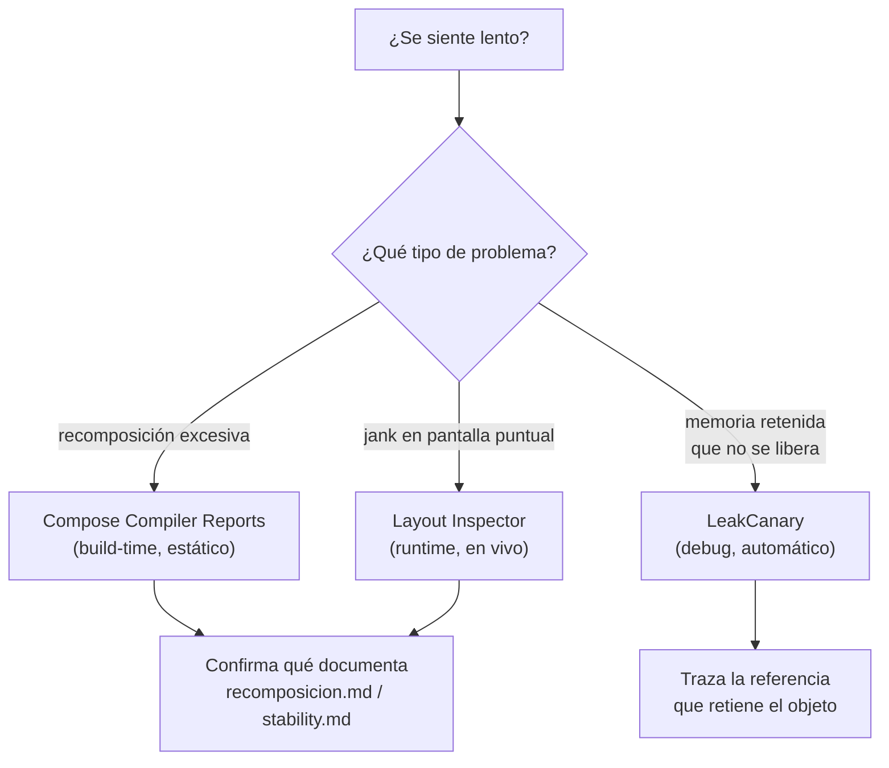

# profiling_y_leaks.md

## 1. Mapa del flujo



## 2. Qué es y cómo funciona

Profiling es el proceso de medir dónde efectivamente se gasta tiempo/CPU/memoria en una app en runtime, en vez de asumirlo. En el ecosistema Compose hay dos herramientas centrales para esto: los **Compose Compiler Metrics/Reports** — archivos de texto generados en build-time que listan, por cada composable, si es "restartable" y "skippable" (y por qué no, si no lo es) — y el **Layout Inspector** de Android Studio, que muestra en runtime cuántas veces recompuso efectivamente cada composable mientras interactuás con la app. Memory leaks (fugas de memoria) es un problema relacionado pero distinto: objetos que deberían haber sido liberados por el recolector de basura (porque su Activity/Fragment/ViewModel ya se destruyó) pero siguen retenidos porque algo en la app todavía los referencia — la herramienta estándar para detectarlos es **LeakCanary**, de Square.

"Se siente lento" es una percepción, no un diagnóstico. Sin profiling, es imposible saber si el problema es recomposición excesiva (ver `recomposicion.md` y `stability.md`), un layout costoso de medir/dibujar, o simplemente trabajo síncrono bloqueando el hilo principal — y sin esa distinción, cualquier intento de "optimizar" es a ciegas, como resume el diagrama: cada síntoma tiene una herramienta específica que lo confirma con datos reales, no con intuición. Los memory leaks son todavía más traicioneros: no generan ningún síntoma inmediato (la app sigue funcionando "normal"), la memoria retenida crece de a poco con cada Activity/pantalla que se destruye sin liberarse del todo, y el síntoma final — un crash por `OutOfMemoryError` — aparece mucho después y lejos del código que realmente causó el leak, casi imposible de rastrear a mano.

**Criterio de uso de cada herramienta:**

- **Compose Compiler Reports (build-time) vs. Layout Inspector (runtime)**: Compiler Reports para un inventario completo y objetivo de qué composables/clases del proyecto son estables/skippables — auditar toda la codebase de una sola vez, sin interactuar con la app. Layout Inspector cuando ya se identificó una pantalla puntual con jank y hace falta ver, en vivo, cuántas veces recompone cada composable mientras se interactúa — dice qué está pasando de verdad, no solo qué podría pasar. Compiler Reports es exhaustivo pero estático (no distingue "esto recompone 50 veces por segundo" de "esto nunca recompone en la práctica"); Layout Inspector es preciso sobre lo que ocurre pero solo cubre la sesión de debug puntual.
- **Cuándo correr un audit**: cuando hay jank visible reportado, antes de un release grande, o como parte de preparación técnica para entrevistas SSR/senior. No perseguir 100% de skippability sin evidencia de un problema real (mismo criterio ya documentado en `stability.md`) — mejor retorno resolviendo los composables que el reporte marca como "restartable pero no skippable" dentro de una lista grande, que auditando pantallas estáticas que nunca recomponen.
- **LeakCanary en debug**: siempre, en cualquier proyecto en desarrollo activo — el costo de setup es una línea de Gradle (`debugImplementation`), y corre completamente aislado de los builds de release, nunca termina en el APK que llega a producción.

## 3. Cómo se ve en distintos contextos

En una **app de mensajería**, correr los Compose Compiler Reports antes de un release grande confirma que la lista de conversaciones (potencialmente cientos de chats) mantiene sus composables skippables — un composable marcado como "restartable pero no skippable" dentro de esa lista es exactamente el tipo de hallazgo que justifica una revisión puntual.

En una **app de streaming de video**, LeakCanary detecta que un listener de progreso de reproducción registrado al abrir el reproductor de video sigue vivo mucho después de que el usuario cerró esa pantalla — la traza de referencias apunta directo al listener nunca desregistrado, ahorrando horas de debugging manual comparado con perseguir un `OutOfMemoryError` genérico reportado días después.

## 4. Implementación real

**El PO pide:** en la pantalla de detalle de un pedido, escuchar el estado de conectividad para avisar si se pierde la conexión mientras se espera confirmación del pago — sin generar un memory leak al salir de la pantalla.

```kotlin
// build.gradle.kts del módulo: habilita los reportes del compilador de Compose
composeCompiler {
    reportsDestination = layout.buildDirectory.dir("compose_compiler")
    metricsDestination = layout.buildDirectory.dir("compose_compiler")
}
```

```kotlin
// build.gradle.kts: LeakCanary solo en debug, cero código extra
dependencies {
    debugImplementation("com.squareup.leakcanary:leakcanary-android:2.14")
    // no hace falta tocar Application.onCreate() ni ningún otro archivo
}
```

```kotlin
// Caso trampa (lo que NO hay que hacer): listener dentro de LaunchedEffect
@Composable
fun OrderDetailScreenBad(viewModel: OrderDetailViewModel, connectivityManager: ConnectivityManager) {
    LaunchedEffect(Unit) {
        val listener = object : NetworkStateListener {
            override fun onChange(isConnected: Boolean) {
                viewModel.onEvent(OrderDetailEvent.OnConnectivityChanged(isConnected))
            }
        }
        connectivityManager.registerListener(listener) // 🚩 nunca se desregistra
    }
}
```

```kotlin
// Corrección: DisposableEffect obliga a declarar la limpieza explícita
@Composable
fun OrderDetailScreen(viewModel: OrderDetailViewModel, connectivityManager: ConnectivityManager) {
    DisposableEffect(Unit) {
        val listener = object : NetworkStateListener {
            override fun onChange(isConnected: Boolean) {
                viewModel.onEvent(OrderDetailEvent.OnConnectivityChanged(isConnected))
            }
        }
        connectivityManager.registerListener(listener)
        onDispose {
            connectivityManager.unregisterListener(listener) // limpieza explícita y obligatoria
        }
    }
}
```

Correr `./gradlew assembleRelease` con `composeCompiler` configurado genera, por módulo, un archivo `<modulo>-composables.txt` que lista cada composable con sus atributos (`restartable`, `skippable`, o no) — la fuente de verdad "estática" para todo lo documentado en `stability.md`, ahora medible en vez de intuido. Es importante correrlo sobre un build de release: los builds de debug desactivan optimizaciones del compilador y los reportes salen distorsionados.

`LaunchedEffect` cancela la corrutina cuando el composable sale de composición — pero cancelar una corrutina solo limpia lo que la corrutina misma controla (otras corrutinas hijas, un `delay()`, la colección de un `Flow`). No tiene ningún poder sobre un objeto que un sistema externo a las coroutines — acá, `ConnectivityManager`, un servicio atado al ciclo de vida de la `Application`, no de la pantalla — sigue reteniendo por su cuenta. En la versión `Bad`, el `listener` (y todo lo que capturó por closure, incluido potencialmente el `viewModel`) queda vivo indefinidamente, mucho después de que el usuario salió de esa pantalla. LeakCanary lo reportaría como un `ViewModel` o una `Activity` retenida, con la traza de referencias apuntando a este listener nunca desregistrado.

## 5. Buenas prácticas y errores comunes — checklist de auditoría de código de IA

Si una IA generó o modificó código con implicancias de performance o memoria, revisar:

- **¿Hay un callback/listener de una API que no sea coroutine-based** (no es una `suspend fun` ni expone un `Flow`) **registrado dentro de un `LaunchedEffect` en vez de un `DisposableEffect`?** Es el candidato número uno a memory leak — la corrección es `DisposableEffect`, cuyo `onDispose { }` obligatorio existe exactamente para forzar esta limpieza (ver `effects_guia_completa.md`).
- **¿Se está optimizando recomposición sin haber corrido ninguna herramienta de profiling primero?** "Se siente lento" no es un diagnóstico — cualquier cambio de performance debería estar respaldado por un Compiler Report o una sesión de Layout Inspector, no por intuición.
- **¿Se corrieron los Compose Compiler Reports sobre un build de debug en vez de release?** Los builds de debug desactivan optimizaciones del compilador — los reportes generados ahí no reflejan el comportamiento real de producción.
- **¿El proyecto tiene LeakCanary como `debugImplementation` permanente, o solo se agregó puntualmente para investigar un bug específico?** El costo de setup es nulo y el beneficio (detectar un leak antes de que un usuario real lo sufra) es alto — no hay buena razón para no tenerlo activo todo el tiempo durante desarrollo.
- **¿Se persigue 100% de skippability en toda la app sin evidencia de un problema real?** Mismo criterio que en `stability.md` y `recomposicion.md` — es optimización, no corrección; mejor invertir tiempo en los 2-3 composables que un reporte real marca como problemáticos dentro de una lista grande, que en auditar pantallas estáticas sin síntomas.