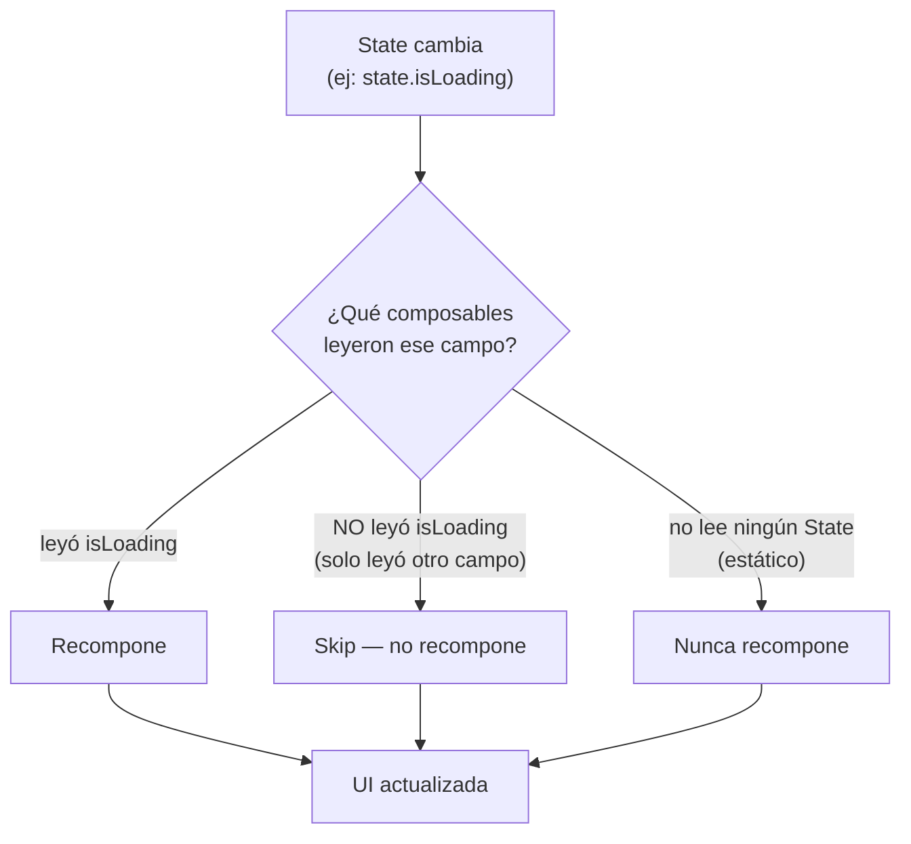

# recomposicion.md

## 1. Mapa del flujo



## 2. Qué es y cómo funciona

Recomposición es el proceso por el cual Compose vuelve a ejecutar una función `@Composable` cuando alguno de los valores de `State` que esa función lee cambia. No es "redibujar toda la pantalla desde cero": Compose lleva un registro fino de qué composable leyó qué `State`, y solo vuelve a ejecutar (recompone) las funciones que efectivamente dependen del valor que cambió — el resto del árbol se saltea (**recomposition skipping**), como muestra el diagrama: un mismo cambio de `State` puede disparar recomposición en una rama del árbol y ser completamente invisible para otra.

En un modelo de UI imperativo (Android View clásico), cuando un dato cambia, el desarrollador tiene que buscar manualmente cada `View` afectada y llamar a `setText()`, `setVisibility()`, etc. — es responsabilidad humana mantener la UI sincronizada con el estado, y es una fuente constante de bugs ("me olvidé de actualizar ese label").

Compose invierte el problema: la UI se declara como una función del `State` (`@Composable fun Screen(state: State)`), y el framework se encarga de detectar qué cambió y volver a ejecutar solo esa parte. El desarrollador nunca escribe código imperativo de "actualizar esto"; solo describe "así se ve dado este estado", y Compose decide cuándo y qué recomponer.

La granularidad de qué `State` lee cada composable es la palanca principal: pasar el campo puntual que un composable necesita (`title: String`) en vez de todo el objeto contenedor (`state: OrdersState`) maximiza cuánto puede skipear Compose — pasar el objeto completo hace que ese composable "lea" (a ojos de Compose) el objeto entero, y cualquier cambio en cualquier campo fuerza su recomposición aunque el campo que realmente usa no haya cambiado.

## 3. Cómo se ve en distintos contextos

En una **app de clima**, la pantalla principal tiene un composable de fondo animado (que solo depende de si es de día o de noche) y, superpuesto, un composable de temperatura actual. Si el `State` se actualiza cada pocos segundos con datos de sensores, pero el campo `isDayTime` cambia solo dos veces al día, el fondo animado — si recibe únicamente `isDayTime` como parámetro y no el objeto completo — prácticamente nunca recompone, mientras el composable de temperatura sí lo hace en cada actualización.

En una **app de mensajería**, la lista de chats y el indicador de "escribiendo..." de un chat abierto son dos ramas independientes del árbol: si el indicador de tipeo recibe solo `isTyping: Boolean` como parámetro, un mensaje nuevo llegando a otro chat de la lista (que cambia otra parte del `State`) no le provoca ninguna recomposición — permanece completamente ajeno a cambios que no leyó.

## 4. Implementación real

**El PO pide:** en la pantalla de historial de pedidos, agregar un indicador de "actualizando..." que aparece mientras se refresca la lista, sin que ese refresco provoque recomposición innecesaria en el resto de la pantalla.

```kotlin
data class OrdersState(
    val orders: List<Order> = emptyList(),
    val isRefreshing: Boolean = false,
    val title: String = "Mis pedidos"
)
```

```kotlin
// Caso trampa (lo que NO hay que hacer): los tres composables reciben
// el objeto completo — cualquier campo que cambie recompone a los tres
@Composable
fun OrdersScreenBad(state: OrdersState) {
    Column {
        OrdersHeader(state = state)       // solo usa state.title
        RefreshingIndicator(state = state) // solo usa state.isRefreshing
        OrdersList(state = state)          // solo usa state.orders
    }
}
```

```kotlin
// Corrección: desestructurar en el punto de entrada y pasar campos puntuales
@Composable
fun OrdersScreen(viewModel: OrdersViewModel) {
    val state by viewModel.state.collectAsStateWithLifecycle()

    Column {
        OrdersHeader(title = state.title)
        RefreshingIndicator(isRefreshing = state.isRefreshing)
        OrdersList(orders = state.orders)
    }
}

@Composable
fun RefreshingIndicator(isRefreshing: Boolean) {
    // Este composable SOLO recompone si "isRefreshing" cambia,
    // sin importar que orders o title hayan cambiado
    if (isRefreshing) {
        LinearProgressIndicator()
    }
}
```

Con la versión corregida, si el usuario hace pull-to-refresh y solo cambia `state.isRefreshing` (los `orders` todavía no llegaron), Compose recompone únicamente `RefreshingIndicator` — `OrdersHeader` y `OrdersList` se skippean por completo, porque ninguno de los dos leyó `isRefreshing`. En la versión `Bad`, ese mismo cambio recompondría los tres composables, aunque dos de ellos muestren exactamente lo mismo que antes.

## 5. Buenas prácticas y errores comunes — checklist de auditoría de código de IA

Si una IA generó o modificó composables que consumen `State`, revisar:

- **¿Los composables hijos reciben el objeto `State` completo, o campos puntuales?** Es el error más común y el que más cuesta detectar a simple vista: el código compila, corre, y se ve correcto — la degradación es de performance silenciosa, no de comportamiento visible. Revisar especialmente composables que reciben un parámetro `state: XState` completo cuando solo usan uno o dos campos de él.
- **¿Un composable "sin estado" (como `Header` estático) termina leyendo algo de un scope externo por error** (una variable capturada en el closure que sí cambia)? Pierde la garantía de "nunca recompone" sin que el compilador avise — hay que revisar que genuinamente no lea ningún `State` cambiante.
- **¿Se está optimizando recomposición sin evidencia de un problema real?** Perseguir el skipping perfecto en toda la app sin señales de jank o listas lentas es tiempo mal invertido — la señal correcta para investigar es un síntoma real (frames perdidos, scroll lento), verificable con el Layout Inspector de Android Studio, no una sospecha genérica.
- **¿El punto de desestructuración del `State` completo está en el nivel más alto posible** (la `Screen` que colecta el `StateFlow`), o se desestructura tarde, después de ya haber pasado el objeto completo dos o tres niveles hacia abajo? Cuanto más tarde se desestructura, más composables intermedios heredan la dependencia innecesaria al objeto completo.
- **Conexión con la capa de arquitectura:** que el `ViewModel` emita un `State` completo nuevo en cada `_state.update { it.copy(...) }` es correcto y necesario para MVI (ver `08_flow/stateflow.md` — el `State` como única fuente de verdad). Eso no contradice lo anterior: la responsabilidad de mantener esa garantía de estado único vive en `presentation`, mientras que la responsabilidad de desestructurar para performance vive en `ui`, en el punto de entrada donde se colecta ese `State`. Son dos capas con responsabilidades distintas, aunque ambas toquen el mismo objeto.