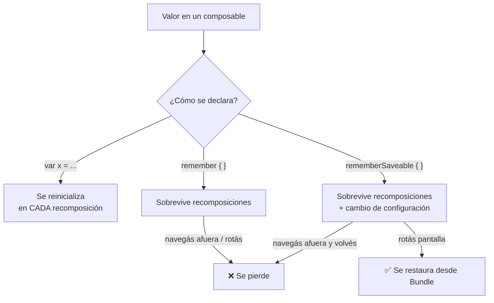

# remember_vs_remembersaveable.md

## 1. Mapa del flujo



## 2. Qué es y cómo funciona

`remember` y `rememberSaveable` son APIs para guardar un valor en memoria dentro de un composable, sobreviviendo a recomposiciones sucesivas. La diferencia entre ambos está en **qué eventos del ciclo de vida sobreviven**, como resume el diagrama: sin ninguno de los dos, una variable local se reinicializa en cada recomposición; con `remember`, sobrevive recomposiciones pero se pierde ante una rotación de pantalla o al salir de la composición; con `rememberSaveable`, además sobrevive el cambio de configuración, porque serializa el valor a un mecanismo de persistencia liviano (el `Bundle` en Android, o el equivalente por plataforma en KMP) y lo restaura automáticamente.

Sin `remember`, cualquier variable local declarada dentro del cuerpo de un composable (`var expanded = false`) se reinicializaría en **cada** recomposición, porque el cuerpo de la función vuelve a ejecutarse de punta a punta — perdiendo cualquier estado de UI efímero cada vez que Compose decide recomponer, aunque sea por un motivo completamente ajeno a esa variable.

`remember` resuelve eso, pero solo dentro de los límites de la composición actual: no protege contra un cambio de configuración, que en Android históricamente recreaba la Activity entera. `rememberSaveable` resuelve ese segundo problema, agregando persistencia real (aunque liviana y temporal) para que el usuario no pierda estado de UI visible al rotar la pantalla — algo que rompería la expectativa básica de continuidad que tiene cualquier usuario.

## 3. Cómo se ve en distintos contextos

En una **app de checklist de viaje**, si cada ítem de la lista tiene un chevron para expandir/colapsar notas adicionales, ese estado de expansión es un candidato típico de `remember`: perderlo al rotar el dispositivo es un detalle menor que el usuario ni siquiera nota como un problema.

En una **app de reserva de turnos**, el formulario donde el usuario completa nombre y motivo de la consulta necesita `rememberSaveable` en cada campo — si el usuario gira el dispositivo a horizontal para ver mejor un selector de fecha y el formulario se vacía, la experiencia se percibe como un bug real, no como un detalle cosmético.

## 4. Implementación real

**El PO pide:** en la pantalla de nuevo pedido, el usuario carga una nota opcional ("dejar en la puerta") en un campo de texto — no debe perderse si rota el dispositivo. Además, cada `OrderItem` de la lista de productos disponibles tiene un ícono de info que se expande al tocarlo — ese detalle sí puede perderse sin problema.

```kotlin
@Composable
fun NewOrderScreen(viewModel: NewOrderViewModel) {
    val state by viewModel.state.collectAsStateWithLifecycle()

    // Estado de negocio: vive en el ViewModel, sobrevive rotación
    // por su propio scope de ciclo de vida — no necesita remember
    Column {
        state.availableItems.forEach { item ->
            AvailableItemRow(item = item)
        }

        // Estado de UI efímero, con expectativa de continuidad del usuario:
        // rememberSaveable, porque perder lo tipeado SÍ se percibe como bug
        var deliveryNote by rememberSaveable { mutableStateOf("") }

        TextField(
            value = deliveryNote,
            onValueChange = { deliveryNote = it },
            label = { Text("Nota de entrega (opcional)") }
        )

        Button(onClick = { viewModel.onEvent(NewOrderEvent.OnSubmitClicked(deliveryNote)) }) {
            Text("Confirmar pedido")
        }
    }
}

@Composable
fun AvailableItemRow(item: OrderItem) {
    // Estado puramente visual, efímero: remember alcanza,
    // perderlo al rotar es un detalle sin impacto real
    var isInfoExpanded by remember { mutableStateOf(false) }

    Column(modifier = Modifier.clickable { isInfoExpanded = !isInfoExpanded }) {
        Text("${item.quantity}x ${item.name}")
        if (isInfoExpanded) {
            Text("Info adicional del producto", style = MaterialTheme.typography.bodySmall)
        }
    }
}
```

Si el usuario rota el dispositivo mientras escribe la nota de entrega, `deliveryNote` sobrevive porque usa `rememberSaveable` — el texto tipeado sigue ahí. Si en cambio tenía un ítem expandido con `isInfoExpanded`, esa expansión se resetea al rotar — comportamiento aceptado porque no hay expectativa real del usuario de que ese detalle visual persista.

## 5. Buenas prácticas y errores comunes — checklist de auditoría de código de IA

Si una IA generó o modificó un composable con `remember`/`rememberSaveable`, revisar:

- **¿Se usó `remember` para un campo de formulario o cualquier input donde el usuario esperaría continuidad al rotar?** Si el valor tipeado se pierde al girar el dispositivo, corresponde `rememberSaveable`, no `remember`.
- **¿Se usó `remember`/`rememberSaveable` como atajo para un dato que en realidad tiene relevancia de negocio o necesita sobrevivir a la navegación (no solo a la rotación)?** Es el caso trampa más común: un `var localName by remember { mutableStateOf(state.name) }` que nunca llega al `ViewModel` crea una segunda fuente de verdad, rompiendo el principio de **state hoisting** (`composables_y_state_hoisting.md`) — otros composables que necesiten reaccionar en vivo a ese valor (validación, un contador de caracteres, un preview) no se enteran de nada hasta que se dispare el evento final. La corrección es que cada tecla dispare un `Event` hacia el `ViewModel`, no acumular estado local paralelo.
- **¿Se usa `rememberSaveable` con un tipo que no es serializable de forma directa** (un objeto complejo sin soporte nativo de `Bundle`)? Sin un `Saver` custom, esto falla en runtime o silenciosamente no persiste — revisar que el tipo sea primitivo o tenga un `Saver` explícito.
- **¿Se está usando `rememberSaveable` para datos que en realidad pertenecen al `State` del `ViewModel`?** El `ViewModel` ya sobrevive cambios de configuración por su propio scope de ciclo de vida (atado a la navegación, no a la Activity/Composable — ver `07_coroutines/coroutines_suspend_scope.md` respecto a `viewModelScope`). Usar `rememberSaveable` para datos de negocio es redundante en el mejor caso, y en el peor introduce una segunda fuente de verdad separada del `State` real.
- **Regla práctica de auditoría:** `remember`/`rememberSaveable` deberían reservarse exclusivamente para estado que genuinamente nace y muere en la UI (si un diálogo está abierto, si una card está expandida) — nunca como atajo para evitar declarar un `Event` nuevo hacia el `ViewModel`.