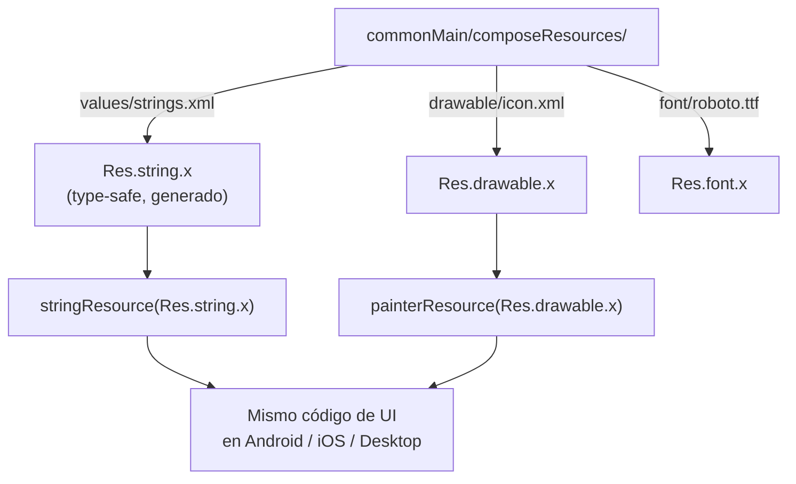

# resources_multiplatform.md

## 1. Mapa del flujo



## 2. Qué es y cómo funciona

`composeResources` es el sistema oficial de recursos compartidos de Compose Multiplatform: strings, imágenes (`.xml`/`.png`/`.svg`/`.webp`), fuentes (`.ttf`/`.otf`) y archivos raw, definidos una sola vez en `commonMain` bajo una carpeta `composeResources/`, con el compilador generando accesos type-safe (`Res.string.app_name`, `Res.drawable.icon_player`, `Res.font.roboto_bold`) utilizables desde cualquier plataforma del proyecto — como muestra el diagrama, el mismo recurso declarado una vez llega, vía `stringResource()`/`painterResource()`, al mismo código de UI sin importar en qué plataforma corra.

Reemplaza el modelo clásico de Android, donde `res/` vive únicamente dentro del módulo Android y cada plataforma (iOS, Desktop) necesitaría su propio mecanismo de recursos completamente separado.

En un proyecto KMP sin `composeResources`, cada plataforma maneja sus recursos de forma nativa y aislada: Android usa `res/values/strings.xml`, iOS usaría `Localizable.strings` o assets del bundle, Desktop necesitaría su propio mecanismo de carga de archivos. Esto significa mantener el mismo string o el mismo ícono duplicado en 2-3 lugares distintos, con el riesgo real de que se desincronicen (un texto se corrige en Android pero no en iOS) y sin ningún chequeo de compilación que detecte un recurso faltante.

`composeResources` resuelve esto centralizando todo en `commonMain`, con generación de código type-safe: si un string no existe, es un error de compilación (`Res.string.nombre_inexistente` no compila), no un crash en runtime como pasaría con un `getString(R.string.nombre_inexistente)` mal tipeado en el modelo clásico de Android.

Usar `composeResources` es la opción correcta por default para la gran mayoría de strings e imágenes de una app KMP — la excepción son recursos inherentemente nativos de una plataforma (un ícono de notificación de Android con formato específico exigido por el sistema, metadata de `Info.plist` en iOS), que no pasan por Compose Multiplatform en absoluto. Cualquier texto visible al usuario final debería vivir en `composeResources`, salvo texto verdaderamente interno de desarrollo (logs, nombres de debug) — centralizar todos los strings en un solo lugar facilita auditar el copy completo de la app y deja la puerta abierta a soporte multi-idioma sin refactors futuros.

## 3. Cómo se ve en distintos contextos

En una **app de recetas**, los nombres de las categorías ("Postres", "Entradas", "Platos principales") viven en `composeResources/values/strings.xml` con sus traducciones correspondientes por idioma — si la app se lanza en un mercado nuevo, agregar el idioma es declarar un nuevo `values-xx/strings.xml` sin tocar ningún composable.

En una **app de clima**, los íconos de condiciones climáticas (sol, lluvia, nublado) se declaran una sola vez en `drawable/` dentro de `commonMain` y se acceden vía `Res.drawable.icon_sunny` desde el mismo composable en las tres plataformas — sin necesidad de mantener tres sets de íconos sincronizados manualmente.

## 4. Implementación real

**El PO pide:** un diálogo de confirmación al cancelar un pedido, con el nombre del pedido interpolado en el mensaje, que debe poder traducirse a otros idiomas más adelante.

```xml
<!-- commonMain/composeResources/values/strings.xml -->
<resources>
    <string name="cancel_order_title">Cancelar pedido</string>
    <string name="cancel_order_confirmation">¿Confirmás cancelar el pedido #%1$s?</string>
</resources>
```

```kotlin
// Caso trampa (lo que NO hay que hacer): string hardcodeado con interpolación directa
@Composable
fun CancelOrderDialogBad(orderId: String) {
    AlertDialog(
        onDismissRequest = {},
        text = { Text("¿Confirmás cancelar el pedido #$orderId?") }, // hardcodeado
        confirmButton = { /* ... */ }
    )
}
```

```kotlin
// Corrección: recurso type-safe con placeholder posicional
@Composable
fun CancelOrderDialog(orderId: String, onConfirm: () -> Unit, onDismiss: () -> Unit) {
    AlertDialog(
        onDismissRequest = onDismiss,
        title = { Text(stringResource(Res.string.cancel_order_title)) },
        text = { Text(stringResource(Res.string.cancel_order_confirmation, orderId)) },
        confirmButton = {
            TextButton(onClick = onConfirm) { Text("Sí, cancelar") }
        },
        dismissButton = {
            TextButton(onClick = onDismiss) { Text("Volver") }
        }
    )
}
```

`stringResource(Res.string.cancel_order_confirmation, orderId)` reemplaza el placeholder `%1$s` del string declarado en el `.xml` con el valor de `orderId` en tiempo de ejecución — Compose Multiplatform soporta placeholders posicionales igual que el sistema de recursos clásico de Android. A diferencia de la versión `Bad`, este texto sí aparece en `composeResources/values/strings.xml`, así que es descubrible para cualquiera que audite el copy completo de la app, y queda listo para traducirse con solo agregar un `values-en/strings.xml` sin tocar el composable.

## 5. Buenas prácticas y errores comunes — checklist de auditoría de código de IA

Si una IA generó o modificó código con texto o imágenes visibles al usuario, revisar:

- **¿Hay un `Text("texto literal")` con contenido visible al usuario, en vez de `stringResource(Res.string.x)`?** Es el error más común, y el más fácil de pasar por alto en una revisión rápida — el código compila y funciona igual, pero ese string queda invisible para cualquier auditoría de copy o esfuerzo de traducción futuro.
- **¿Un string con interpolación directa (`"Hola $nombre"`) en vez de un placeholder posicional del recurso (`Res.string.saludo` con `%1$s`)?** Mismo problema que el anterior, agravado porque además hay que revisar manualmente el código Kotlin para entender qué texto se muestra realmente, en vez de leerlo directo del `.xml`.
- **¿Se usó `composeResources` para un recurso que en realidad es inherentemente nativo de una plataforma** (metadata de `Info.plist`, un ícono de notificación con formato específico del sistema)? Forzar ese tipo de recurso a `commonMain` no funciona técnicamente — esos casos puntuales deben quedar en la configuración nativa correspondiente.
- **¿Los nombres de los recursos son descriptivos** (`cancel_order_confirmation`) **o genéricos** (`text1`, `msg_2`, `img_final_v2`)? Un nombre pobre se sufre en cada uso futuro, porque es literalmente lo que aparece en el autocompletado del IDE al usar el recurso.
- **¿Falta algún recurso referenciado** (`Res.string.nombre_inexistente`)? A diferencia del modelo clásico de Android, esto debería fallar en compilación, no en runtime — si el código compila, es una señal de que el recurso efectivamente existe declarado en `commonMain`.