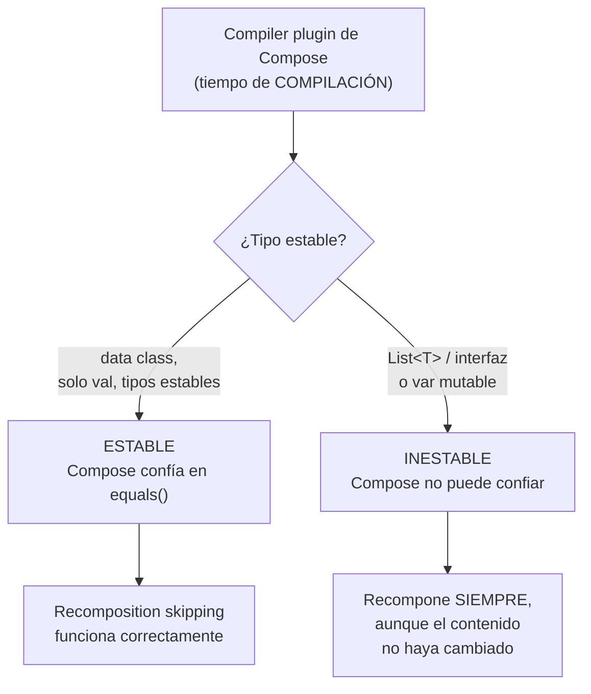

# stability.md

## 1. Mapa del flujo



## 2. Qué es y cómo funciona

**Stability** es el criterio que usa el compilador de Compose para decidir si puede confiar en un tipo lo suficiente como para **skipear** la recomposición de un composable que lo recibe como parámetro. Un tipo es "estable" si Compose puede garantizar que, mientras sus propiedades públicas no cambien, dos instancias del mismo tipo producen el mismo resultado visual — y que Compose se va a enterar si efectivamente cambiaron (vía `equals()`).

Este análisis lo hace el **compiler plugin de Compose** en tiempo de compilación, no en runtime: como muestra el diagrama, cada tipo queda marcado internamente como estable o inestable *antes* de que la app corra — no es una decisión que Compose tome dinámicamente mientras la UI está en pantalla.

Recomposition skipping (documentado en `recomposicion.md`) depende de que Compose pueda comparar "¿los parámetros de este composable cambiaron respecto a la última vez?". Si un tipo es mutable de forma que Compose no puede verificar con seguridad (por ejemplo, una interfaz como `List<T>`, que en teoría podría ser una `MutableList` mutada por fuera sin que nadie se entere), Compose no puede confiar en que no cambió — y para estar seguro, **recompone igual**, incluso si en la práctica nada cambió.

Sin el concepto de stability, cada composable con un parámetro de tipo "dudoso" perdería automáticamente el beneficio de skipping, sin que el desarrollador tenga ninguna señal de por qué su pantalla recompone más de lo esperado.

## 3. Cómo se ve en distintos contextos

En una **app de recetas**, el `State` de la pantalla de detalle expone `ingredients: List<Ingredient>`. Aunque el usuario no toque nada relacionado a los ingredientes, cualquier otro cambio del `State` (por ejemplo, `isFavorite` al tocar el corazón) fuerza a Compose a recomponer también el composable que renderiza la lista de ingredientes — porque `List<T>` es inestable, Compose no puede confiar en que "sigue siendo la misma lista" solo por comparación.

En una **app de biblioteca personal**, un `State` con `books: List<Book>` sufre exactamente el mismo problema al marcar un libro como leído: aunque el catálogo de libros no cambió en absoluto, el composable que lo muestra recompone de todas formas — el costo es invisible para el usuario en catálogos chicos, pero se vuelve perceptible (jank real) en catálogos largos con covers de libros pesados de renderizar.

## 4. Implementación real

**El PO pide:** en la pantalla de historial de pedidos, agregar un pull-to-refresh — sin que cada refresco recomponga innecesariamente la lista completa de pedidos cuando su contenido no cambió.

```kotlin
// INESTABLE: List<T> es una interfaz, Compose no puede confiar en ella
data class OrdersState(
    val orders: List<Order> = emptyList(), // <- inestable a ojos del compilador
    val isRefreshing: Boolean = false
)

@Composable
fun OrdersList(orders: List<Order>) {
    // NO puede skipear basándose solo en "orders", porque List<T>
    // podría ser una MutableList mutada por fuera sin nueva composición
    LazyColumn {
        items(orders, key = { it.id }) { order -> OrderCard(order) }
    }
}
```

```kotlin
// ESTABLE: ImmutableList<T> le da a Compose la garantía que necesita
import kotlinx.collections.immutable.ImmutableList
import kotlinx.collections.immutable.toImmutableList

data class OrdersState(
    val orders: ImmutableList<Order> = persistentListOf(),
    val isRefreshing: Boolean = false
)

@Composable
fun OrdersList(orders: ImmutableList<Order>) {
    // Ahora SÍ puede skipear: si "orders" es la misma instancia
    // inmutable, Compose confía en que el contenido no cambió
    LazyColumn {
        items(orders, key = { it.id }) { order -> OrderCard(order) }
    }
}
```

```kotlin
// En el ViewModel, al construir el nuevo State tras el refresh:
_state.update { current ->
    current.copy(
        isRefreshing = true
        // orders NO se reasigna acá: sigue siendo la misma instancia
        // inmutable hasta que llegue la respuesta real del repositorio
    )
}
```

Sin el cambio a `ImmutableList`, cada vez que el usuario hace pull-to-refresh y solo cambia `isRefreshing` (los pedidos todavía no llegaron de vuelta), Compose recompone igual todo `OrdersList` completo — aunque el contenido de `orders` sea exactamente el mismo. Con `ImmutableList<Order>`, Compose puede confiar en que si la instancia no cambió, el contenido tampoco, y `OrdersList` se skipea correctamente mientras solo cambia el indicador de refresco (ver `recomposicion.md`).

## 5. Buenas prácticas y errores comunes — checklist de auditoría de código de IA

Si una IA generó o modificó un `State` o un composable que lo consume, revisar:

- **¿El `State` expone `List<T>`, `Map<K,V>` o `Set<T>` planos en lugar de sus versiones de `kotlinx.collections.immutable`?** Es inestable por definición del compiler plugin de Compose, independientemente de que en la práctica nunca se mute. La corrección es `ImmutableList<T>` / `persistentListOf()`, no reestructurar el resto del `State`.
- **¿Alguna propiedad del `State` es `var` en vez de `val`?** Además de romper el patrón de estado inmutable de MVI (ver `06_presentation/mvi.md`), un `var` marca automáticamente ese tipo como inestable — el compilador no puede confiar en que no mutó por fuera de un `copy()`.
- **¿Se está reescribiendo todo el `State` a tipos inmutables "por las dudas", sin evidencia de un problema real?** Es optimización, no corrección — el código sigue siendo funcionalmente correcto con `List<T>` normal, solo pierde una optimización de performance. La señal correcta para actuar es evidencia real vía Layout Inspector (mismo criterio que en `recomposicion.md`), no una sospecha genérica.
- **¿Se agregó la dependencia `kotlinx.collections.immutable` y la conversión explícita (`.toImmutableList()` / `persistentListOf()`) en el punto donde se construye el `State`,** o solo se cambió el tipo del parámetro del composable sin tocar el origen del dato? Cambiar solo la firma del composable sin ajustar cómo el `ViewModel` construye esa colección no soluciona nada — la inestabilidad sigue estando en el origen.
- **¿El proyecto es chico y sin síntomas de performance, y aun así se está introduciendo esta complejidad extra?** Seguir usando `List<T>` simple es válido cuando la fricción de agregar la librería y las conversiones no se justifica todavía — no es un estándar a aplicar ciegamente en todo `State` nuevo.