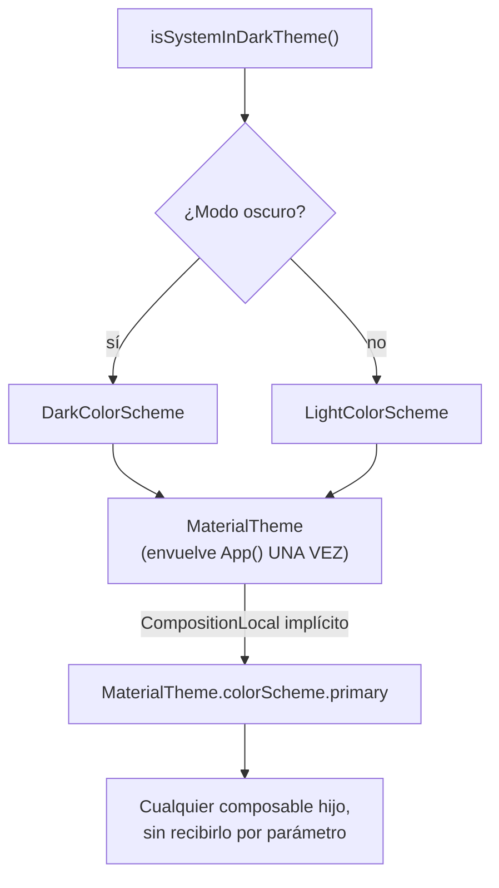

# theming_material3.md

## 1. Mapa del flujo



## 2. Qué es y cómo funciona

El theming en Material3 es el mecanismo por el cual toda la app comparte una única fuente de verdad para colores, tipografía y formas: un `ColorScheme`, una `Typography` y un `Shapes`, agrupados dentro de un `MaterialTheme` que envuelve toda la app desde la raíz (usualmente en el `App()` composable). Cualquier composable hijo accede a esos valores vía `MaterialTheme.colorScheme.primary`, `MaterialTheme.typography.bodyLarge`, etc., en vez de hardcodear colores o tamaños de fuente sueltos — como muestra el diagrama, el `ColorScheme` elegido se propaga implícitamente a cualquier profundidad del árbol, sin que ningún composable intermedio necesite recibirlo ni reenviarlo por parámetro.

Sin un theme centralizado, cada composable definiría sus propios colores y tamaños de texto de forma independiente (`Color(0xFF6200EE)` repetido en 30 archivos distintos). El resultado: inconsistencia visual, y un cambio de paleta (por ejemplo, para soportar modo oscuro) obligaría a tocar cada composable uno por uno.

`MaterialTheme` resuelve esto centralizando la paleta y la tipografía en un solo lugar. Cambiar el `ColorScheme` que se le pasa a `MaterialTheme` en la raíz de la app propaga el cambio a *toda* la UI automáticamente, porque cada composable lee `MaterialTheme.colorScheme.primary` en vez de un valor fijo — el mismo mecanismo de propagación implícita que se documenta en `compositionlocal.md` (de hecho, `MaterialTheme` está construido internamente sobre `CompositionLocal`).

Los colores semánticos vienen en pares `X`/`onX` (`primary`/`onPrimary`, `surface`/`onSurface`): `onPrimary` siempre es el color de texto/ícono legible *sobre* `primary`, calculado para cumplir accesibilidad, sin que el desarrollador elija manualmente "blanco o negro" cada vez — elegir un color "a ojo" para texto sobre un fondo de color es exactamente el tipo de decisión que el sistema `X`/`onX` reemplaza, evitando bugs de contraste en modo oscuro.

## 3. Cómo se ve en distintos contextos

En una **app de notas**, el `ColorScheme` custom define un `primary` verdoso para reforzar identidad de marca, y tanto el botón de "Nueva nota" como los headers de sección usan `MaterialTheme.colorScheme.primary` — si más adelante cambia la paleta de marca, ese único cambio en la definición del `ColorScheme` se propaga a toda la app sin tocar un solo composable.

En una **app de fitness**, el modo oscuro no es opcional (mucha gente la usa de noche antes de dormir para revisar su progreso): definir `lightColorScheme`/`darkColorScheme` con pares `X`/`onX` completos desde el día uno evita que, seis meses después, aparezcan pantallas con texto ilegible sobre fondo oscuro porque alguien hardcodeó un color pensando solo en modo claro.

## 4. Implementación real

**El PO pide:** un banner de advertencia en la pantalla de pedido cuando el método de pago falló, que se vea correctamente tanto en modo claro como oscuro.

```kotlin
private val AppLightColors = lightColorScheme(
    primary = Color(0xFF2E7D32),
    onPrimary = Color.White,
    secondary = Color(0xFFFFA000)
)

private val AppDarkColors = darkColorScheme(
    primary = Color(0xFF81C784),
    onPrimary = Color.Black,
    secondary = Color(0xFFFFCA28)
)

@Composable
fun AppTheme(
    useDarkTheme: Boolean = isSystemInDarkTheme(),
    content: @Composable () -> Unit
) {
    val colorScheme = if (useDarkTheme) AppDarkColors else AppLightColors

    MaterialTheme(
        colorScheme = colorScheme,
        typography = Typography(), // valores default de M3, o customizados
        content = content
    )
}
```

```kotlin
// Caso trampa (lo que NO hay que hacer): colores hardcodeados
@Composable
fun PaymentFailedBannerBad(message: String) {
    Box(modifier = Modifier.background(Color(0xFFFFF3CD))) { // amarillo hardcodeado
        Text(text = message, color = Color.Black) // negro hardcodeado
    }
}
```

```kotlin
// Corrección: colores semánticos del ColorScheme, ya resueltos para ambos modos
@Composable
fun PaymentFailedBanner(message: String, modifier: Modifier = Modifier) {
    Box(
        modifier = modifier
            .fillMaxWidth()
            .background(MaterialTheme.colorScheme.errorContainer)
            .padding(12.dp)
    ) {
        Text(
            text = message,
            color = MaterialTheme.colorScheme.onErrorContainer,
            style = MaterialTheme.typography.bodyMedium
        )
    }
}
```

`isSystemInDarkTheme()` lee la preferencia del sistema operativo automáticamente; `AppTheme` decide qué `ColorScheme` aplicar según eso, y todo lo que esté dentro de `content` accede al resultado vía `MaterialTheme.colorScheme` sin saber si está en modo claro u oscuro. En la versión corregida del banner, `errorContainer`/`onErrorContainer` ya vienen calculados con el contraste correcto tanto para modo claro como oscuro — a diferencia de la versión `Bad`, que se vería como un parche amarillo fuera de tono en cuanto el usuario active modo oscuro.

## 5. Buenas prácticas y errores comunes — checklist de auditoría de código de IA

Si una IA generó o modificó código con colores o tipografía, revisar:

- **¿Aparece algún `Color(0xFF...)` hardcodeado directamente en un composable de UI**, en vez de `MaterialTheme.colorScheme.algo`? Salvo un caso verdaderamente fijo e independiente del tema (el color exacto de un logo de marca externa), es señal de que se está esquivando el theme en vez de usarlo — y rompe silenciosamente el modo oscuro sin ningún error de compilación.
- **¿Se usa un color de fondo sin su contraparte `on` correspondiente para el texto/ícono que va encima** (`background(colorScheme.errorContainer)` con `color = Color.Black` en vez de `colorScheme.onErrorContainer`)? Es el bug de contraste más común — el par `X`/`onX` existe justamente para no tener que adivinar manualmente qué color de texto es legible sobre cada fondo.
- **¿El bug "se ve raro mezclado" en modo oscuro fue descartado por no generar ningún error visible en testing?** Este tipo de bug no crashea ni falla ningún test automático — solo se detecta activando modo oscuro manualmente y mirando la pantalla. Vale la pena revisar cualquier pantalla nueva en ambos modos antes de dar por cerrado un PR.
- **¿`MaterialTheme` se está envolviendo más de una vez en distintos niveles del árbol** (en vez de una sola vez en la raíz, `App()`)? Aunque técnicamente funcione, reintroduce el mismo problema que el theme centralizado busca evitar — múltiples fuentes de verdad para la paleta.
- **¿Se customizó `Typography` a mitad de proyecto, después de que ya existían muchos `Text` asumiendo el default de M3?** No es un error de código, pero vale la pena señalarlo como riesgo — revisar cada `style` afectado en vez de asumir que el cambio de tipografía se propaga sin fricciones visuales.