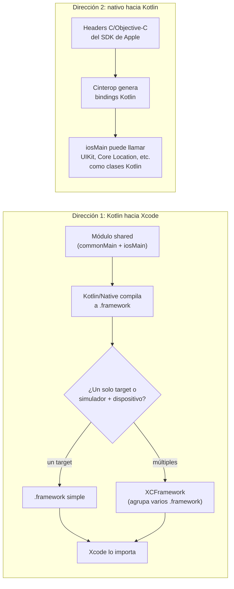

# Framework / XCFramework / Cinterop

## 1. Mapa del flujo



Son dos direcciones del mismo puente: Framework/XCFramework saca código Kotlin *hacia* Xcode; Cinterop trae APIs nativas *hacia* Kotlin. Este archivo cubre las dos, porque comparten el mismo objetivo de interoperabilidad — el consumo desde Swift de las clases Kotlin ya expuestas se profundiza en `interop_inverso_swift.md`.

## 2. Qué es y cómo funciona

Tres piezas relacionadas que resuelven el problema de **cómo el mundo Kotlin y el mundo Swift/Objective-C se comunican en ambas direcciones**:

- **Framework**: el formato binario que Xcode entiende y puede embeber en un proyecto iOS. El módulo `shared` de KMP no se consume directamente desde Swift — se compila a un `.framework`, la unidad de distribución estándar de Apple para código nativo (lo mismo que produciría un proyecto Swift/Objective-C compilado como librería).
- **XCFramework**: un contenedor que agrupa **varios** `.framework` — uno por cada arquitectura/target (simulador ARM64, dispositivo físico ARM64, Intel, etc). Xcode elige automáticamente el binario correcto según dónde se esté compilando. Es necesario porque un solo `.framework` no puede contener simultáneamente binarios para simulador y dispositivo físico sin conflictos.
- **Cinterop**: la herramienta que genera *bindings* Kotlin para librerías C/Objective-C ya existentes. Es lo que permite que código en `iosMain` llame directamente APIs de UIKit, Core Location, Core Foundation, etc., como si fueran clases Kotlin normales.

**Por qué hacen falta las tres piezas:** sin Framework/XCFramework, Xcode no tendría forma de "entender" el binario que produce Kotlin/Native — se necesita el formato que la toolchain de Apple sabe consumir, con headers y metadata compatibles. Sin Cinterop, el código Kotlin en `iosMain` quedaría aislado del ecosistema nativo de iOS — no se podría llamar ninguna API del SDK de Apple, porque esas APIs están escritas en Objective-C/C, no en Kotlin. En conjunto resuelven la interoperabilidad en las dos direcciones.

**Dato de contexto reciente (Kotlin 2.4, junio 2026):** además de la vía clásica de XCFramework, Kotlin sumó soporte para **Swift packages como dependencia directa** — una alternativa más al momento de distribuir el módulo compartido, pensada para simplificar la integración vía Swift Package Manager sin pasar por CocoaPods. No reemplaza la mecánica de XCFramework descrita acá, pero es un dato a tener en cuenta al decidir cómo el equipo iOS va a consumir el módulo `shared`.

## 3. Cómo se ve en distintos contextos

En una **app de fitness** que recién suma su primera versión iOS, el equipo genera el XCFramework desde Gradle (`assembleXCFramework`) y lo embebe manualmente en Xcode para el prototipo inicial — es la ruta más simple cuando todavía no hay CI/CD armado y el equipo es chico. La superficie de Cinterop en ese proyecto es mínima: solo un par de funciones `expect/actual` que necesitan leer el identificador del dispositivo o pedir permisos de notificaciones, ambas resueltas con bindings automáticos hacia UIKit.

En una **app de e-commerce** con equipos Android e iOS separados y un pipeline de CI ya maduro, el módulo `shared` se distribuye como dependencia versionada vía CocoaPods (o, más recientemente, como Swift package), no copiado a mano. El equipo iOS nunca toca el `.framework` directamente — lo consume como cualquier otra dependencia externa, y cada nueva versión del módulo compartido pasa por el mismo pipeline de release que el resto del proyecto.

## 4. Implementación real

**El pedido del PO:** *"Necesito que la app pueda identificar el dispositivo de forma anónima para asociar el carrito abandonado, tanto en Android como en la futura versión de iOS."*

```kotlin
// commonMain — declaración expect, sin implementación concreta
expect fun getDeviceId(): String
```

```kotlin
// androidMain — implementación Android, sin Cinterop de por medio
actual fun getDeviceId(): String =
    Settings.Secure.getString(context.contentResolver, Settings.Secure.ANDROID_ID)
```

```kotlin
// iosMain — acá entra Cinterop: "platform.UIKit" es un binding generado
// automáticamente a partir de los headers Objective-C del SDK de iOS
actual fun getDeviceId(): String =
    platform.UIKit.UIDevice.currentDevice.identifierForVendor?.UUIDString ?: ""
```

```kotlin
// shared/build.gradle.kts — configuración del framework para los tres targets iOS
kotlin {
    listOf(
        iosX64(),
        iosArm64(),
        iosSimulatorArm64()
    ).forEach {
        it.binaries.framework {
            baseName = "shared" // nombre que va a importar Swift
        }
    }
}
```

```swift
// del lado Swift, una vez embebido el XCFramework en Xcode
import shared

let deviceId = SharedKt.getDeviceId() // la función Kotlin, consumida como si fuera nativa
```

El único punto donde interviene Cinterop en este ejemplo es el `actual` de `iosMain` — ahí es donde Kotlin necesita hablar con UIKit. El resto del flujo (declarar `expect`, generar el framework, importarlo en Swift) no usa Cinterop, usa Framework/XCFramework.

## 5. Buenas prácticas y errores comunes

Checklist para auditar código o configuración de build entregada por una IA:

- **¿El `.framework` que se está por compartir con el equipo iOS corresponde a un solo target?** Si viene de `build/bin/iosSimulatorArm64/`, solo sirve para simulador Apple Silicon — no va a andar en dispositivo físico (`iosArm64`) ni en Mac Intel (`iosX64`). Si la IA generó instrucciones para "copiar el framework" sin mencionar `assembleXCFramework`, es una bandera roja: probablemente está asumiendo un solo target sin decirlo.
- **¿El código en `iosMain` usa Cinterop para algo que en realidad debería resolverse con una librería KMP ya existente?** Llamar directo a una API de UIKit vía Cinterop cuando ya existe una librería multiplatform equivalente agrega superficie de mantenimiento innecesaria.
- **¿Los bindings generados por Cinterop se están exponiendo tal cual hacia capas superiores (`domain`, `presentation`), en vez de quedar encapsulados en `iosMain`?** Los bindings de Cinterop pueden ser verbosos o poco idiomáticos — si se filtran fuera de la capa de plataforma, contaminan capas que deberían ser agnósticas de plataforma. Un wrapper propio en `iosMain` es la solución esperable.
- **¿Se agregó `cocoapods {}` o configuración de SPM sin que el equipo iOS lo haya pedido?** Sumar un manejador de dependencias específico es una decisión de equipo, no algo que una IA debería introducir por su cuenta en el `build.gradle.kts`.
- **Si el proyecto está evaluando cómo distribuir el módulo `shared` hoy:** vale la pena verificar si el soporte de Kotlin 2.4 para Swift packages como dependencia directa simplifica el pipeline actual, en vez de asumir por defecto que XCFramework + CocoaPods sigue siendo la única opción vigente.