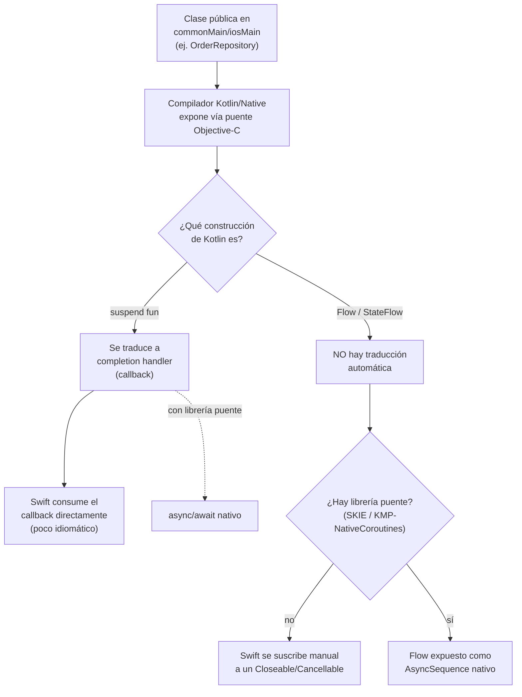

# Interop Inverso (Swift/Objective-C llamando a Kotlin)

## 1. Mapa del flujo



Esta es la dirección contraria a la de `framework_xcframework_cinterop.md`: acá Swift consume las clases públicas del módulo `shared`, no al revés. El punto de fricción real está en las dos ramas de la derecha — `suspend fun` y `Flow` no se traducen igual.

## 2. Qué es y cómo funciona

Todo lo público en `commonMain`/`iosMain` se expone automáticamente en el `.framework` generado como clases y funciones Objective-C/Swift-friendly — no hace falta escribir ningún wrapper manual para que existan del lado Swift, el compilador de Kotlin/Native se encarga de esa traducción.

El detalle importante está en **cómo se traducen dos construcciones específicas de Kotlin que no tienen equivalente directo en Swift**: `suspend fun` y `Flow`.

**Por qué esto importa:** sin interop inverso, compartir lógica en KMP no serviría de mucho — se podría tener todo el `domain`/`data`/`presentation` en Kotlin puro, pero si Swift no pudiera consumirlo de forma razonable, el equipo iOS terminaría reescribiendo esa lógica de todos modos, anulando el propósito de compartir código.

El problema de fondo es la brecha de paradigmas asincrónicos: Kotlin tiene coroutines (`suspend fun`, `Flow`) y Swift tiene su propio modelo (`async/await`, Combine/`AsyncSequence`). No son binariamente compatibles — Objective-C, que es el puente real que usa Kotlin/Native para exponerse (ver `framework_xcframework_cinterop.md`), no tiene concepto de coroutine. Por eso el compilador traduce `suspend fun` a algo que Objective-C sí entiende (completion handlers/callbacks), y `Flow` queda **directamente sin traducción automática** — necesita una librería puente.

**Las dos librerías puente disponibles:**

| Librería | Cómo funciona |
|---|---|
| **SKIE** | Plugin de Gradle que genera automáticamente la API Swift-friendly (async/await + AsyncSequence) directo desde la compilación |
| **KMP-NativeCoroutines** | Requiere un paso de generación de código adicional, pero es igualmente madura y probada en producción |

## 3. Cómo se ve en distintos contextos

En una **app de fitness** que expone un `WorkoutRepository` con `suspend fun getWorkoutPlan()`, el equipo iOS que recién arranca con KMP se encuentra por defecto con el completion handler que genera Kotlin/Native sin librería puente — funciona, pero anidar varios de esos callbacks en una pantalla con múltiples cargas se vuelve rápidamente ilegible comparado con el `async/await` nativo de Swift al que están acostumbrados.

En una **app de e-commerce** cuyo `ViewModel` expone `state: StateFlow<CheckoutState>` para que SwiftUI lo observe reactivamente, la ausencia de librería puente es un bloqueo real, no solo una molestia de estilo: sin SKIE ni KMP-NativeCoroutines, `Flow` no tiene ningún camino automático hacia `AsyncSequence`, así que el equipo iOS necesita suscribirse manualmente al `Closeable` que genera Kotlin/Native y gestionar la cancelación a mano — mucho más trabajo que el caso de `suspend fun`, que al menos compila algo usable sin ayuda externa.

## 4. Implementación real

**El pedido del PO:** *"El equipo iOS va a empezar a consumir el historial de pedidos. Necesito que puedan traer la lista una vez y también observar cambios en tiempo real, de la forma más nativa posible para SwiftUI."*

```kotlin
// commonMain — repository ya definido en 02_domain/03_data
class OrderRepository {
    suspend fun getOrderHistory(userId: String): List<Order> { /* ... */ }
    fun observeOrders(userId: String): Flow<List<Order>> { /* ... */ }
}
```

**Sin librería puente — así se ve expuesto por defecto:**

```swift
// suspend fun -> completion handler, generado automáticamente por Kotlin/Native
orderRepository.getOrderHistory(userId: userId) { orders, error in
    if let orders = orders {
        // actualizar UI con los datos
    } else if let error = error {
        // manejar el error
    }
}

// Flow NO tiene equivalente directo — esto no compila así en Swift plano.
// Sin librería puente, hay que suscribirse manualmente a un objeto
// Closeable/Cancellable que genera Kotlin/Native para representar la suscripción.
```

**Con SKIE o KMP-NativeCoroutines instalado:**

```swift
// suspend fun se consume con async/await nativo de Swift
let orders = try await orderRepository.getOrderHistory(userId: userId)

// y Flow se expone como AsyncSequence, iterable con for-await
for await orders in orderRepository.observeOrders(userId: userId) {
    // actualizar UI en cada nueva emisión, de forma idiomática
}
```

La decisión técnica acá no es "cuál código Kotlin escribir" — el `OrderRepository` no cambia una línea entre ambos escenarios. La decisión es si sumar SKIE/KMP-NativeCoroutines al proyecto iOS, y esa decisión determina qué tan idiomático es el consumo del lado Swift.

## 5. Buenas prácticas y errores comunes

Checklist para auditar código o decisiones de interop entregadas por una IA:

- **¿Se asume que `Flow` se traduce automáticamente igual que `suspend fun`?** Es el error conceptual más común de este archivo — son casos distintos: `suspend fun` tiene traducción built-in (aunque poco idiomática, vía completion handler), `Flow` directamente no tiene traducción built-in en absoluto sin librería puente.
- **¿Se agregó SKIE o KMP-NativeCoroutines sin que haya `Flow`/`StateFlow` expuesto hacia Swift?** Si el proyecto solo expone modelos de datos y funciones síncronas, sumar una librería puente es una dependencia extra sin beneficio real todavía.
- **¿El `ViewModel`/`Repository` que se está exponiendo hacia iOS tiene una superficie async grande (varias `suspend fun` y `Flow`) pero el proyecto sigue sin librería puente?** Es una señal de que el equipo iOS probablemente está lidiando con callbacks anidados innecesariamente — vale la pena revisar si corresponde sumar SKIE/KMP-NativeCoroutines.
- **¿El código Kotlin cambió para "facilitar" el interop (por ejemplo, evitando `Flow` y reemplazándolo por callbacks manuales escritos a mano)?** Es un antipatrón — el problema de traducción se resuelve en la capa de interop (librería puente), no rediseñando la API de Kotlin para acomodarse a la limitación de exposición.
- **¿La gestión de cancelación del lado Swift (sin librería puente) libera correctamente el `Closeable`/`Cancellable`?** Sin SKIE/KMP-NativeCoroutines, olvidarse de cancelar la suscripción manual a un `Flow` expuesto es una fuga de recursos real, no solo un detalle de estilo.