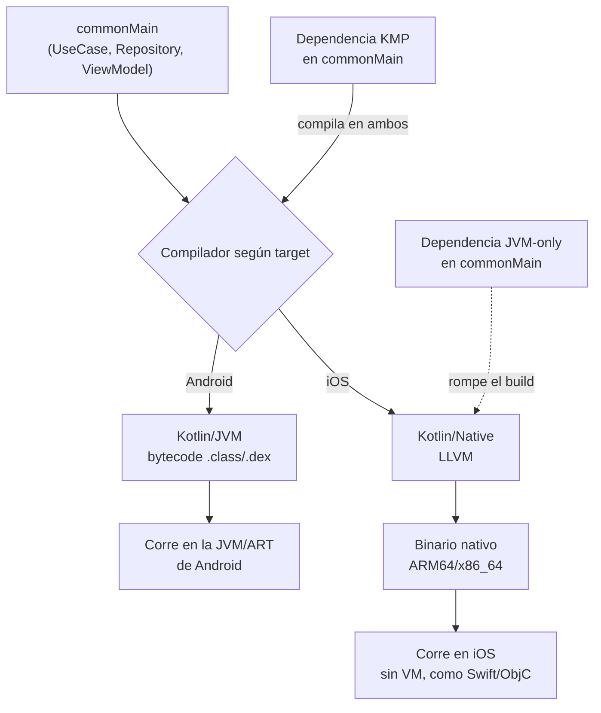

# Kotlin/Native

## 1. Mapa del flujo



El mismo archivo fuente en `commonMain` entra por el mismo cuadro `A` y sale por rutas completamente distintas. La línea punteada marca el punto de falla más común: una dependencia JVM-only nunca llega a compilar contra Kotlin/Native, aunque el código Kotlin en sí sea perfectamente válido.

## 2. Qué es y cómo funciona

**Kotlin/Native** es el compilador de Kotlin que genera binario nativo directamente, sin pasar por una máquina virtual. Usa **LLVM** por debajo para producir código máquina específico del target (ARM64 para dispositivo iOS, x86_64/ARM64 para simulador, según la Mac). Es la pieza que permite que código Kotlin puro corra en un iPhone sin que exista una JVM en el medio.

Es importante no pensarlo como "un compilador más de Kotlin" — es un compilador *distinto* al que se usa para Android, y tu mismo código fuente en `commonMain` se compila **dos veces, con dos toolchains totalmente diferentes**:

| Plataforma | Compilador | Output | Runtime |
|---|---|---|---|
| Android | Kotlin/JVM | bytecode `.class`/`.dex` | JVM/ART |
| iOS | Kotlin/Native (LLVM) | binario nativo ARM64/x86_64 | ninguno — nativo |

**Por qué existe:** iOS no tiene una JVM disponible — no hay forma de correr bytecode ahí. Si Kotlin solo pudiera compilar a JVM, "Kotlin Multiplatform" sería en la práctica "Kotlin Android + algo liviano en otros lados", nunca lógica de dominio compartida de verdad ejecutándose nativamente en iOS. Kotlin/Native resuelve exactamente eso: la lógica se escribe una sola vez (`UseCase`, `Repository`, `ViewModel` en `commonMain`) y termina siendo binario nativo en iOS, con el mismo nivel de integración que código escrito directamente en Swift.

**La restricción que se deriva de esto:** el código en sí compila para ambos targets, pero **toda la cadena de dependencias** (directa o transitiva) que uses en `commonMain` también tiene que soportar Kotlin/Native, no solo Kotlin/JVM. Una librería JVM-only en `commonMain` rompe el build de iOS en tiempo de compilación, sin importar qué tan bien escrito esté el resto del código — por eso este repo usa Ktor en vez de Retrofit, y por eso cualquier librería que se sume a `commonMain` necesita verificarse contra targets Kotlin/Native antes de agregarla.

## 3. Cómo se ve en distintos contextos

En una **app de fitness** que comparte lógica de cálculo de calorías y planes de entrenamiento entre Android e iOS, todo el módulo `domain` (modelos, `UseCase`, interfaces de `Repository`) vive en `commonMain` precisamente para aprovechar Kotlin/Native. El equipo eligió desde el día uno una librería de persistencia local multiplatform en vez de una Android-only, sabiendo que cualquier alternativa JVM-only les hubiera bloqueado la salida a iOS más adelante — la decisión de stack no fue estética, fue de compatibilidad de compilador.

En una **app de e-commerce** que arrancó siendo solo Android y después sumó iOS, el equipo se encontró con el escenario inverso: parte del `data` layer ya usaba una librería de logging JVM-only. Migrar a `commonMain` no fue un simple "mover el archivo" — hubo que reemplazar esa dependencia por una alternativa KMP antes de que el módulo compilara para iOS. El código Kotlin en sí no cambió una línea; lo que cambió fue la cadena de dependencias que ese código arrastraba.

## 4. Implementación real

**El pedido del PO:** *"Necesitamos que el historial de pedidos se calcule igual en Android y en la futura app de iOS — mismo total, mismo criterio de agrupado por fecha. No quiero mantener esa lógica dos veces."*

La respuesta técnica es: esa lógica va en `commonMain`, y Kotlin/Native es lo que garantiza que corra nativamente en iOS sin reescribirla.

```kotlin
// commonMain — este archivo se compila DOS VECES, con DOS compiladores distintos
class GetOrderHistoryUseCase(
    private val repository: OrderRepository
) {
    suspend operator fun invoke(userId: String): List<Order> {
        return repository.getOrders(userId)
            .sortedByDescending { it.date }
    }
}
```

```kotlin
// commonMain — el modelo también vive acá, sin cambios entre plataformas
data class Order(
    val id: String,
    val items: List<OrderItem>,
    val date: Long,
    val total: Double
)
```

No hay ninguna anotación ni configuración especial en este código que "active" Kotlin/Native — es Kotlin puro. La diferencia está enteramente en el paso de compilación:

```
Build Android → Kotlin/JVM    → GetOrderHistoryUseCase.class → corre en ART
Build iOS     → Kotlin/Native → GetOrderHistoryUseCase (binario ARM64) → corre nativo
```

**El error que rompería esto:** si `OrderRepository` (también en `commonMain`) se implementara usando una librería HTTP JVM-only en vez de una KMP-compatible, el build de Android seguiría funcionando sin ningún síntoma — pero el build de iOS fallaría en tiempo de compilación, con un error de resolución de dependencias, no un error de lógica. El `UseCase` de arriba nunca se enteraría de por qué: el problema está un nivel más abajo, en qué implementación eligió `data` para `OrderRepository`.

## 5. Buenas prácticas y errores comunes

Checklist para auditar código de `commonMain` entregado por una IA:

- **¿Toda nueva dependencia agregada a `commonMain` declara soporte explícito para targets Kotlin/Native (iosArm64, iosSimulatorArm64, etc.)?** Si la IA agregó una librería sin verificar esto, puede compilar hoy en Android y romper recién cuando exista un build real de iOS — el error no aparece en el momento en que se lo espera.
- **¿El código asume "es Kotlin, entonces compila en todos lados"?** Es el error conceptual más común. Kotlin puro en `commonMain` compila en todos lados *si y solo si* toda su cadena de dependencias, directa y transitiva, también es KMP.
- **¿Hay imports de plataforma colados en `commonMain`?** Un import de `android.*` o de una API JVM-only dentro de un archivo que debería ser puro dominio es una señal de que la IA no separó bien las capas — eso no solo rompe Kotlin/Native, rompe Clean Architecture.
- **¿El código de auditoría de la IA reemplaza una dependencia JVM-only por una alternativa KMP sin verificar que esa alternativa cubra la misma superficie de API que se estaba usando?** Cambiar de librería para "arreglar" el build de iOS puede introducir silenciosamente un comportamiento distinto si la API no es un reemplazo 1:1.
- **¿Se está usando `expect`/`actual` donde en realidad el problema es de dependencia, no de plataforma?** Son herramientas para problemas distintos — `expect`/`actual` resuelve "necesito una implementación distinta por plataforma"; una dependencia JVM-only resuelve con "cambiar de librería", no con `expect`/`actual`.