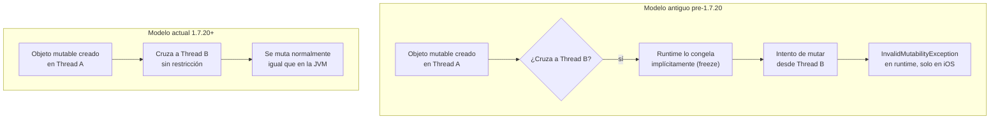

# Memory Model (Modelo de Memoria)

## 1. Mapa del flujo



El contraste entre ambos caminos es el contenido entero del archivo: el modelo antiguo tenía un paso extra (`freeze`) que podía explotar en runtime; el modelo actual simplemente no tiene ese paso.

## 2. Qué es y cómo funciona

Es la estrategia que usa Kotlin/Native para permitir que objetos mutables se compartan y muten entre distintos threads. Desde Kotlin **1.7.20** (hoy el único modelo soportado en cualquier proyecto KMP activo), los objetos se comparten y mutan entre threads igual que en la JVM — sin ningún paso manual de por medio.

Es un tema que hoy es mayormente **histórico**: importa para entender por qué código KMP viejo tiene `freeze()` por todos lados, y para no repetir en una entrevista un miedo que ya no aplica al stack actual.

**Qué resolvía el modelo anterior (y por qué generaba fricción):** antes de 1.7.20 existía un modelo "estricto" donde un objeto mutable creado en un thread no podía mutarse desde otro thread sin antes "congelarlo" (`freeze()`) — convertirlo en inmutable en runtime. El caso típico: una coroutine en background (`Dispatchers.Default`/`Dispatchers.IO`) actualizando un objeto que ya había cruzado de threads en algún punto anterior. El runtime lo había congelado implícitamente, y el intento de mutarlo lanzaba `InvalidMutabilityException` — en tiempo de ejecución, no en compilación, y **solo en iOS** (en Android el mismo código corría sin problema, porque Kotlin/JVM nunca tuvo esa restricción).

El modelo nuevo elimina el problema de raíz: ya no existe el concepto de "congelar" un objeto al cruzar de thread. El comportamiento de compartir/mutar estado entre threads es consistente entre Android y iOS, sin cuidado adicional — no es una optimización que haya que activar, es el comportamiento por defecto del compilador en cualquier versión reciente.

## 3. Cómo se ve en distintos contextos

En una **app de fitness** con un `ViewModel` que carga en paralelo el plan de entrenamiento y las estadísticas del usuario (dos `async` corriendo en simultáneo), el resultado se combina en un `_state.update { it.copy(...) }` sin ningún cuidado especial sobre en qué thread se creó cada objeto — el mismo código que corre en Android corre igual en iOS.

En una **app de e-commerce** que mantiene código KMP heredado de una migración vieja, alguien puede encontrarse con llamadas a `.freeze()` esparcidas en clases de dominio, o con un wrapper manual tipo `AtomicReference` usado "por las dudas" para evitar mutabilidad entre threads. Ninguna de las dos cosas es necesaria hoy — son señales de que ese código (o el tutorial del que se copió) es anterior a 1.7.20, no una práctica a imitar.

## 4. Implementación real

**El pedido del PO:** *"Quiero que la pantalla de historial de pedidos cargue los pedidos y el resumen de totales en paralelo, para que no se sientan dos loaders en cadena."*

```kotlin
class OrdersViewModel(
    private val getOrderHistory: GetOrderHistoryUseCase,
    private val getOrdersSummary: GetOrdersSummaryUseCase
) : ViewModel() {

    private val _state = MutableStateFlow(OrdersState())
    val state: StateFlow<OrdersState> = _state.asStateFlow()

    fun loadOrders(userId: String) {
        viewModelScope.launch {
            _state.update { it.copy(isLoading = true) }

            // con el modelo de memoria ACTUAL (1.7.20+): esto simplemente
            // funciona igual en Android y en iOS, sin ningún cuidado especial
            // sobre en qué thread se crearon "orders" o "summary"
            val orders = async { getOrderHistory(userId) }
            val summary = async { getOrdersSummary(userId) }

            _state.update {
                it.copy(
                    orders = orders.await(),
                    summary = summary.await(),
                    isLoading = false
                )
            }
        }
    }
}
```

No hay ninguna línea que "active" el modelo nuevo — es simplemente el comportamiento del compilador en cualquier versión reciente de Kotlin. Si este mismo código se hubiera escrito bajo el modelo pre-1.7.20, existía el riesgo real de que `orders` o `summary` llegaran "congelados" al `.copy()`, dependiendo de en qué thread se hubiera instanciado cada objeto en el camino — un bug de aparición tardía y específico de iOS.

## 5. Buenas prácticas y errores comunes

Checklist para auditar código KMP entregado por una IA en relación al modelo de memoria:

- **¿Aparece `.freeze()` en algún lugar del código?** Es la señal de alarma más directa: con el modelo de memoria actual es innecesario, y su presencia sugiere que la IA generó el código basándose en una fuente desactualizada (pre-1.7.20).
- **¿Hay algún `AtomicReference` usado como workaround manual de mutabilidad entre threads?** Mismo caso — era un patrón para sortear el modelo viejo, no una práctica recomendada hoy.
- **¿El código captura `InvalidMutabilityException` en algún `try/catch`?** Si una IA generó manejo de errores para esa excepción específica, es una fuerte señal de que replicó un patrón obsoleto sin verificar contra el modelo actual.
- **Importante — lo que este ítem NO cubre:** el modelo de memoria actual elimina el `freeze()` obligatorio, pero **no elimina la necesidad de sincronización correcta** ante una race condition genuina. Si el bug que se está depurando es una race condition real (dos threads escribiendo el mismo estado mutable sin coordinación), la solución sigue siendo diseño correcto de concurrencia (ver `07_coroutines`), no algo relacionado al memory model.
- **Señal general para reconocer fuentes desactualizadas:** si un tutorial o repo de referencia menciona `freeze()`, `AtomicReference` como workaround, o `InvalidMutabilityException`, probablemente esté describiendo el modelo viejo — útil no solo para este archivo puntual, sino como criterio para evaluar cualquier fuente KMP que no tenga fecha clara.

## 6. Profundización: cómo funcionaba el modelo antiguo y por qué dejó de ser necesario

Vale la pena entender el mecanismo interno una sola vez, no para aplicarlo, sino para poder leer código legacy sin que genere alarma injustificada.

**El problema de fondo que Kotlin/Native tenía que resolver:** a diferencia de la JVM, que tiene un garbage collector diseñado desde el origen para memoria compartida entre threads con sincronización explícita del programador, el runtime de Kotlin/Native necesitaba una forma de garantizar que un objeto mutable no se corrompiera si dos threads lo tocaban a la vez — sin asumir que el desarrollador iba a poner los `synchronized`/locks correctos en cada punto de cruce.

**La solución del modelo antiguo (pre-1.7.20):** en vez de confiar en que el desarrollador sincronizara correctamente, el runtime aplicaba una regla binaria y automática:

1. Un objeto mutable creado en el Thread A podía mutarse libremente **mientras siguiera siendo accedido solo desde el Thread A**.
2. En el momento en que ese objeto **cruzaba** a otro thread — por ejemplo, se pasaba como resultado de un `async {}` que corría en `Dispatchers.Default` y se consumía desde `Dispatchers.Main` — el runtime lo marcaba como **frozen** (congelado) de forma implícita y automática.
3. Una vez frozen, el objeto pasaba a comportarse como inmutable: cualquier intento posterior de modificar una de sus propiedades `var`, sin importar desde qué thread, lanzaba `InvalidMutabilityException` en tiempo de ejecución.
4. El freeze era **contagioso**: si un objeto frozen tenía una referencia a otro objeto, ese otro objeto también quedaba frozen. Un solo objeto cruzando de thread podía terminar congelando buena parte del grafo de objetos conectado a él.

Esto era seguro (evitaba corrupción de memoria por escrituras concurrentes no sincronizadas) pero generaba una clase entera de bugs confusos: el error aparecía en runtime, no en compilación; aparecía solo en iOS, nunca en Android (la JVM nunca tuvo este concepto); y el punto exacto donde el objeto se había congelado podía estar lejos, en código, del punto donde explotaba el `InvalidMutabilityException`.

**Por qué el modelo nuevo (1.7.20+) pudo eliminar esto:** el equipo de Kotlin/Native rediseñó el garbage collector y el modelo de memoria para soportar objetos mutables compartidos entre threads de forma nativa, con un GC capaz de rastrear y colectar referencias cruzadas entre threads sin necesitar que los objetos fueran inmutables para hacerlo con seguridad. En otras palabras: el problema no se "resolvió" pidiéndole al desarrollador que evite la mutación entre threads — se resolvió haciendo que el runtime soporte esa mutación de forma segura, tal como ya lo hace la JVM. Por eso el cambio es transparente: no hay una nueva API que aprender, simplemente dejó de existir la restricción.

**Consecuencia práctica para leer código legacy:** si en un repo o tutorial aparece `.freeze()`, esa línea era necesaria para forzar el mismo comportamiento que hoy es automático — declarar explícitamente "este objeto va a cruzar de thread, tratalo como inmutable". Hoy esa declaración no hace nada (el compilador la ignora funcionalmente), pero tampoco rompe el build: es ruido conceptual, no un error.