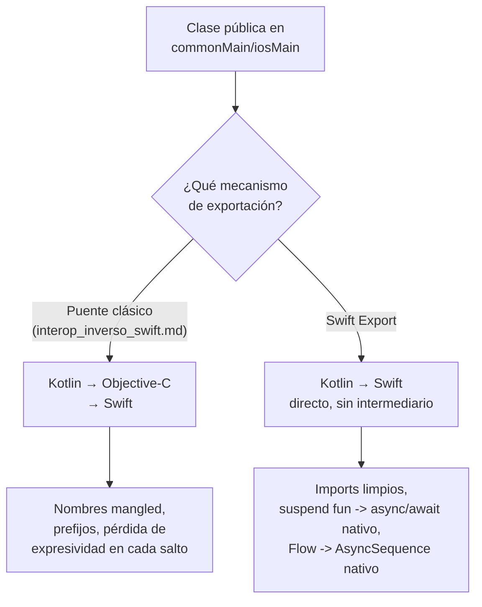

# Swift Export

## 1. Mapa del flujo



El contraste central del archivo: el puente clásico (cubierto en `interop_inverso_swift.md`) pasa por Objective-C como intermediario; Swift Export elimina ese salto generando Swift directamente desde el compilador de Kotlin/Native.

## 2. Qué es y cómo funciona

Swift Export es el mecanismo de Kotlin/Native para exponer código Kotlin directamente a Swift, sin pasar por el puente Objective-C que documenta `interop_inverso_swift.md`. En vez de que el compilador traduzca las clases/funciones públicas del módulo `shared` a headers Objective-C (que Swift después interpreta con su propio sistema de bridging), Swift Export genera directamente un módulo Swift nativo.

**Línea de tiempo verificada de su evolución:**

| Versión de Kotlin | Fecha | Qué cambió en Swift Export |
|---|---|---|
| 2.2.20 | sep 2025 | Habilitado **por defecto** en el toolchain (dejó de requerir un flag experimental para existir) |
| 2.3.0 | dic 2025 | Opciones de exportación mejoradas para interop con Swift |
| 2.4.0 | jun 2026 | Exporta **value classes**; suma soporte para **Swift packages como dependencia** |

Con esa base, desde que quedó habilitado por defecto exporta `suspend fun` como `async/await` nativo y `Flow` como `AsyncSequence` nativo, sin necesitar SKIE ni KMP-NativeCoroutines para ese caso puntual.

**Nota sobre alcance de cobertura:** distintas construcciones de Kotlin llegan a tener soporte completo en Swift Export en releases distintos — coroutines y `Flow` fue de los primeros casos cubiertos, `value class` recién se sumó en 2.4.0. Esto importa porque no todo lo que existe en Kotlin tiene necesariamente la misma madurez de exportación al mismo tiempo; antes de asumir que una construcción puntual (por ejemplo `sealed class`/`sealed interface`, que este repo usa en cada `Contract` de MVI) está totalmente cubierta, conviene verificar contra el changelog de la versión exacta de Kotlin del proyecto, no contra la fecha en que "salió Swift Export" en general.

## 3. Cómo se ve en distintos contextos

Sobre el mismo `OrderRepository` con `suspend fun getOrderHistory()` y `fun observeOrders(): Flow<List<Order>>` visto en `interop_inverso_swift.md`: con el puente clásico sin librería puente, Swift recibía un completion handler poco idiomático y no tenía forma automática de consumir el `Flow`. Con Swift Export, ambas construcciones llegan del lado Swift ya traducidas de forma nativa — sin agregar SKIE ni KMP-NativeCoroutines, y sin pasar por el paso intermedio de Objective-C.

En una **app de fitness** que arranca su integración iOS hoy, desde cero, adoptar Swift Export directamente puede tener sentido: no hay código legacy atado al puente clásico, y el equipo puede absorber los cambios de una herramienta en evolución activa sin arriesgar nada en producción.

En una **app de e-commerce** que ya tiene una versión iOS en producción usando el puente Objective-C con SKIE, migrar a Swift Export no es una decisión liviana — implica reemplazar el pipeline de build (`embedAndSignAppleFrameworkForXcode` por `embedSwiftExportForXcode`) y volver a probar la superficie completa expuesta hacia Swift. En ese contexto, suele ser más razonable seguir con el puente clásico y evaluar Swift Export en paralelo, en un módulo o prototipo aislado, antes de migrar el proyecto real.

## 4. Implementación real

**El pedido del PO:** *"Vamos a arrancar la versión iOS desde cero. Si hoy existe una forma más prolija de exponer el historial de pedidos que la que ya evaluamos con SKIE, prefiero evaluarla antes de fijar el enfoque."*

```kotlin
// commonMain — el mismo repository ya definido en 02_domain/03_data,
// sin cambios de código respecto a interop_inverso_swift.md
class OrderRepository {
    suspend fun getOrderHistory(userId: String): List<Order> { /* ... */ }
    fun observeOrders(userId: String): Flow<List<Order>> { /* ... */ }
}
```

```kotlin
// shared/build.gradle.kts — Swift Export sigue requiriendo configuración
// explícita del DSL, aunque el toolchain esté habilitado por defecto desde 2.2.20
import org.jetbrains.kotlin.gradle.swiftexport.ExperimentalSwiftExportDsl

kotlin {
    iosArm64()
    iosSimulatorArm64()

    @OptIn(ExperimentalSwiftExportDsl::class)
    swiftExport {
        moduleName = "Shared"
        flattenPackage = "com.example.shared" // limpia el prefijo largo de paquete en el Swift generado
    }
}
```

```swift
// Swift, con Swift Export — sin SKIE ni KMP-NativeCoroutines instalados
let orders = try await orderRepository.getOrderHistory(userId: userId) // suspend fun -> async/await nativo

for await orders in orderRepository.observeOrders(userId: userId) { // Flow -> AsyncSequence nativo
    // actualizar UI en cada nueva emisión
}
```

En Xcode, además, hay que reemplazar la Run Script phase que usa `embedAndSignAppleFrameworkForXcode` (puente clásico) por `embedSwiftExportForXcode` — son dos pipelines de build distintos, no coexisten transparentemente en el mismo target sin ese cambio.

**Configuración de `flattenPackage`:** conviene configurarlo cuando el paquete Kotlin real (`com.example.shared.data.remote...`) es largo y generaría imports Swift incómodos. Dejarlo por default en proyectos chicos, con jerarquía de paquetes corta, es aceptable — el costo de no configurarlo es puramente cosmético.

## 5. Buenas prácticas y errores comunes

Checklist para auditar decisiones o código de Swift Export entregado por una IA:

- **¿Se está adoptando Swift Export en un proyecto que ya está en producción, sin evaluar el riesgo de breaking changes?** JetBrains sigue evolucionando la herramienta activamente release a release (ver la tabla de la Sección 2) — adoptarla en un proyecto productivo sin margen para absorber cambios de compatibilidad es una decisión de riesgo, no una mejora automática.
- **¿La IA asume que porque `suspend fun` y `Flow` se exportan bien, cualquier otra construcción de Kotlin (por ejemplo `sealed class`/`sealed interface` en los `Contract` de MVI) tiene la misma cobertura?** Es el error central de este archivo: distintas construcciones maduran en releases distintos. Antes de decidir exportar algo puntual vía Swift Export, hay que verificar el changelog de la versión exacta de Kotlin del proyecto — no dar por sentado cobertura pareja.
- **¿Se mezclan en el mismo target el pipeline clásico (`embedAndSignAppleFrameworkForXcode`) y Swift Export (`embedSwiftExportForXcode`) sin haber migrado explícitamente el Run Script de Xcode?** No coexisten transparentemente — si la IA generó configuración de Swift Export sin tocar el pipeline de Xcode existente, el build probablemente no refleja el cambio.
- **¿Se está migrando un proyecto en producción a Swift Export solo por la mejora de ergonomía, sin una razón de negocio que justifique absorber el riesgo?** Es válido seguir con el puente clásico (`interop_inverso_swift.md`) documentado y estable — no adoptar una herramienta en evolución activa es una decisión legítima, no una omisión.
- **¿El dato de versión que la IA cita sobre Swift Export está verificado contra una fuente reciente?** Es una herramienta que cambia de estado con cada release de Kotlin — cualquier afirmación sobre "qué soporta hoy" que no esté fechada o verificada contra el changelog actual debería tratarse con sospecha, incluida la información de este mismo archivo si pasa mucho tiempo sin revisarse.