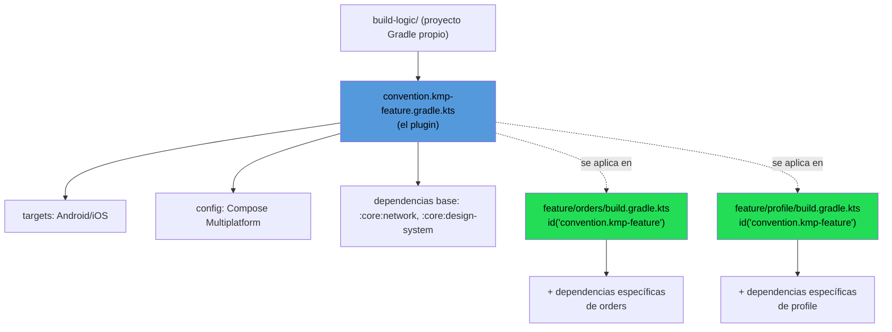

# Convention plugins

## 1. Mapa del flujo



## 2. Qué es y cómo funciona

Plugins Gradle custom (típicamente ubicados en un módulo `build-logic` o `buildSrc`) que centralizan configuración repetida entre módulos: sourceSets, targets (Android/iOS/Desktop), versiones de Compose, dependencias comunes. En vez de que cada `build.gradle.kts` de cada feature reescriba la misma configuración de targets, aplica un solo plugin propio (`id("convention.kmp-feature")`) que ya trae todo eso resuelto.

**El problema que resuelve:** modularizar (ver archivo anterior) trae un costo colateral. Cada módulo nuevo necesita su propio `build.gradle.kts` con targets (`androidTarget()`, `iosX64()`, `iosArm64()`, `iosSimulatorArm64()`), configuración de Compose, y dependencias base. En un proyecto con 3-4 módulos, copiar y pegar esa configuración en cada uno es molesto pero tolerable. En un proyecto con 15-20 módulos, se vuelve un problema real:

- **Duplicación masiva.** El mismo bloque de configuración de targets repetido en cada `build.gradle.kts` — si hay que agregar un target nuevo (por ejemplo, sumar soporte Wasm), hay que tocar todos los módulos uno por uno.
- **Inconsistencia silenciosa.** Alguien crea un módulo nuevo copiando el `build.gradle.kts` de otro módulo más viejo, y arrastra configuración desactualizada sin darse cuenta — no hay una única fuente de verdad de "así se configura un módulo feature en este proyecto".
- **Fricción para crear módulos nuevos.** Si crear un módulo implica escribir varias líneas de Gradle a mano, eso desalienta la modularización fina — la gente termina metiendo cosas de más en un módulo existente en vez de crear uno nuevo, justo lo contrario de lo que se buscaba en el archivo anterior.

## 3. Cómo se ve en distintos contextos

**App bancaria con 15-20 módulos:** acá los convention plugins dejan de ser un "nice to have" y se vuelven casi imprescindibles. Si mañana hay que actualizar la versión de Compose Multiplatform o sumar un target nuevo, la alternativa sin plugin es tocar 15-20 archivos `build.gradle.kts` a mano, con el riesgo real de que alguno quede desactualizado. Con el plugin, se cambia en un solo lugar (`build-logic`) y todos los módulos que lo aplican quedan alineados automáticamente. Además, con varios equipos creando módulos en paralelo, el plugin fuerza una configuración consistente en vez de que cada dev configure su módulo "a su manera".

**Proyecto con 2-3 módulos:** acá el costo de mantener un `build-logic` propio —que es, en sí mismo, otro proyecto Gradle con su propia curva de setup— no se paga con tan poca duplicación. Copiar y pegar la configuración de targets en 2-3 archivos es tolerable, y crear un plugin custom para tan pocos módulos es indirección sin beneficio real todavía.

## 4. Implementación real

**Contexto:** el proyecto ya tiene `:feature:orders` y `:feature:profile` (del archivo anterior), y el PO pide sumar una tercera feature. El equipo nota que está copiando la misma configuración de targets y dependencias base en cada `build.gradle.kts` nuevo, y pide centralizarla.

```kotlin
// build-logic/build.gradle.kts — declara que build-logic es, en sí,
// un proyecto Gradle que compila plugins (no una app)
plugins {
    `kotlin-dsl`
}
```

```kotlin
// build-logic/src/main/kotlin/convention.kmp-feature.gradle.kts
// este archivo ES el plugin — su nombre de archivo define el id del plugin
plugins {
    id("org.jetbrains.kotlin.multiplatform")
    id("org.jetbrains.compose")
}

kotlin {
    androidTarget()
    iosX64()
    iosArm64()
    iosSimulatorArm64()

    sourceSets {
        commonMain.dependencies {
            implementation(project(":core:network"))
            implementation(project(":core:design-system"))
        }
    }
}
```

```kotlin
// feature/orders/build.gradle.kts — así de simple queda cada módulo
// toda la configuración de targets/Compose/dependencias base ya viene del plugin
plugins {
    id("convention.kmp-feature")
}

kotlin {
    sourceSets {
        commonMain.dependencies {
            // acá solo van las dependencias ESPECÍFICAS de esta feature
            implementation(project(":core:database"))
        }
    }
}
```

```kotlin
// feature/profile/build.gradle.kts — misma base, sin repetir targets/Compose
plugins {
    id("convention.kmp-feature")
}

kotlin {
    sourceSets {
        commonMain.dependencies {
            implementation(project(":core:database"))
        }
    }
}
```

**Resultado:** ambos módulos comparten la misma configuración de targets y Compose sin que nadie la haya copiado a mano. Si mañana se agrega un target nuevo, se cambia una sola vez en `convention.kmp-feature.gradle.kts`.

## 5. Buenas prácticas y errores comunes

Checklist para auditar convention plugins escritos por una IA:

- **¿Hay dependencias específicas de una sola feature metidas en el plugin compartido?** Si el plugin `convention.kmp-feature` incluye una librería que solo usa una feature (por ejemplo, un SDK de escaneo de tarjetas), está mal — eso infla el build de todas las features que aplican el plugin, aunque no la necesiten. Esa dependencia puntual va en el `build.gradle.kts` propio del módulo, después de aplicar el plugin base.
- **¿Se creó un `build-logic` para 2-3 módulos?** Si el proyecto tiene poca superficie, un convention plugin agrega indirección (alguien nuevo tiene que entender que `id("convention.kmp-feature")` no es un plugin de JetBrains sino uno propio) sin que la duplicación evitada lo justifique. Verificar que haya 4-5+ módulos con configuración repetida antes de introducir esta capa.
- **¿El plugin mezcla varias responsabilidades en un solo archivo?** Si `convention.kmp-feature` termina configurando cosas muy distintas (targets, Compose, y además reglas de testing, y además detekt), puede valer la pena separarlo en plugins más chicos y específicos en vez de uno monolítico que todos aplican aunque no necesiten todo.
- **¿La configuración del plugin sigue siendo visible o quedó "escondida"?** Si alguien audita `feature/orders/build.gradle.kts` y no entiende de dónde salen los targets configurados, falta documentación mínima en el plugin o un comentario que indique dónde mirar (`build-logic/`).
- **¿Hay inconsistencia entre módulos que deberían usar el mismo plugin?** Si dos features nuevas terminaron con configuración de targets ligeramente distinta a mano en vez de aplicar el plugin existente, es una señal de que el plugin no se está usando consistentemente — auditar que todo módulo nuevo lo aplique en vez de copiar `build.gradle.kts` de otro.