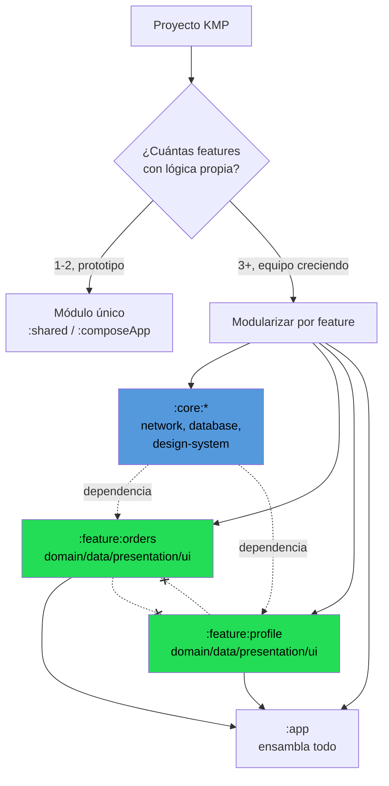

# Modularización por feature

## 1. Mapa del flujo



*(la línea punteada con "x" entre `:feature:orders` y `:feature:profile` representa la barrera: el compilador impide que una feature dependa directamente de otra)*

## 2. Qué es y cómo funciona

Dividir el código de un proyecto KMP en módulos Gradle independientes en vez de tener todo (o casi todo) en un único módulo `:shared` o `:composeApp`. Se separa típicamente en tres tipos de módulo:

- **`:core:*`** — código transversal (network, database, design-system) que consumen varias features.
- **`:feature:*`** — una feature completa, con sus propias sub-capas domain/data/presentation/ui.
- **`:app`** — el módulo final que ensambla todo y es el entrypoint real.

**El problema que resuelve:** en un proyecto chico, tener todo en `:shared` funciona bien. A medida que el proyecto crece aparecen dos problemas concretos:

- **Build times.** Gradle recompila el módulo completo ante cualquier cambio, aunque sea en una sola pantalla. En un módulo gigante, eso significa esperar minutos por un cambio de una línea.
- **Sin barrera real entre features.** Nada impide que el código de una feature importe directamente una clase `internal` de otra porque, al vivir en el mismo módulo, técnicamente pueden verse entre sí. La separación es solo de carpetas, no del compilador.

Con módulos separados, Gradle solo recompila lo que cambió (y lo que depende de eso), y el compilador impide literalmente que una feature acceda a los internals de otra — es una barrera forzada, no una convención que alguien puede romper sin darse cuenta.

**Regla dura:** ninguna feature puede depender de otra feature directamente. Lo compartido vive en `:core` (o en un módulo intermedio tipo `:feature:orders-api` si el dato es muy específico de esa feature).

## 3. Cómo se ve en distintos contextos

**App bancaria:** acá la modularización deja de ser una decisión estética y se vuelve casi obligatoria. Con features como transferencias, tarjetas, préstamos e inversiones, es común que equipos distintos —a veces con ciclos de release desacoplados— trabajen en paralelo sobre features distintas. Sin límites de módulo forzados por el compilador, dos equipos grandes tocando el mismo módulo gigante es garantía de conflictos de merge constantes. Además hay un beneficio de compliance: un bug en el módulo de soporte/chat no debería poder tocar, ni por accidente de import, el módulo de transferencias — la barrera de módulo permite que un audit de seguridad razone "qué módulos tocan dinero" de forma explícita, en vez de revisar un monolito completo. El token de sesión (login, refresh) es el ejemplo típico de algo que sí pertenece a `:core` — todas las features lo necesitan por igual, no tiene sentido que cada una reimplemente su propio manejo de sesión.

**App de fitness con 2-3 pantallas:** acá modularizar sería sobre-ingeniería. Un único módulo compartido compila en segundos, hay un solo dev tocando el proyecto, y cada módulo nuevo agregaría overhead de configuración (su propio `build.gradle.kts`, sourceSets, targets) que no se paga sola con tan poca superficie. El punto de quiebre típico no es un número mágico de pantallas, sino cuándo el build empieza a doler en el día a día o cuándo aparece una segunda persona tocando el proyecto en paralelo.

## 4. Implementación real

**Contexto:** el PO pide separar la feature de pedidos (`Order`, `OrderItem`, `OrdersViewModel`, ya definidos en `02_domain`) en su propio módulo Gradle, porque el equipo va a sumar una segunda persona que va a trabajar en la feature de perfil de usuario en paralelo, y los cambios en pedidos no deberían obligar a recompilar todo el proyecto.

```kotlin
// settings.gradle.kts — cada módulo se declara como proyecto Gradle independiente
include(":core:network")
include(":core:database")
include(":core:design-system")
include(":feature:orders")
include(":feature:profile")
include(":app")
```

```kotlin
// feature/orders/build.gradle.kts
plugins {
    id("org.jetbrains.kotlin.multiplatform")
    id("org.jetbrains.compose")
}

kotlin {
    androidTarget()
    iosX64(); iosArm64(); iosSimulatorArm64()

    sourceSets {
        commonMain.dependencies {
            // depende de :core, nunca de otro :feature directamente
            implementation(project(":core:network"))
            implementation(project(":core:database"))
            implementation(project(":core:design-system"))
        }
    }
}
```

```kotlin
// feature/orders/src/commonMain/kotlin/.../domain/model/Order.kt
// vive dentro del módulo :feature:orders — nadie fuera del módulo
// puede tocar sus internals si se marcan explícitamente
internal class OrderRepositoryImpl(
    private val remote: OrderRemoteDataSource,
    private val local: OrderLocalDataSource
) : OrderRepository
// :feature:profile NO puede importar esto ni por accidente —
// el compilador lo bloquea, no depende de que nadie lo intente
```

```kotlin
// feature/orders/src/commonMain/kotlin/.../presentation/OrdersViewModel.kt
// la clase pública que sí se expone (si otra capa necesita orquestar)
class OrdersViewModel(
    private val getOrdersUseCase: GetOrdersUseCase
) {
    // implementación completa cubierta en 06_presentation
}
```

**Resultado:** el equipo de perfil puede modificar `:feature:profile` sin que Gradle recompile `:feature:orders`, y el compilador garantiza que ninguna de las dos features importe internals de la otra — sin depender de que nadie rompa esa convención por error.

## 5. Buenas prácticas y errores comunes

Checklist para auditar una modularización hecha por una IA:

- **¿Hay dependencias cruzadas entre `:feature:*` hermanos?** Si `:feature:profile` importa algo de `:feature:orders` directamente (aunque sea un modelo simple), está mal — eso reintroduce el acoplamiento que la modularización busca evitar. Lo compartido va a `:core` o a un módulo `-api` intermedio.
- **¿Se modularizó sin necesidad real?** Si el proyecto tiene 1-2 features chicas y un solo dev, la IA pudo haber sobre-modularizado por "buenas prácticas" genéricas. Verificar que haya al menos 3 features con lógica sustancial, o build times que ya duelen, o más de una persona tocando el proyecto.
- **¿Las clases internas quedaron realmente `internal`?** Si una implementación de repositorio o data source quedó `public` sin necesidad, cualquier otro módulo puede importarla — auditar que solo lo que debe exponerse (interfaces, casos de uso) sea público.
- **¿`:core` se convirtió en un cajón de sastre?** Si algo específico de una sola feature terminó en `:core` "por las dudas", revisar si realmente lo necesitan 2+ features o si debería volver a vivir dentro del módulo feature que lo usa.
- **¿El módulo nuevo declara solo las dependencias que necesita?** Si `:feature:orders` terminó dependiendo de `:core:design-system` sin usarlo, o de otro `:core:*` innecesario, es ruido que infla el build sin motivo.