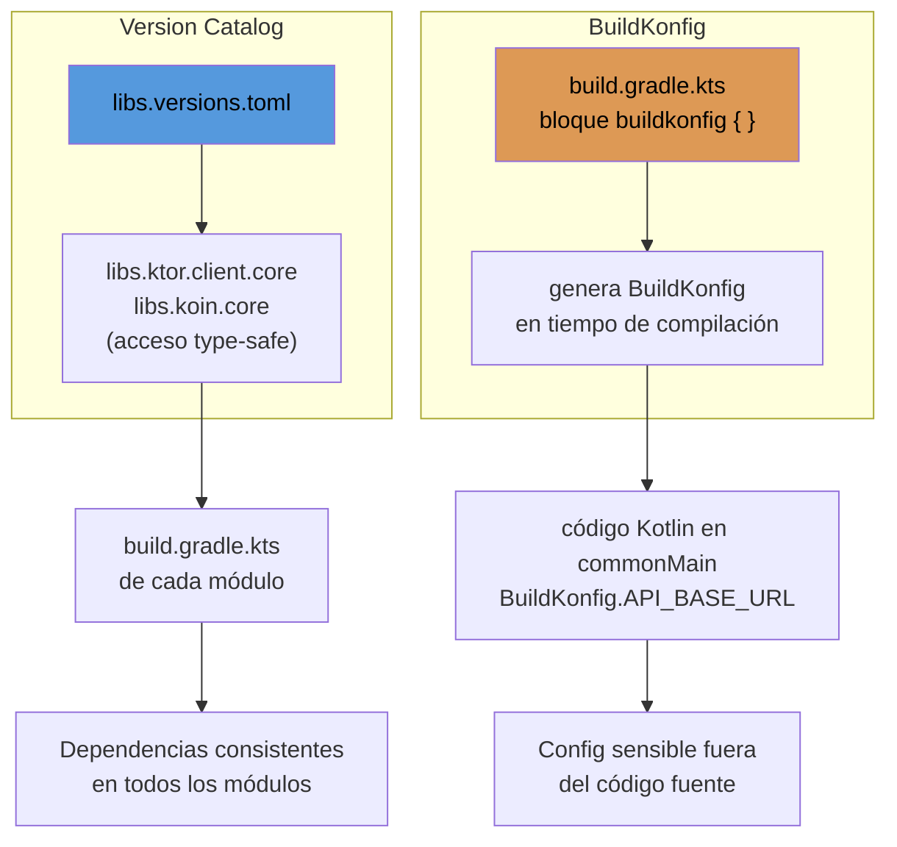

# Version catalog & BuildKonfig

## 1. Mapa del flujo



## 2. Qué es y cómo funciona

Dos mecanismos distintos de configuración Gradle que suelen confundirse porque ambos "centralizan valores", pero resuelven problemas diferentes:

- **Version catalog (`libs.versions.toml`):** un archivo TOML que centraliza en un solo lugar las versiones y coordenadas de todas las dependencias del proyecto (librerías, plugins), generando accesos type-safe (`libs.ktor.client.core`) usables desde cualquier `build.gradle.kts`.
- **BuildKonfig:** un plugin de Gradle que genera código Kotlin en tiempo de compilación a partir de variables de entorno o valores definidos en el build script — pensado específicamente para manejar API keys, Base URLs, y flags que no deberían estar hardcodeados ni commiteados al repo.

**El problema que resuelve cada uno:**

Sin version catalog: cada `build.gradle.kts` de cada módulo declara sus dependencias con la versión escrita a mano. En un proyecto con varios módulos, la misma librería termina con versiones ligeramente distintas entre módulos porque alguien actualizó en un lugar y se olvidó en otro — un problema real de consistencia que además complica actualizar (hay que buscar y reemplazar la versión en N archivos).

Sin BuildKonfig (o algo equivalente): las API keys y Base URLs terminan hardcodeadas directo en el código Kotlin (`const val API_KEY = "sk-abc123"`), lo que significa que quedan commiteadas al repo — visibles para cualquiera con acceso al historial de Git, incluyendo si el repo alguna vez se hace público o se comparte. Además, no hay forma limpia de tener una key distinta para debug vs release, o para desarrollo local vs CI.

## 3. Cómo se ve en distintos contextos

**Proyecto con un único módulo, sin secretos propios:** el version catalog aplica igual, sin excepción real — es la forma recomendada por Google/JetBrains incluso en proyectos de un solo módulo, y previene inconsistencias de versión desde el día uno. BuildKonfig, en cambio, no tiene mucho sentido todavía si toda la configuración sensible (por ejemplo, la de Firebase) ya pasa por sus propios archivos de configuración estándar, que tienen su propio mecanismo de protección.

**App con backend propio y múltiples ambientes:** acá BuildKonfig entra en juego con fuerza. Si el proyecto necesita diferenciar una Base URL de desarrollo de una de producción (por ejemplo, un backend propio de sincronización de pedidos), BuildKonfig es la herramienta correcta apenas aparece una URL o key propia del proyecto que deba variar por ambiente — sin eso, la alternativa es hardcodear la URL o manejarla con lógica condicional dispersa en el código.

## 4. Implementación real

**Contexto:** el PO pide que el cliente HTTP compartido use una Base URL configurable por ambiente (dev/prod) en vez de tenerla hardcodeada, y de paso pide ordenar las versiones de las dependencias que ya se están usando en el proyecto (Ktor, Koin) para que dejen de estar escritas a mano en cada módulo.

```toml
# gradle/libs.versions.toml
[versions]
ktor = "3.1.2"
koin = "4.0.2"
kotlin = "2.4.0"

[libraries]
ktor-client-core = { module = "io.ktor:ktor-client-core", version.ref = "ktor" }
ktor-client-okhttp = { module = "io.ktor:ktor-client-okhttp", version.ref = "ktor" }
koin-core = { module = "io.insert-koin:koin-core", version.ref = "koin" }

[plugins]
kotlin-multiplatform = { id = "org.jetbrains.kotlin.multiplatform", version.ref = "kotlin" }
```

```kotlin
// feature/orders/build.gradle.kts — acceso type-safe generado automáticamente
plugins {
    alias(libs.plugins.kotlin.multiplatform)
}

kotlin {
    sourceSets {
        commonMain.dependencies {
            implementation(libs.ktor.client.core)
            implementation(libs.koin.core)
        }
    }
}
// si mañana hay que actualizar Ktor, se cambia UNA vez en el .toml
// y todos los módulos que usan libs.ktor.client.core quedan actualizados
```

```kotlin
// build.gradle.kts (módulo shared) — configuración de BuildKonfig
buildkonfig {
    packageName = "com.example.app.shared"

    defaultConfigs {
        buildConfigField(
            FieldSpec.Type.STRING,
            "API_BASE_URL",
            System.getenv("API_BASE_URL") ?: "https://api-dev.example.com"
        )
    }
}
```

```kotlin
// código Kotlin compartido, consumiendo el valor generado
// BuildKonfig genera una clase BuildKonfig con el campo ya tipado
val client = HttpClient {
    defaultRequest {
        url(BuildKonfig.API_BASE_URL)
    }
}
```

**Resultado:** las versiones de Ktor y Koin quedan centralizadas en un único lugar, y la Base URL del cliente HTTP ya no está hardcodeada — se resuelve en tiempo de compilación según el ambiente activo.

## 5. Buenas prácticas y errores comunes

Checklist para auditar version catalog y BuildKonfig escritos por una IA:

- **¿Cada módulo declara versiones a mano en vez de usar `libs.*`?** Si aparece `implementation("io.ktor:ktor-client-core:3.1.2")` escrito directo en un `build.gradle.kts` en vez de `implementation(libs.ktor.client.core)`, se perdió el punto del version catalog — auditar que ningún módulo tenga versiones hardcodeadas por fuera del `.toml`.
- **¿Se metió una constante de negocio no sensible en BuildKonfig?** Si algo como `MAX_ITEMS_PER_ORDER = 20` (un valor de negocio, no un secreto, igual en todos los ambientes) terminó en el bloque `buildkonfig { }`, es sobre-ingeniería — eso va como `const val` directo en Kotlin, sin pasar por Gradle.
- **¿Se asumió que `System.getenv()` en BuildKonfig ya resuelve la seguridad del secreto?** No commitear la key al repo es real y valioso, pero BuildKonfig igual genera una clase Kotlin con el valor embebido como constante en el binario compilado — cualquiera con el APK/IPA final puede decompilarlo y extraer esa key igual, sea de debug o de release. Para secretos verdaderamente sensibles (no solo una key pública de un SDK de terceros), la protección real pasa por no embeber la key en el cliente en absoluto y hacer esas llamadas a través de un backend propio que las intermedia.
- **¿El nombre de campo en `buildConfigField` coincide exactamente con el que se consume en Kotlin?** Un typo entre el nombre declarado en `buildkonfig { }` y el que se referencia como `BuildKonfig.X` no siempre es obvio en el error de compilación — vale la pena revisar el archivo generado (`generateBuildKonfig`) después de cualquier cambio, en vez de asumir que compiló bien porque no tiró error.
- **¿Hay un `defaultConfigs` sin fallback razonable?** Si `System.getenv("API_BASE_URL")` no tiene un valor por defecto (`?: "https://..."`), un build local sin esa variable de entorno seteada puede fallar de forma poco clara, o peor, generar un valor nulo que rompe en runtime en vez de en compile-time.