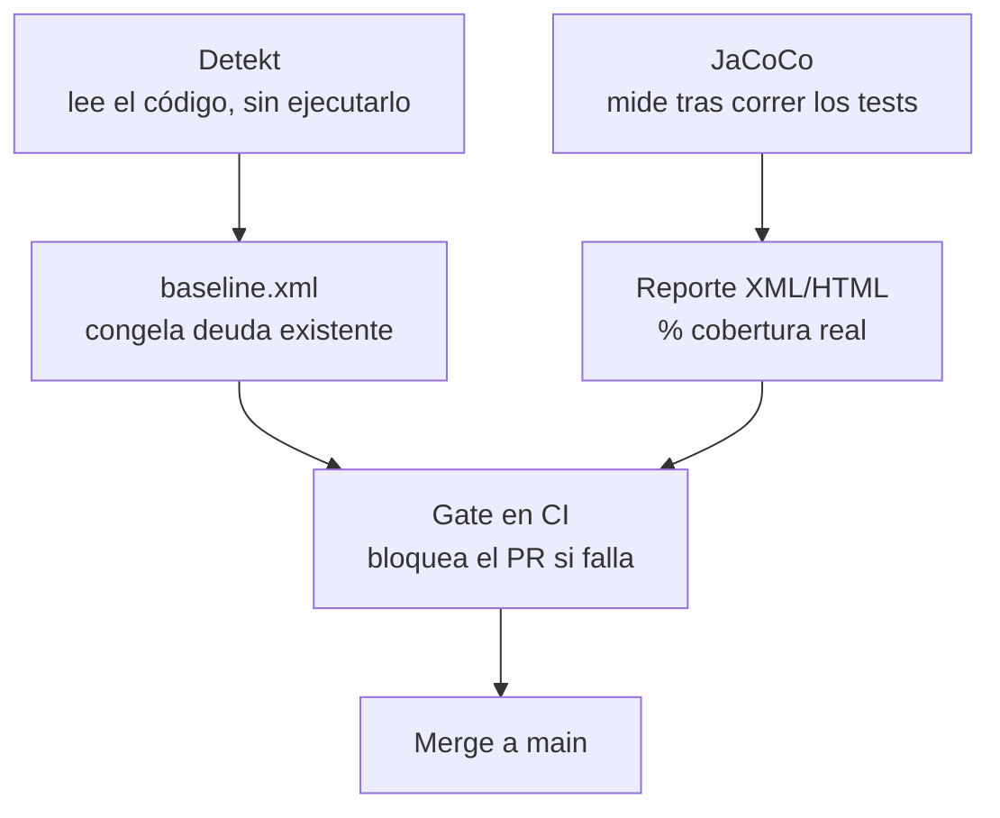

# Detekt + JaCoCo (Análisis Estático y Coverage)

## 1. Mapa del flujo



## 2. Qué es y cómo funciona

Detekt y JaCoCo automatizan dos preguntas distintas sobre la calidad del código, ninguna de las cuales depende de la otra:

- **Detekt**: analizador estático para Kotlin. Lee el código fuente (sin ejecutarlo) y reporta *code smells* — funciones demasiado largas, complejidad ciclomática alta, nombres poco claros, imports sin usar — según un set de reglas configurables (`detekt.yml`). Puede además envolver `ktlint` (vía el módulo `detekt-formatting`) para chequear estilo/formato en la misma pasada.
- **JaCoCo**: herramienta de *code coverage*. A diferencia de Detekt, sí necesita que los tests corran — instrumenta el bytecode para registrar qué líneas/branches se ejecutaron durante la suite, y produce un reporte con el porcentaje real de código cubierto.

Como muestra el diagrama, Detekt pregunta "¿este código está bien escrito?" sin correrlo jamás. JaCoCo pregunta "¿mis tests realmente tocan este código?" y solo puede responder después de ejecutarlos. Ambos alimentan el mismo gate en CI antes de un merge.

Sin Detekt, los *code smells* se atrapan únicamente en code review humano — algo inconsistente, que depende de quién revisa ese día. Sin JaCoCo, "tenemos tests" es una afirmación sin evidencia objetiva: no hay forma de distinguir entre una suite que ejerce el 80% de la lógica de negocio y una con 3 tests que siempre pasan por el mismo camino feliz. Ambas herramientas automatizan un gate de calidad que de otra forma dependería enteramente del criterio (y el tiempo disponible) de quien revisa el Pull Request.

## 3. Cómo se ve en distintos contextos

En una **app de fitness**, una regla de Detekt de complejidad ciclomática alta señalaría si el cálculo de plan de entrenamiento personalizado (con ajustes por objetivo, nivel, y restricciones físicas) creciera hasta un punto donde un solo `UseCase` se vuelve difícil de leer — una señal objetiva de que esa lógica merece descomponerse.

En una **app de e-commerce**, JaCoCo aplica con matiz distinto en el módulo de checkout: el domain (cálculo de totales, aplicación de descuentos) es donde el equipo prioriza testear primero, así que ahí el número de cobertura es confiable y accionable. En el módulo de UI del checkout, en cambio, un número bajo de cobertura no necesariamente representa un problema — es la capa donde, según `estrategia_y_prioridades.md`, casi no se invierte en tests automatizados.

## 4. Implementación real

**El PO pide:** "quiero que el equipo no pueda mergear código con complejidad excesiva sin darse cuenta, y necesito un número confiable de cuánto domain está realmente cubierto por tests."

```kotlin
// build.gradle.kts — Detekt
plugins {
    id("io.gitlab.arturbosch.detekt") version "1.23.6"
}

detekt {
    buildUponDefaultConfig = true // arranca con las reglas default de Detekt como base
    config.setFrom("$projectDir/config/detekt.yml") // reglas propias del proyecto, por encima del default
    baseline = file("$projectDir/config/baseline.xml") // suprime deuda YA existente, no deuda nueva
}
```

```kotlin
// build.gradle.kts — JaCoCo, sobre un módulo Android con Kotlin
apply(plugin = "jacoco")

tasks.register<JacocoReport>("jacocoTestReport") {
    dependsOn("testDebugUnitTest") // corre primero los tests, JaCoCo mide sobre esa ejecución
    reports {
        xml.required.set(true)  // formato que consumen herramientas de CI
        html.required.set(true) // formato navegable para revisar a mano
    }
}
```

`baseline.xml` es la pieza clave para adoptar Detekt en un proyecto que ya tiene código: en vez de forzar arreglar cientos de *findings* existentes de una sola vez, el baseline los "congela" como conocidos, y Detekt solo falla el build ante *código nuevo* que viole las reglas. En este proyecto, ese gate aplica directo sobre el domain (`RefreshOrdersUseCase`, mappers de `03_data`): si mañana ese `UseCase` crece con más ramas de manejo de error, Detekt marca la complejidad antes de que llegue a code review humano — y JaCoCo confirma, con el reporte HTML, si los tests nuevos realmente ejercitaron esas ramas o solo el camino feliz de siempre.

## 5. Buenas prácticas y errores comunes — checklist de auditoría de código de IA

Si una IA configuró o modificó la integración de Detekt/JaCoCo, revisar:

- **¿Detekt corre solo en el IDE/pre-commit, sin ser bloqueante en CI?** El pre-commit es una ayuda, no un gate — es fácil saltearse un hook local. La garantía real de que nada con violaciones nuevas llega a `main` es el paso bloqueante en el pipeline de CI.
- **¿Se está usando `baseline.xml` como excusa permanente en vez de una lista a reducir con el tiempo?** El baseline es pragmático para adoptar la herramienta sin bloquear al equipo, pero si nadie lo revisita, se convierte en una alfombra debajo de la cual esconder deuda indefinidamente.
- **¿Un gate de cobertura mínima (`no bajar de X%`) se introdujo en un proyecto que recién está adoptando cultura de testing?** Un gate estricto desde el día uno incentiva tests superficiales que solo "tocan la línea" para subir el número, sin verificar nada real — la cobertura debería ser informativa primero, gate obligatorio después, cuando ya hay disciplina establecida.
- **¿El porcentaje de cobertura reportado por JaCoCo sobre funciones `inline` se está tomando como verdad absoluta sin correlacionarlo con los tests que realmente existen?** Ver Sección 6 — es la trampa más específica de esta herramienta y la más fácil de malinterpretar en una auditoría rápida.
- **¿Se agregó `detekt-formatting` duplicando una responsabilidad que ya cubre otra herramienta de formato del proyecto (el formatter nativo de Android Studio, un `ktlint` corriendo independiente)?** Mantener dos herramientas para el mismo aspecto es mantenimiento redundante sin beneficio real.

## 6. Profundización: JaCoCo y funciones inline

El caso trampa de la Sección 5 merece el mecanismo completo, porque "0% de cobertura" en un caso así es fácil de leer como "no está testeado" cuando en realidad es una limitación de medición.

**Qué hace el compilador con `inline`:**

```kotlin
// commonMain — una función inline, como cualquier scope function de Kotlin
inline fun <T> T.applyIfValid(condition: Boolean, block: T.() -> Unit): T {
    if (condition) block()
    return this
}
```

Cuando el compilador de Kotlin encuentra una llamada a una función `inline`, no genera una llamada real a esa función en el bytecode — copia el cuerpo de la función directamente en el lugar donde se la invoca (el *call site*). Si `applyIfValid` se llama en 5 lugares distintos del código, el bytecode final tiene 5 copias del cuerpo de esa función, cada una fundida dentro del método que la llamó — no una función separada que JaCoCo pueda instrumentar como una unidad independiente.

**Por qué esto rompe la medición de JaCoCo:** JaCoCo instrumenta el bytecode para saber qué líneas se ejecutaron, asociando cada bloque de bytecode instrumentado con una línea del código fuente original. Cuando el compilador inlinea una función, el bytecode resultante ya no tiene una correspondencia limpia de "esta línea de bytecode pertenece a esta línea del archivo `.kt` de la función" — quedó mezclado con el bytecode del call site. Durante años, esto llevó a que JaCoCo reportara funciones `inline` como 0% cubiertas incluso cuando el test las ejecutaba de verdad:

```kotlin
// test que SÍ ejercita la función, pero JaCoCo históricamente podía reportarla en 0%
@Test
fun `applyIfValid ejecuta el block cuando condition es true`() {
    val result = Order(id = "1", items = emptyList(), total = 0.0)
        .applyIfValid(condition = true) { /* ... */ }
    // el test pasa, la función se ejecutó de verdad
}
```

**Estado actual:** versiones recientes de JaCoCo (0.8.13, 2025) mejoraron esto explícitamente — agregando cálculo de cobertura para funciones `inline`, incluidas las que tienen parámetros `reified`, y filtrando bytecode generado por el compiler plugin de Compose para no ensuciar el número. Pero a la fecha siguen reportándose casos puntuales donde el número sale inflado o directamente en cero según dónde vive el call site.

**La verificación correcta:** no confiar en el número aislado — correlacionarlo con la lista real de tests que existen para esa función antes de decidir que falta cobertura. Las scope functions (`let`/`apply`/`run`/`also`, ver `scope_functions.md`) son inline por definición, y Compose usa `inline` extensivamente en su propio DSL — así que este caso aparece más seguido de lo que parece a primera vista.