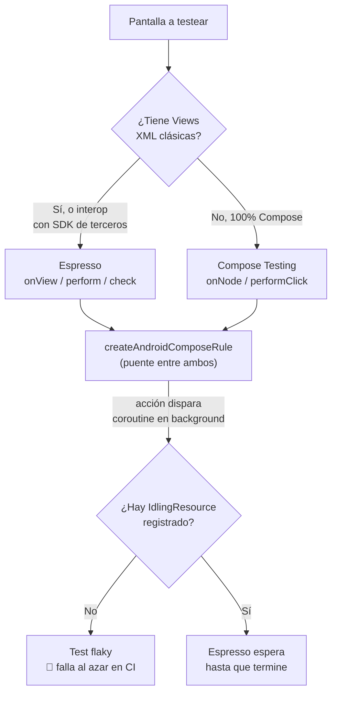

# Espresso (UI Testing Instrumentado)

## 1. Mapa del flujo



## 2. Qué es y cómo funciona

Espresso es el framework oficial de Google para tests de UI **instrumentados** — tests que corren dentro de un dispositivo o emulador Android real, interactuando con la jerarquía de `View` de verdad, no simulada. Su API se organiza en tres piezas que se combinan siempre en el mismo orden, como muestra el diagrama: `ViewMatcher` (encontrar la vista — `withId()`, `withText()`), `ViewAction` (hacer algo — `click()`, `typeText()`) y `ViewAssertion` (verificar el resultado — `matches(isDisplayed())`), todo orquestado por el punto de entrada `onView(...)`.

Nació para apps basadas en `View`/XML — con Compose, ese rol pasó en gran parte a la **Compose Testing Library** (`ComposeTestRule`), que opera sobre el árbol de semántica (ya documentado en `accesibilidad_a11y.md`) en vez de la jerarquía de `View`, con una filosofía casi idéntica (encontrar, actuar, verificar) pero una implementación completamente distinta y no intercambiable: Espresso no puede encontrar nodos de Compose, y Compose Testing no puede encontrar `View` clásicas.

Los tests unitarios de `UseCase`/`ViewModel` corren en la JVM, sin tocar un dispositivo real — verifican lógica, no que la UI efectivamente se vea o reaccione como se espera. Un test instrumentado resuelve esa capa faltante, pero introduce un problema propio: la **sincronización**. Sin ella, un test podría hacer una aserción sobre una vista antes de que una animación o llamada asincrónica termine, dando resultados intermitentes. Espresso espera automáticamente a que la cola de mensajes del hilo principal esté idle antes de ejecutar el siguiente paso — pero, como muestra la rama derecha del diagrama, esa sincronización automática tiene un límite concreto que se detalla en la Sección 5.

## 3. Cómo se ve en distintos contextos

En una **app de notas**, si la pantalla de edición es 100% Compose, el test de "escribir texto en el título y verificar que aparece en la lista" usa `ComposeTestRule` directo — no hace falta Espresso salvo que la app integre un editor de texto enriquecido de terceros que exponga una `View` nativa embebida en el árbol de Compose.

En una **app de reservas de restaurantes**, si el mapa de ubicación del restaurante usa un SDK de mapas que expone su propia `View` (no un composable nativo), el test de esa pantalla necesita combinar ambos: `composeTestRule.onNode` para los elementos Compose de la pantalla (botón de confirmar, selector de fecha) y `onView` de Espresso para interactuar con el mapa embebido — el escenario exacto que resuelve `createAndroidComposeRule`.

## 4. Implementación real

**El PO pide:** "en la pantalla de historial de pedidos, cuando el usuario toca 'Actualizar', tiene que verse el spinner de carga y después la lista actualizada — necesitamos un test instrumentado que cubra ese flujo completo, porque es la pantalla más usada de la app."

```kotlin
// Compose Testing — la pantalla de OrdersScreen es 100% Compose
@get:Rule
val composeTestRule = createAndroidComposeRule<MainActivity>()

@Test
fun tappingRefresh_showsLoadingThenUpdatedList() {
    composeTestRule.onNodeWithContentDescription("Actualizar").performClick()

    // el ViewModel dispara viewModelScope.launch { refreshOrders() } — ver caso trampa (Sección 5)
    composeTestRule.onNodeWithTag("orders_loading_indicator").assertIsDisplayed()

    composeTestRule.waitUntil(timeoutMillis = 5_000) {
        composeTestRule.onAllNodesWithTag("orders_loading_indicator").fetchSemanticsNodes().isEmpty()
    }

    composeTestRule.onNodeWithText("Pedido #nuevo").assertIsDisplayed()
}
```

Este test es exactamente el caso donde `estrategia_y_prioridades.md` recomienda moderación: es un flujo crítico de punta a punta (la pantalla más usada), así que justifica el costo de un test instrumentado — pero no reemplaza el test unitario de `RefreshOrdersUseCase` (JVM, milisegundos) ni el del `ViewModel` con Turbine, que siguen siendo la primera línea de defensa. `composeTestRule.waitUntil` acá cumple el mismo rol que un `IdlingResource` en Espresso puro: le da a Compose Testing una forma explícita de esperar el trabajo asincrónico antes de seguir.

## 5. Buenas prácticas y errores comunes — checklist de auditoría de código de IA

Si una IA generó un test instrumentado, revisar:

- **¿El test asume que Espresso (u `onView`) sincroniza automáticamente con una coroutine, un `Flow`, o una llamada de red disparada por el `ViewModel`?** Este es el caso trampa central: Espresso solo sincroniza con trabajo que pasa por la cola de mensajes del hilo principal de Android — no tiene visibilidad sobre coroutines ni streams de `Flow`. Un test así puede pasar la mayoría de las veces y fallar intermitentemente en CI, el síntoma clásico de un test flaky. La corrección es un `IdlingResource` (`CountingIdlingResource`) o, en Compose Testing, un `waitUntil` explícito como en el ejemplo — nunca asumir que "ya va a estar listo para cuando se ejecute la siguiente línea".
- **¿Se eligió Espresso para una pantalla 100% Compose sin ninguna `View` clásica de por medio?** Si no hay interop real con `View`, usar `ComposeTestRule` directo — es más rápido y menos propenso a flakiness porque su sincronización conoce el ciclo de recomposición.
- **¿Se usó `createAndroidComposeRule<Activity>()` cuando `createComposeRule()` alcanzaba?** `createAndroidComposeRule` levanta la `Activity` real de la app — es más pesado y solo se justifica cuando hace falta el contexto real (interop con `View`, DI real) o combinar Espresso con Compose Testing en el mismo test.
- **¿Este test instrumentado duplica cobertura que ya existe (o debería existir) como test unitario más rápido?** Si lo que se está verificando es lógica de estado (loading → data → error), eso ya lo cubre — más barato y más rápido — un test de `ViewModel` con Turbine. Reservar los tests instrumentados para flujos de punta a punta que realmente necesitan verificarse contra el framework real.
- **¿El test tiene un timeout razonable en su espera (`waitUntil`, `IdlingResource`), o puede quedar colgado indefinidamente si algo no llega a completarse?** Un test sin timeout que espera un estado que nunca llega no falla rápido — cuelga el pipeline de CI hasta que algo externo lo mate.