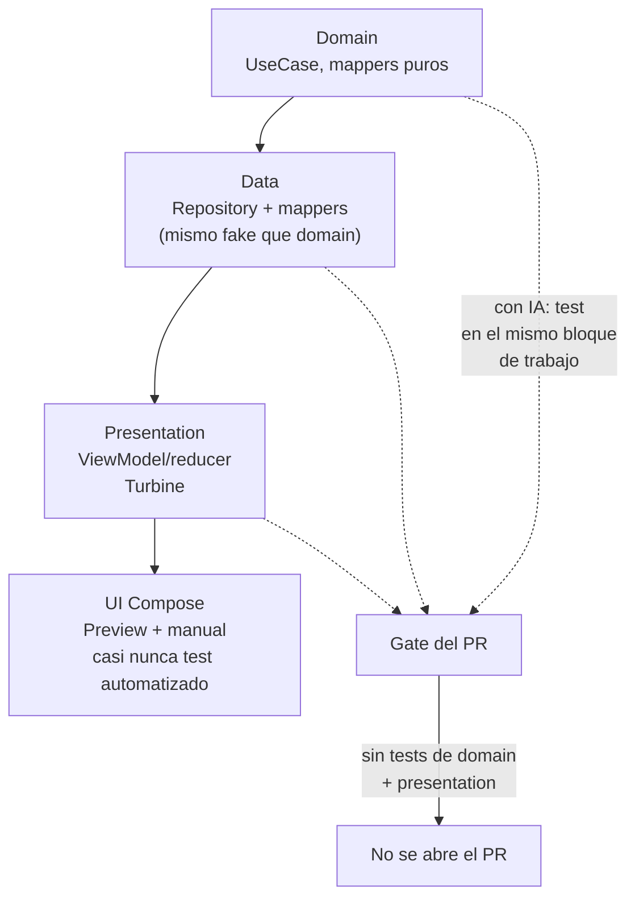

# Estrategia y prioridades de testing

## 1. Mapa del flujo



## 2. Qué es y cómo funciona

La estrategia de testing es la decisión de **qué se testea, en qué orden, y en qué momento del ciclo de desarrollo** — no es "escribir tests", es decidir dónde conviene invertir el tiempo limitado que tenés, porque nadie testea el 100% de una app real con el mismo nivel de detalle en todas las capas.

En KMP con Clean Architecture, la prioridad la sugiere la propia arquitectura: se testea más y primero donde vive la lógica pura (domain), y cada vez menos a medida que te acercás a UI/plataforma, como muestra el diagrama — ahí el costo de testear sube y el valor relativo baja (Compose Preview + testing manual cubren gran parte de lo visual).

**Orden real, capa por capa:**

1. **Domain primero, siempre** — se define el `Model` y la firma del `UseCase` antes que nada, porque es el contrato que todo lo demás va a consumir. Si la regla es simple (un mapeo, una validación de un campo), el test se escribe inmediatamente después del código, en el mismo bloque de trabajo. Si la regla es compleja o tiene casos borde no triviales, ahí sí conviene escribir 2-3 tests primero — te obliga a pensar la función antes de escribirla, y es más barato encontrar el bug en el test que en el `UseCase` ya integrado.
2. **Data (Repository + mappers)** — se testea después de tener el `UseCase` funcionando, normalmente con el mismo `FakeRepository` que ya se usó para testear el `UseCase` (doble uso). El mapper se testea aparte, rápido, porque es una función pura sin dependencias.
3. **Presentation (ViewModel/reducer)** — se testea al final de la capa de lógica, antes de tocar UI. El patrón real: se escribe primero el `Contract` completo (State/Event/Effect, sin tests — es solo definición de tipos), después el `ViewModel`, y ahí sí los tests son casi obligatorios, porque es donde más bugs de estado se filtran a producción.
4. **UI (Compose)** — normalmente no se testea con tests automatizados en el día a día, salvo en equipos grandes con QA dedicado. Se valida con Preview + testing manual.

**El gate real** de un equipo profesional no es "escribo el código y algún día testeo" — es **"no se abre Pull Request sin tests de domain y presentation"**. Nadie exige TDD estricto, pero sí se rechaza un PR con un `UseCase` no trivial sin al menos 2-3 tests cubriendo los casos principales y un caso borde.

**Con IA en el medio, el flujo cambia respecto a hace unos años:** se describe la feature completa a la IA (rol ARQUITECTO) → la IA genera `Model` + `UseCase` + `Repository` interface → **inmediatamente después de aceptar ese código, mismo bloque de trabajo**, se piden los tests de ese `UseCase` (rol TESTING + QA). No hay separación temporal real entre "código" y "test" cuando la IA genera ambos rápido: el costo de escribir el test bajó tanto que la excusa de "lo hago después" ya no aplica. La dupla código+test es la unidad mínima de trabajo terminado, no dos tareas separadas. Esto se repite por capa: domain (código+test) → data (código+test) → presentation (código+test) → recién ahí UI.

## 3. Cómo se ve en distintos contextos

En una **app de fitness**, el `UseCase` que calcula el volumen total de una rutina (series × repeticiones × peso, con ajustes por tipo de ejercicio) es candidato directo al patrón "2-3 tests antes de escribir la función" — tiene casos borde no obvios (repeticiones al fallo, series de calentamiento que no cuentan) que conviene pensar antes de codear. En cambio, el mapper que convierte un `WorkoutDto` a `Workout` es tan directo que el test se escribe inmediatamente después, sin pensarlo dos veces.

En una **app de e-commerce**, `ConfirmPaymentUseCase` (que combina `PaymentRepository` y `CartRepository`) es un caso donde vale la pena escribir el test del camino feliz y el de "el pago tuvo éxito pero vaciar el carrito falló" antes de terminar la implementación, porque ese caso borde es fácil de pasar por alto si se escribe el código primero y se testea "por completitud" al final.

## 4. Implementación real

**El PO pide:** "en el historial de pedidos, si el usuario refresca y no hay conexión, la lista vieja tiene que seguir viéndose — no queremos una pantalla en blanco por un error de red."

Se define `RefreshOrdersUseCase` (ya existe en domain, ver `02_domain/usecases.md`) y se escribe el test **en el mismo bloque de trabajo** en que se acepta el código del UseCase — no en una sesión de testing separada:

```kotlin
// domain/usecases/RefreshOrdersUseCase.kt — código ya aceptado
class RefreshOrdersUseCase(private val repository: OrderRepository) {
    suspend operator fun invoke(): Result<Unit> {
        return try {
            repository.refreshOrders()
            Result.Success(Unit)
        } catch (e: CancellationException) {
            throw e
        } catch (e: Exception) {
            Result.Error(e)
        }
    }
}
```

```kotlin
// domain/usecases/RefreshOrdersUseCaseTest.kt — se pide/escribe inmediatamente después
class RefreshOrdersUseCaseTest {

    private val fakeRepository = FakeOrderRepository()
    private val useCase = RefreshOrdersUseCase(fakeRepository)

    @Test
    fun `refresca correctamente cuando hay conexion`() = runTest {
        val result = useCase()

        assertTrue(result is Result.Success)
    }

    @Test
    fun `devuelve Result Error sin lanzar excepcion cuando no hay conexion`() = runTest {
        fakeRepository.shouldThrowOnRefresh = IOException("sin conexion")

        val result = useCase()

        // este es el caso borde que justifica el requisito del PO:
        // el error se captura como Result, nunca se propaga sin control
        assertTrue(result is Result.Error)
    }
}
```

El segundo test es el que verifica directamente el requisito del PO: si `refreshOrders()` lanza una excepción de red, el `UseCase` la traduce a `Result.Error` en vez de dejarla propagar — lo que en la capa de `ViewModel` (`06_presentation_mvi`) se traduce en mantener `state.orders` con los datos previos y solo actualizar `state.error` o disparar un `Effect` de aviso puntual, nunca vaciar la lista.

## 5. Buenas prácticas y errores comunes — checklist de auditoría de código de IA

Si una IA generó código y tests para una feature, revisar:

- **¿El test llegó en la misma entrega que el código, o el código quedó "para testear después"?** Si pediste un `UseCase` y la IA no ofreció el test en la misma respuesta o la inmediatamente siguiente, pedirlo ahí — no dejarlo pendiente. La trampa más común: "se ve simple, no hace falta testearlo ahora" es casi siempre falsa, porque un `UseCase` simple hoy acumula casos borde mañana sin que nadie vuelva a revisar si algo se rompió.
- **¿El test verifica el resultado, o solo confirma que "no explotó"?** Un test que solo hace `assertNotNull(result)` sin verificar el contenido específico (qué `Result.Success`/`Result.Error` exacto, qué valor) da falsa confianza — pasa aunque la lógica esté mal.
- **¿Hay al menos un test de caso borde, no solo el camino feliz?** Un `UseCase` con lógica no trivial (cálculos, validaciones, combinación de repositorios) con un solo test de "funciona bien" no cumple el gate real de un PR profesional.
- **¿Se testeó domain y presentation antes que UI, o la IA generó tests de Compose para algo que ni siquiera tiene lógica condicional?** Tests de UI automatizados en un composable puramente visual son esfuerzo mal invertido — revisar si esa cobertura tendría más valor en la capa de abajo.
- **¿El hecho de que la IA haya generado el código se está tomando como si eso ya lo "probara"?** Generar código y generar el test que lo verifica son dos pasos separados con la misma probabilidad de error — el test es la única verificación real, lo haya escrito una IA o no. Si no hay un test explícito y revisado, no hay evidencia de que el código funcione.