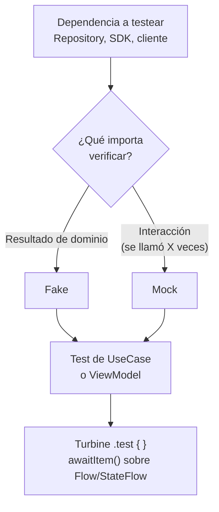

# Fakes vs Mocks + Turbine

## 1. Mapa del flujo



## 2. Qué es y cómo funciona

**Fake** y **Mock** son dos formas distintas de reemplazar una dependencia real (una API, una DB) por algo controlable en un test. No son lo mismo aunque en conversación casual se usen como sinónimos:

- **Fake**: una implementación real y funcional de la interfaz, pero simplificada — sin red, sin DB real. Tiene comportamiento propio (guarda datos en una `MutableList` en memoria, por ejemplo).
- **Mock**: un objeto "hueco" que no tiene comportamiento propio — vos le programás explícitamente qué devolver ante cada llamada, y además podés verificar que un método fue llamado N veces con ciertos argumentos.

Como muestra el diagrama, la pregunta que desambigua cuál usar no es "¿cuál es más fácil de armar?" sino **¿qué necesito verificar?** — un resultado de dominio (Fake) o una interacción puntual (Mock).

**Turbine** es una librería (de Cash App) diseñada específicamente para testear `Flow`, `StateFlow` y `SharedFlow` de forma legible, sin armar colectores manuales con `launch` + `toList()` + cancelación a mano. Testear un `Flow` a mano es incómodo y propenso a bugs de test — hay que lanzar una coroutine para colectar, guardar los valores en una lista, y acordarse de cancelar la colección al final o el test queda colgado (un `Flow` frío nunca termina solo). Turbine da una API (`.test { awaitItem() }`) que maneja todo eso: colecta, espera el próximo valor con timeout automático, y cancela al salir del bloque.

**Fake vs Mock resuelve:** cómo aislar la clase testeada (un `UseCase`, un `ViewModel`) de sus dependencias reales, sin que el test dependa de una API que puede caerse, tardar, o requerir internet — algo inviable en un test unitario que corre cientos de veces por día en CI.

## 3. Cómo se ve en distintos contextos

En una **app de fitness**, testear `ObserveActiveWorkoutUseCase` (reactivo, ver `02_domain/usecases.md`) usa un `FakeWorkoutRepository` con un `MutableStateFlow` interno — el fake simula que la rutina activa cambia con el tiempo, y el test verifica que el `UseCase` propaga esas emisiones tal cual. Un Mock ahí no serviría: no hay una "interacción" puntual que verificar, sino una secuencia de valores en el tiempo.

En una **app de e-commerce**, `ConfirmPaymentUseCase` es un buen candidato para un Mock puntual del `PaymentGatewayClient` — no porque sea difícil de fakear, sino porque el test necesita simular explícitamente una excepción específica del gateway (tarjeta rechazada) sin tener que programar esa lógica de fallo dentro de un Fake completo.

## 4. Implementación real

**El PO pide:** "en el historial de pedidos, necesitamos loguear un evento de analytics cada vez que el usuario refresca manualmente — y el test tiene que verificar que ese evento se dispara con el nombre correcto."

Dos cosas distintas a testear: el `Flow` de pedidos (Fake + Turbine) y el evento de analytics (Mock, porque lo que importa es la llamada, no un resultado de dominio).

```kotlin
// Fake: implementación real y simple de OrderRepository, vive en memoria
class FakeOrderRepository : OrderRepository {

    private val ordersFlow = MutableStateFlow<List<Order>>(emptyList())
    var shouldThrowOnRefresh: Exception? = null

    override fun getOrderHistory(): Flow<List<Order>> = ordersFlow

    override suspend fun refreshOrders() {
        shouldThrowOnRefresh?.let { throw it }
        ordersFlow.value = ordersFlow.value + Order(id = "nuevo", items = emptyList(), total = 0.0)
    }
}
```

```kotlin
// Turbine: testeando el Flow<List<Order>> que expone GetOrderHistoryUseCase
class GetOrderHistoryUseCaseTest {

    private val fakeRepository = FakeOrderRepository()
    private val useCase = GetOrderHistoryUseCase(fakeRepository)

    @Test
    fun `emite la lista actualizada despues de un refresh exitoso`() = runTest {
        useCase().test {
            assertEquals(emptyList<Order>(), awaitItem()) // estado inicial

            fakeRepository.refreshOrders()

            assertEquals(1, awaitItem().size) // nueva emisión tras el refresh

            cancelAndIgnoreRemainingEvents() // Turbine exige salir explícito del flow infinito
        }
    }
}
```

```kotlin
// Mock: no tiene comportamiento propio, se programa y se verifica la interacción
class OrdersViewModelAnalyticsTest {

    private val fakeRepository = FakeOrderRepository()
    private val mockAnalytics = mock<AnalyticsClient>()

    @Test
    fun `dispara el evento de analytics al refrescar manualmente`() = runTest {
        val viewModel = OrdersViewModel(
            getOrderHistory = GetOrderHistoryUseCase(fakeRepository),
            refreshOrders = RefreshOrdersUseCase(fakeRepository),
            analytics = mockAnalytics
        )

        viewModel.onEvent(OrdersEvent.OnRefresh)

        // acá lo que importa es la INTERACCIÓN, no un resultado de dominio
        verify(mockAnalytics).logEvent(eq("orders_refreshed_manually"))
    }
}
```

El primer test usa Fake + Turbine porque lo que importa es **qué termina en la lista**. El segundo usa Mock porque lo que importa es **que se llamó a `logEvent` con ese nombre exacto** — no hay ningún `State` resultante que verificar, solo la llamada en sí.

## 5. Buenas prácticas y errores comunes — checklist de auditoría de código de IA

Si una IA generó o modificó tests con Fake/Mock/Turbine, revisar:

- **¿Se mockeó un `Repository` que solo necesitaba devolver datos, sin ninguna lógica de fallo puntual a simular?** Es la trampa más común de sobre-uso de Mock: un `whenever(mockRepository.getOrders()).thenReturn(flowOf(...))` es exactamente lo que hace un `FakeRepository`, pero con más ceremonia y menos legibilidad. Si el `Repository` no necesita simular un caso de fallo específico, el Fake es siempre la opción más limpia.
- **¿El bloque `.test { }` de Turbine termina con `cancelAndIgnoreRemainingEvents()` o con exactamente la cantidad de `awaitItem()` esperados?** Si el `Flow` sigue emitiendo después del último `awaitItem()` y el bloque no se cierra explícitamente, Turbine tira un error de "eventos no consumidos" — no ignorar ese error asumiendo que es un detalle cosmético del framework.
- **¿Un test con Mock verifica la interacción correcta, o solo que "se llamó a algo"?** `verify(mock).logEvent(any())` sin especificar el argumento esperado deja pasar un bug donde el evento se dispara con el nombre equivocado — siempre verificar el argumento exacto cuando el nombre/valor importa.
- **¿Un `FakeRepository` compartido entre varios tests arrastra estado de un test al siguiente?** Si el fake no se reinstancia en cada test (por ejemplo, vive como propiedad de clase sin resetear en un `@BeforeTest`), un test puede pasar o fallar según el orden de ejecución — el fake debe nacer limpio en cada test.
- **¿Se está mockeando una dependencia que en realidad es fácil y barata de fakear, solo porque "mock" es el reflejo automático al escribir un test?** Revisar si el Mock realmente aporta algo (verificar una llamada) o si es indirección innecesaria sobre algo que un Fake resolvería más simple.