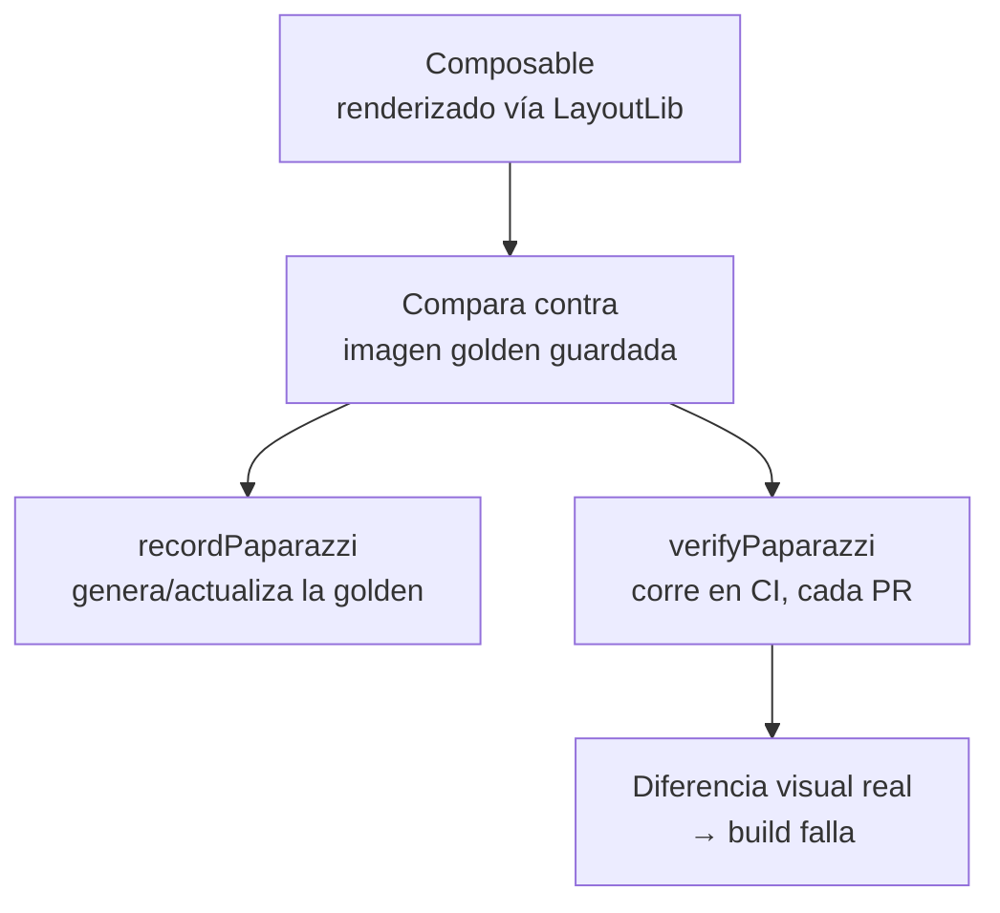

# Paparazzi (Screenshot Testing)

## 1. Mapa del flujo



## 2. Qué es y cómo funciona

Paparazzi es una librería de Cash App para **screenshot testing** (también llamado snapshot testing): renderiza un composable (o una `View` clásica) en la JVM — sin emulador ni dispositivo físico — usando `LayoutLib`, la misma librería privada que usa Android Studio para renderizar los Compose Previews. El resultado se guarda como una imagen "golden" (la referencia correcta), y en cada corrida posterior Paparazzi vuelve a renderizar el mismo composable y lo compara píxel a píxel contra esa imagen, como muestra el diagrama — si hay una diferencia visual real, el test falla.

Es la capa de testing que responde una pregunta distinta a todo lo demás en `12_testing`: no "¿la lógica es correcta?" (`fakes_vs_mocks_turbine.md`) ni "¿la interacción funciona?" (`espresso_testing_ui.md`), sino **"¿se sigue viendo igual?"**.

Una regresión visual (un padding que cambió, un color que no se aplicó, un texto que ahora se corta) casi nunca rompe un test de lógica — el `ViewModel` puede devolver el `State` perfectamente correcto, y aun así la UI verse mal. Tampoco lo detecta necesariamente Compose Testing: `assertIsDisplayed()` confirma que el elemento está en pantalla, no que tenga el color o el espaciado correctos. Paparazzi corre tan rápido como un test unitario (no hay emulador que bootear), lo que lo hace viable correr en **cada Pull Request**, atrapando exactamente la categoría de bug que el resto de la pirámide de testing no cubre.

## 3. Cómo se ve en distintos contextos

En una **app de fitness**, los componentes reusables como una tarjeta de resumen de rutina (con barra de progreso, nombre del ejercicio, contador de series) son candidatos naturales — cambian poco en lógica pero mucho en diseño visual a lo largo del desarrollo, y una regresión ahí (un padding roto, un color de estado que dejó de aplicarse) es exactamente lo que Paparazzi atrapa antes de que llegue a producción.

En una **app de e-commerce**, el componente de tarjeta de producto en el listado (imagen, precio, badge de descuento) es un caso típico donde el equipo de diseño itera seguido — Paparazzi protege que esas iteraciones no rompan sin querer el layout en otras pantallas donde el mismo componente se reusa.

## 4. Implementación real

**El PO pide:** "necesitamos protegernos de que alguien rompa visualmente la fila de pedido del historial sin darse cuenta — quiero un test automático que corra en cada PR."

```kotlin
// build.gradle.kts del módulo — Paparazzi exige que el módulo sea com.android.library,
// NUNCA com.android.application (los módulos "application" generan recursos en bytecode
// que LayoutLib no puede leer — es una limitación real de la herramienta, no configuración)
plugins {
    id("com.android.library")
    id("app.cash.paparazzi")
}
```

```kotlin
class OrderRowScreenshotTest {

    @get:Rule
    val paparazzi = Paparazzi(
        deviceConfig = DeviceConfig.PIXEL_5,
        theme = "android:Theme.Material.Light.NoActionBar"
    )

    @Test
    fun orderRow_expanded() {
        paparazzi.snapshot {
            AppTheme {
                OrderRow(
                    order = Order(
                        id = "1234",
                        items = listOf(OrderItem(name = "Hamburguesa", quantity = 2)),
                        total = 15.50
                    ),
                    isExpanded = true,
                    onToggleExpand = {}
                )
            }
        }
    }
}
```

`./gradlew recordPaparazzi` genera la imagen golden la primera vez (se commitea al repo junto con el código). `./gradlew verifyPaparazzi` corre en CI en cada PR — vuelve a renderizar `OrderRow` y compara contra esa imagen guardada, y cualquier diferencia visual real por encima de la tolerancia configurada rompe el build.

## 5. Buenas prácticas y errores comunes — checklist de auditoría de código de IA

Si una IA generó o modificó un test de Paparazzi, revisar:

- **¿El composable testeado carga una imagen real de forma asincrónica (una URL vía Coil/`AsyncImage`) sin fakear esa carga?** Es el caso trampa central: si `OrderRow` mostrara el avatar del repartidor vía una URL real, Paparazzi renderiza un frame estático — no hay ciclo de vida real donde esperar determinísticamente a que la carga termine. El resultado es un snapshot flaky: a veces sale con la imagen cargada, a veces con el placeholder, a veces en blanco. La corrección es inyectar un `ImageLoader` de test con un drawable local fijo, la misma idea de `fakes_vs_mocks_turbine.md` aplicada a lo visual.
- **¿Se corrió `record` en CI en algún punto del pipeline, en vez de solo `verify`?** Correr `record` en CI de forma automática "acepta" cualquier regresión visual como si fuera la nueva normalidad, sin revisión humana — `record` solo debería correr localmente, y solo cuando el cambio visual fue intencional.
- **¿El módulo donde vive el composable testeado es `com.android.application` en vez de `com.android.library`?** Paparazzi no puede testear composables que viven directo en el módulo `app` — es una limitación real de `LayoutLib`, no un detalle de configuración a ignorar.
- **¿Se está testeando con Paparazzi una pantalla completa en vez de un componente reusable acotado?** La superficie de cosas que pueden variar en una pantalla completa (animaciones en curso, datos dinámicos) hace que la tolerancia sea difícil de calibrar sin falsos positivos — Paparazzi rinde mejor sobre componentes chicos y reusables.
- **¿Se actualizó una imagen golden (`recordPaparazzi`) sin revisar visualmente el diff antes de commitearla?** Aceptar una golden nueva sin mirarla puede estar "aprobando" una regresión real en vez de un cambio intencional — el diff siempre se revisa a ojo antes de commitear.