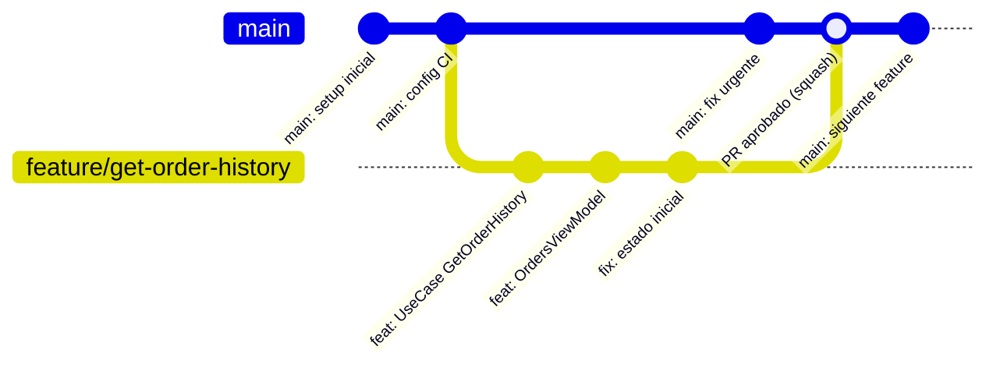

# conceptos_base_branching

## 1. Mapa del flujo



El gráfico muestra el ciclo de vida típico de una rama corta: nace de `main`, acumula commits propios mientras `main` sigue avanzando en paralelo, y vuelve a converger vía PR. Cuanto más tiempo pasa entre el "branch" y el "merge", más diverge el punto de partida — esa distancia es exactamente lo que las estrategias de branching intentan controlar.

## 2. Qué es y cómo funciona

Git es un sistema de control de versiones distribuido: cada desarrollador tiene una copia completa del historial en su máquina, no solo el archivo actual. Sobre esa base viven dos conceptos centrales, visibles en el diagrama de arriba:

- **Commit** — una fotografía del código en un momento dado, con mensaje y hash único que lo encadena al commit anterior. Es un nodo del gráfico.
- **Branch** — un puntero móvil a un commit, no una copia del código. Crear una rama es barato (mover un puntero), no duplica archivos.

Sobre esos dos conceptos se paran las **estrategias de branching**: las reglas que un equipo define para organizar cómo y cuándo se crean, viven y mueren esas ramas. Las dos más relevantes hoy:

- **Trunk-Based Development** — ramas cortas (horas, no semanas) que vuelven rápido a `main`, como la del diagrama. `main` siempre está en estado desplegable.
- **Git Flow** — ramas de larga duración con roles fijos: `main` (producción), `develop` (integración), `feature/*`, `release/*`, `hotfix/*`. Más estructura, más ceremonia.

La decisión entre una y otra no es de gusto: depende de la cadencia de release. Cuanto más espaciados y controlados son los releases (versiones LTS, múltiples versiones en producción a la vez), más se justifica la estructura extra de Git Flow. Cuanto más frecuentes son los releases (CI/CD real, varias veces por semana), más rápido esa estructura se vuelve fricción sin beneficio.

## 3. Cómo se ve en distintos contextos

En una **app de fitness** con un equipo de 4 personas que despliega a producción cada dos o tres días apoyándose en CI/CD, trunk-based es la elección natural: ramas de feature que viven un día o dos, PRs chicos, y `main` siempre listo para salir. Si alguien propusiera Git Flow completo acá, el equipo terminaría manteniendo un `develop` sincronizado sin necesidad real — no hay múltiples versiones en producción que coordinar.

En una **app de e-commerce** que vende licencias a distintas empresas y mantiene tres versiones activas en producción simultáneamente (porque cada cliente actualiza en su propio calendario, y algunos siguen en una versión de hace seis meses), Git Flow sí se paga solo: `release/2.4`, `release/2.5` y `main` conviven, cada uno puede recibir su propio `hotfix/*` sin que un fix urgente en la versión vieja obligue a tocar la versión nueva a medio terminar.

## 4. Implementación real

**Contexto:** el PO pide agregar el historial de pedidos (`GetOrderHistoryUseCase` + `OrdersViewModel`, ya definidos en `02_domain`) a la pantalla principal. El equipo trabaja con CI/CD activo y despliega seguido — trunk-based.

```bash
# 1. partir siempre de main actualizado
git checkout main
git pull

# 2. crear la rama de feature, nombre descriptivo y con prefijo consistente
git checkout -b feature/order-history-screen

# 3. trabajar en commits chicos y con propósito único (ver conventional_commits.md)
git add domain/usecase/GetOrderHistoryUseCase.kt
git commit -m "feat: agregar GetOrderHistoryUseCase"

git add presentation/OrdersViewModel.kt
git commit -m "feat: agregar OrdersViewModel con estado inicial"

# 4. mientras tanto, main puede seguir avanzando con otros cambios —
#    eso está bien, mientras la rama no viva más de un día o dos
```

Si en el medio aparece un bug crítico en producción que no puede esperar a que termine esta feature:

```bash
# hotfix corto, sale directo de main, no de la rama de feature en curso
git checkout main
git checkout -b hotfix/fix-orders-crash-on-empty-list

# ... arreglo puntual, commit, PR, merge inmediato a main ...

# la rama feature/order-history-screen sigue su curso en paralelo,
# sin bloquearse por el hotfix
```

## 5. Buenas prácticas y errores comunes

Checklist para auditar una estrategia de branching (o un flujo de ramas) que entregó una IA:

- [ ] **¿La rama de feature es corta?** Si una IA generó un plan de trabajo con una rama que va a vivir "varios días" sin mergear, es una señal de alerta en un contexto trunk-based — cuanto más vive, más drift acumula contra `main`.
- [ ] **¿El hotfix sale de `main`, no de la rama de feature en curso?** Un error común es que la IA (o un dev apurado) rame un fix urgente desde una rama de feature a medio terminar, mezclando código no relacionado con el fix.
- [ ] **¿Se está proponiendo Git Flow sin que el proyecto tenga múltiples versiones en producción simultáneas?** Si no hay ese problema real, la estructura extra (`develop`, `release/*`) es ceremonia sin beneficio — cuestionar el "porqué" antes de aceptarlo.
- [ ] **¿El nombre de la rama es descriptivo?** `feature/order-history-screen` dice qué hace; `feature/fix2` o `feature/temp` no aportan nada al historial ni ayudan a nadie que lea la lista de ramas después.
- [ ] **¿Se está borrando la rama después de mergear?** Ramas viejas ya mergeadas que quedan sin borrar ensucian la lista de ramas remotas sin aportar nada — `git branch -d` (local) y `git push origin --delete` (remoto).

## 6. Profundización: git stash

Herramienta relacionada pero distinta a branching: guarda los cambios sin commitear (working directory + staging area) en una pila temporal local, dejando el working directory limpio. A diferencia de un commit o una rama, **nunca se pushea** — vive solo en el `.git` local de cada desarrollador, no forma parte del historial compartido.

Se usa para cambiar de contexto rápido (un checkout urgente a otra rama, un `pull` que Git bloquea por cambios locales sin commitear) sin tener que commitear código a medio terminar ni perderlo.

```bash
# guarda los cambios sin commitear y limpia el working directory
git stash

# ... cambiás de rama, hacés otra cosa, atendés el hotfix urgente ...

# recuperás los cambios guardados (el más reciente del stack)
git stash pop
```

```bash
# ver la lista de stashes guardados — podés tener varios apilados
git stash list

# aplicar sin borrar del stack (pop = apply + drop)
git stash apply
```

No sustituye a un commit ni a una rama: es un guardado temporal y descartable, útil para interrupciones cortas de minutos u horas — no para trabajo que necesita historial propio o que se va a compartir con otra persona. Si el cambio a medio terminar va a durar más de una sesión de trabajo, conviene commitearlo (aunque sea con un `wip:` temporal a squashear después) en vez de dejarlo colgado en el stash, donde es fácil de olvidar.