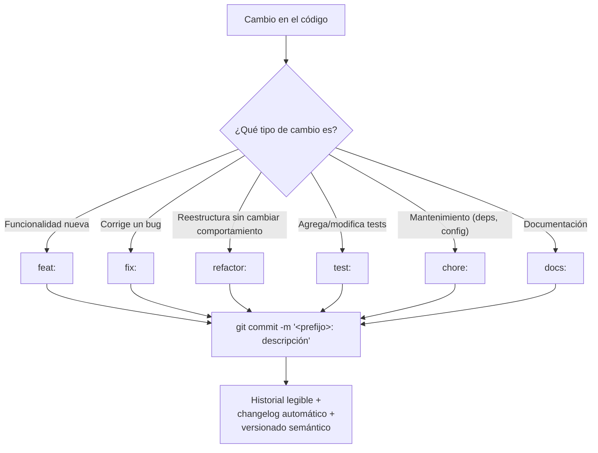

# conventional_commits

## 1. Mapa del flujo



El diagrama muestra que la convención opera en un solo punto de decisión — clasificar el tipo de cambio antes de escribir el mensaje — pero ese único paso es lo que después habilita todo lo que aparece a la derecha: nada de eso es automático si el prefijo no es consistente.

## 2. Qué es y cómo funciona

**Conventional Commits** es una convención de formato para mensajes de commit, donde cada mensaje empieza con un prefijo que indica el tipo de cambio: `feat`, `fix`, `refactor`, `test`, `chore`, `docs`, entre otros. No es una herramienta ni una librería — es un acuerdo de formato que cualquiera puede adoptar escribiendo los mensajes de cierta forma.

```
feat: agregar pantalla de historial de pedidos
fix: corregir cálculo de total con descuento negativo
refactor: extraer OrderMapper a función separada
test: agregar tests para GetOrderHistoryUseCase
chore: actualizar versión de Ktor
docs: documentar arquitectura del módulo shared
```

Sin una convención, el historial de commits termina siendo una lista de frases libres sin estructura (`arreglos varios`, `cambios`, `ahora sí`) — imposible de escanear rápido para entender qué pasó entre dos versiones. Con Conventional Commits, el tipo de cambio queda codificado en el propio mensaje, lo que habilita dos cosas que serían manuales y tediosas sin la convención:

- **Changelog automático**, agrupado por tipo (`feat`, `fix`, etc.).
- **Versionado semántico automático** — herramientas como `semantic-release` deciden si el próximo release es major, minor o patch mirando los prefijos de los commits desde el último release.

## 3. Cómo se ve en distintos contextos

En una **app de fitness** que usa `semantic-release` en su pipeline de CI/CD, cada `feat:` mergeado a `main` dispara automáticamente un bump de versión MINOR y agrega una línea al changelog público — nadie escribe el changelog a mano, se genera leyendo los mensajes de los commits desde el último release.

En una **app de e-commerce** con un equipo grande, la convención además sirve como filtro de búsqueda en el historial: un dev que necesita entender "¿qué fixes tocaron el módulo de pagos en el último mes?" puede buscar directamente `fix:` + `payment` en el log, algo imposible de hacer de forma confiable si los mensajes fueran libres.

## 4. Implementación real

**Contexto:** el PO pidió el historial de pedidos. Mientras lo implementás, corregís además un bug menor que encontrás de paso, y agregás sus tests.

```bash
# feat: nueva funcionalidad visible para el usuario/negocio
git commit -m "feat: agregar pantalla de historial de pedidos"

# fix: corrección de un bug — commit separado, aunque se haya encontrado
# trabajando en la misma feature
git commit -m "fix: corregir total negativo cuando se cancela un item"

# refactor: cambio de estructura interna, SIN cambiar comportamiento
git commit -m "refactor: extraer OrderMapper a función de extensión separada"

# test: agregar o modificar tests, sin tocar código de producción
git commit -m "test: agregar tests de GetOrderHistoryUseCase con FakeOrderRepository"

# chore: tareas de mantenimiento que no afectan al usuario final
git commit -m "chore: actualizar Ktor a 3.1.2"

# docs: documentación
git commit -m "docs: agregar merge_vs_rebase.md (13_git_y_equipo)"
```

```bash
# por qué importa la distinción feat vs fix para versionado semántico:
# si desde el último release solo hubo "fix:", el próximo release es un PATCH (1.2.0 -> 1.2.1)
# si hubo al menos un "feat:", el próximo release es un MINOR (1.2.0 -> 1.3.0)
# un "BREAKING CHANGE:" en el body del commit fuerza un MAJOR (1.2.0 -> 2.0.0)
```

## 5. Buenas prácticas y errores comunes

Checklist para auditar un commit o una serie de commits que entregó una IA:

- [ ] **¿Cada commit tiene un solo propósito con un solo prefijo?** Un commit `fix: corregir cálculo de total y reorganizar OrdersRepository` mezcla un fix con un refactor — si más adelante hace falta revertir específicamente el fix, el revert se lleva puesto también el refactor no relacionado.
- [ ] **¿El prefijo elegido coincide con el impacto real del cambio?** Un `chore:` que en realidad agrega funcionalidad visible (debería ser `feat:`) rompe el versionado semántico automático — el release sale como PATCH cuando debería ser MINOR, y el changelog no refleja lo que realmente cambió.
- [ ] **¿Un `refactor:` cambia comportamiento aunque sea "internamente"?** Si el resultado visible cambia (aunque sea un edge case), no es un refactor puro — el prefijo promete "esto es seguro, no cambia nada visible", y si no es cierto, alguien que confíe en esa promesa puede saltearse revisar el diff con cuidado.
- [ ] **¿La descripción después del prefijo es específica?** `fix: arreglo` no dice nada; `fix: corregir total negativo cuando se cancela un item` sí — el changelog automático es tan útil como lo sean las descripciones que lo alimentan.
- [ ] **¿Se usó `BREAKING CHANGE:` cuando correspondía?** Un cambio que rompe compatibilidad hacia atrás (ej. cambiar la firma de un `UseCase` público) sin marcarlo como breaking change puede terminar en un release MINOR cuando debería forzar un MAJOR — información crítica perdida para quien consuma la librería o el módulo.