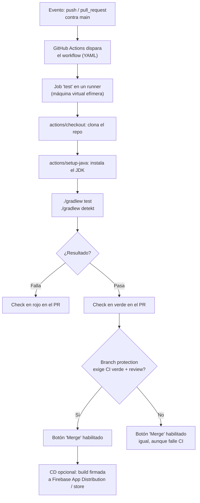

# github_actions_cicd

## 1. Mapa del flujo



El diagrama muestra el punto crítico de todo el módulo: el CI en verde (nodo I) y el botón de merge habilitado (nodo K o L) son cosas distintas — sin branch protection configurada explícitamente, un CI en rojo no bloquea nada por sí solo (rama L).

## 2. Qué es y cómo funciona

**GitHub Actions** es el sistema de automatización de GitHub: ejecuta *workflows* (scripts definidos en YAML) en respuesta a eventos del repositorio (push, pull request, release, etc.), sin depender de que alguien corra esos pasos a mano.

**CI (Continuous Integration)** es la práctica de correr automáticamente tests y validaciones cada vez que se sube código, para detectar problemas apenas se introducen. **CD (Continuous Deployment/Delivery)** extiende esa automatización para también desplegar — subir una build a Firebase App Distribution, TestFlight, o publicar a una store.

Sin CI, cada dev corre tests y lint "a mano" antes de subir código, lo cual depende 100% de la disciplina individual. Sin CD, cada release es un proceso manual repetitivo (compilar, firmar, subir) propenso a errores humanos.

Estructura de un workflow YAML:
- `on:` define el trigger (en el diagrama, cada push o PR contra `main`).
- `jobs:` cada job corre en un runner (máquina virtual efímera) independiente, potencialmente en paralelo con otros jobs.
- `steps:` acciones secuenciales dentro de un job — `uses:` reutiliza una Action ya escrita (de GitHub o de la comunidad), `run:` ejecuta un comando de shell directo.

## 3. Cómo se ve en distintos contextos

En una **app de fitness** con un equipo de 3 personas, un único workflow de CI que corre en cada PR (`gradlew test` + `gradlew detekt`) alcanza para atrapar la mayoría de los errores antes de que lleguen a review humano — sin necesidad todavía de un pipeline de CD, porque las builds de prueba se instalan manualmente en dispositivos del equipo.

En una **app de e-commerce** con testers externos y releases semanales, el pipeline se extiende: además del job de test, un segundo job (que solo corre si el primero pasa, y solo en pushes a `main`) firma la build y la sube automáticamente a Firebase App Distribution, notificando a los testers sin que nadie tenga que generar el `.apk` a mano.

## 4. Implementación real

**Contexto:** el PO pidió que cada PR corra los tests automáticamente antes de poder mergear, para no depender de que cada dev se acuerde de correrlos localmente.

```yaml
name: CI

on:
  pull_request:
    branches: [main]

jobs:
  test:
    runs-on: ubuntu-latest
    steps:
      - uses: actions/checkout@v7
      - uses: actions/setup-java@v4
        with:
          distribution: 'temurin'
          java-version: '21'
      - name: Run tests
        run: ./gradlew test
      - name: Run lint
        run: ./gradlew detekt
```

```yaml
# fragmento extra: usando un secreto para firmar/buildear con una API key,
# sin exponerla nunca en el código ni en los logs del workflow
- name: Build with API key
  env:
    API_KEY: ${{ secrets.API_KEY }}
  run: ./gradlew assembleRelease
```

## 5. Buenas prácticas y errores comunes

Checklist para auditar un workflow de CI/CD que entregó una IA:

- [ ] **¿El workflow por sí solo bloquea el merge, o solo informa?** Que el CI corra y se vea en rojo no impide que alguien apriete "Merge" igual. Solo **branch protection rules** configuradas explícitamente (exigir status checks en verde antes de habilitar el botón) convierten esa información en una regla imposible de saltear.
- [ ] **¿Las Actions están fijadas a una versión mayor razonable y no a `@master`/`@main`?** Fijar a una rama móvil de una Action de terceros expone el pipeline a cambios inesperados (o maliciosos) sin previo aviso; fijar a una versión mayor (`@v7`) es el balance estándar entre estabilidad y mantenimiento.
- [ ] **¿Algún secreto aparece hardcodeado en el YAML o en un log de `run:`?** Las API keys deben vivir siempre en `secrets.*`, nunca en texto plano dentro del workflow — ver `secretos_gitignore.md`.
- [ ] **Si el workflow usa `pull_request_target` para un repo que acepta PRs de forks, ¿evita ejecutar código del fork con privilegios del repo base?** Es un vector real de ataque ("pwn request"): `pull_request_target` corre con el `GITHUB_TOKEN` y los secrets del repo base, así que checkoutear y ejecutar el código de un PR externo ahí es peligroso. `actions/checkout` bloquea este patrón por default desde su versión 7 salvo que se habilite explícitamente.
- [ ] **¿El job de CD depende de que el job de CI haya pasado?** Un pipeline mal encadenado podría desplegar una build sin que los tests hayan corrido — el job de deploy debería declarar `needs: test` (o equivalente) para no desacoplarse del resultado de CI.

## 6. Profundización: branch protection rules como capa separada del CI

Es un error común pensar que configurar el workflow de CI ya "resuelve" el problema de código roto llegando a `main`. El CI, por sí solo, es **información**: corre, muestra un check verde o rojo en el PR, y ahí termina su responsabilidad. Nada en GitHub Actions impide que alguien con permisos de escritura apriete "Merge" con ese check en rojo, salvo que exista una regla explícita que lo prohíba.

Esa regla vive en un lugar distinto del repositorio — **Settings → Branches → Branch protection rules** — y es una capa de configuración completamente separada del archivo YAML del workflow:

- **Require status checks to pass before merging**: el botón de merge queda deshabilitado mientras el check de CI no esté en verde.
- **Require a pull request before merging** (+ cantidad mínima de aprobaciones): impide el push directo a `main`, forzando el flujo de PR descrito en `pull_requests_code_review.md`.
- **Require branches to be up to date before merging**: exige que la rama del PR tenga los últimos cambios de `main` antes de mergear — evita que un PR viejo, testeado contra una versión anterior de `main`, se mergee sin haber corrido CI contra el código actual.

La distinción importa porque son dos configuraciones independientes que hay que auditar por separado: un repo puede tener un workflow de CI impecable y aun así no estar protegido, si nadie activó las branch protection rules correspondientes.