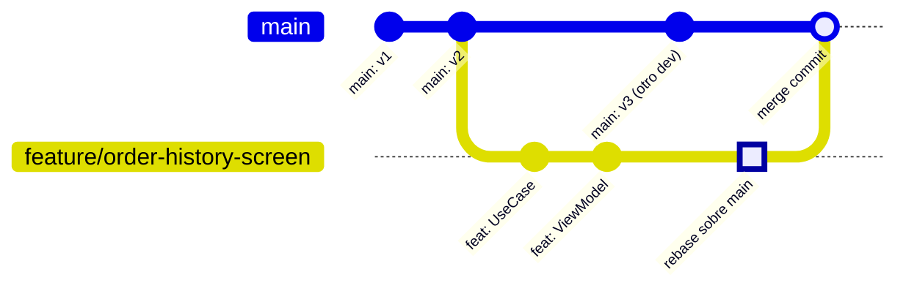

# merge_vs_rebase

## 1. Mapa del flujo



El diagrama muestra los dos momentos donde aparece la disyuntiva: mientras la rama de feature está en curso (ahí se decide si rebasear contra `main` para no quedar atrás), y al integrar el PR aprobado (ahí normalmente se usa merge, para no reescribir historial que ya es compartido). Son dos decisiones distintas, en dos momentos distintos del mismo flujo.

## 2. Qué es y cómo funciona

**Merge** y **rebase** son las dos formas de traer cambios de una rama a otra en Git. Ambos resuelven el mismo problema ("quiero los commits de la rama A también en la rama B"), pero con mecánicas opuestas:

- **Merge** crea un nuevo commit (el "merge commit") que une el historial de ambas ramas, preservando exactamente cómo pasaron las cosas en el tiempo — incluidos los momentos en que ambas ramas avanzaron en paralelo.
- **Rebase** reescribe el historial de tu rama: toma tus commits y los reaplica uno por uno sobre la punta actual de la otra rama, como si hubieras empezado a trabajar desde ahí. El resultado es un historial lineal, sin merge commits — pero con **hashes nuevos** para cada commit reaplicado.

Esa última palabra — *reescribe* — es la que separa a ambos en la práctica: merge nunca toca commits existentes, rebase sí. Por eso rebase es seguro solo mientras esos commits no hayan sido compartidos con nadie más.

## 3. Cómo se ve en distintos contextos

En una **app de fitness** donde cada dev mantiene su propia rama de feature sin que nadie más la baje, rebasear contra `main` antes de abrir el PR es rutina diaria: mantiene la rama al día con lo último de `main` y deja un historial lineal fácil de leer en el diff del PR, sin ensuciarlo con merges intermedios de "traje los cambios de main".

En una **app de e-commerce** con un equipo grande donde dos personas a veces colaboran sobre la misma rama de feature (por ejemplo, mientras arman juntos una integración de checkout compleja), rebasear esa rama compartida sin avisar es directamente riesgoso: en el momento en que el segundo dev hace `pull`, se encuentra con hashes que ya no coinciden con lo que tiene localmente, y Git no tiene forma limpia de reconciliar eso.

## 4. Implementación real

**Contexto:** el PO pidió agregar `RefreshOrdersUseCase` para poder refrescar el historial de pedidos manualmente. Trabajás solo en tu rama `feature/refresh-orders`, pero `main` avanzó mientras tanto con otro fix.

```bash
# MERGE: crea un commit extra que documenta la unión de ambas ramas
git checkout main
git merge feature/refresh-orders
# resultado: "Merge branch 'feature/refresh-orders' into main"
# el historial queda con "forma de diamante"
```

```bash
# REBASE: reescribe tus commits como si arrancaran después
# del último commit de main (nuevos hashes)
git checkout feature/refresh-orders
git rebase main
# resultado: historial lineal, sin merge commit
```

```bash
# flujo típico: rebaseás tu propia rama contra main ANTES de abrir el PR,
# para traer los últimos cambios y resolver conflictos de a poco,
# en vez de que aparezcan todos juntos al momento de mergear
git checkout feature/refresh-orders
git rebase main

# si aparece un conflicto en OrdersRepository.kt durante el rebase:
# 1. resolver el archivo a mano
# 2. git add OrdersRepository.kt
# 3. git rebase --continue

# luego, el PR se mergea a main normalmente (generalmente squash,
# ver squash_y_conflictos.md)
```

## 5. Buenas prácticas y errores comunes

Checklist para auditar una decisión de merge vs. rebase (propia o sugerida por una IA):

- [ ] **¿La rama que se va a rebasear tiene un solo dueño?** Si otra persona ya bajó esa misma rama localmente, rebasear reescribe hashes que esa persona ya tiene — regla dura, sin excepción salvo coordinación explícita del equipo.
- [ ] **¿Se usó `git push --force` sobre una rama compartida?** Es la combinación más peligrosa: rebase + force push sobre una rama que otro también tiene localmente puede pisar directamente su trabajo. Si una IA sugiere `--force` sin verificar quién más usa esa rama, es una bandera roja.
- [ ] **¿Se está rebaseando la integración del PR a `main`, en vez de mergearla?** El merge del PR aprobado a la rama principal normalmente va con merge (o squash), no con rebase — rebasear `main` mismo reescribiría el historial compartido de todo el equipo.
- [ ] **¿El propósito es "limpiar antes de abrir PR" o "integrar un PR ya aprobado"?** Son los dos casos de uso típicos, y cada uno tiene su herramienta: rebase para lo primero (tu rama, historial lineal), merge para lo segundo (integración oficial, sin reescribir nada).
- [ ] **Ante un conflicto durante rebase, ¿se resuelve commit por commit?** A diferencia de un conflicto de merge (una sola resolución), un rebase puede pedir resolver el mismo archivo varias veces — una por cada commit reaplicado que lo toca. Si una IA resuelve todo de una sin entender esto, puede perder cambios intermedios.