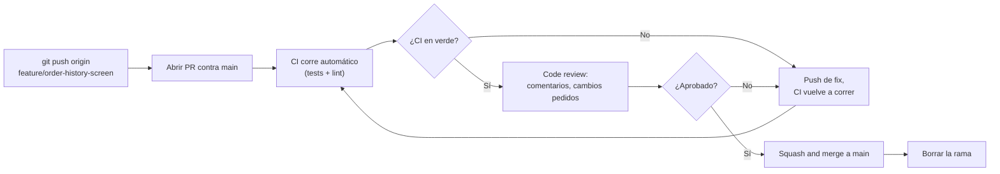

# pull_requests_code_review

## 1. Mapa del flujo



El diagrama muestra que el PR no es un paso único sino un ciclo: CI y review pueden rechazar el cambio y devolverlo a "push de fix" las veces que haga falta antes de llegar al merge. La aprobación humana y el CI en verde son dos condiciones independientes — ambas necesarias, ninguna sustituye a la otra (ver sección 5 de `github_actions_cicd.md` sobre branch protection).

## 2. Qué es y cómo funciona

Un **Pull Request** (PR, o Merge Request en GitLab) es una propuesta de cambio: "quiero traer los commits de mi rama `feature/X` a `main`", abierta para que el equipo la revise antes de aceptarla. No es un concepto de Git en sí — Git no tiene PRs — es una feature construida por la plataforma (GitHub, GitLab, Bitbucket) por encima de Git.

**Code review** es la práctica central del flujo de PR: compañeros leen el diff, comentan, piden cambios, y aprueban antes de que el código llegue a `main`. Cumple dos funciones que suelen confundirse:

- **Detectar bugs** — la parte más obvia, pero solo una parte.
- **Compartir contexto** — por qué se tomó una decisión de diseño, mantener consistencia de estilo en el equipo, y evitar el "bus factor" (que una sola persona sea la única que entiende cierta parte del sistema).

Sin PR, cualquiera podría pushear directo a `main` sin que nadie más vea el cambio antes de que llegue a producción. Sin code review real (más allá de la formalidad del paso), se pierde justamente la segunda función — un review que solo mira "¿compila?" no aporta nada que el CI no aportara solo.

## 3. Cómo se ve en distintos contextos

En una **app de fitness** con un equipo de 3 personas, cada PR de una feature nueva (por ejemplo, "agregar gráfico de progreso semanal") pasa por al menos un compañero antes de mergear — no tanto para pescar bugs de sintaxis (eso ya lo cubre el CI), sino para confirmar que la lógica de cálculo del progreso vive en el `UseCase` correcto y no se filtró al `ViewModel`.

En una **app de e-commerce** con un equipo grande dividido en subequipos (checkout, catálogo, cuenta), un PR que toca código compartido entre equipos (por ejemplo, el modelo base de `Product`) suele requerir aprobación de alguien de cada equipo afectado, no solo de quien esté disponible — ahí el code review también cumple una función de coordinación entre áreas, no solo de calidad de código.

## 4. Implementación real

**Contexto:** el PO pidió el historial de pedidos. Terminaste `feature/order-history-screen` (con `GetOrderHistoryUseCase` y `OrdersViewModel`) y es momento de abrir el PR.

```bash
# 1. pushear la rama al remoto
git push origin feature/order-history-screen

# 2. abrir el PR en GitHub (vía UI), con descripción de qué cambia y por qué:
#    "Agrega pantalla de historial de pedidos. Nuevo GetOrderHistoryUseCase
#    en domain, OrdersViewModel con estado Loading/Success/Error."
```

Un reviewer, al leer el diff, buscaría exactamente este tipo de señal:

```kotlin
// Ejemplo de lo que un reviewer buscaría en el diff de este PR:
// ¿el ViewModel realmente no tiene lógica de negocio filtrada?
class OrdersViewModel(
    private val getOrderHistoryUseCase: GetOrderHistoryUseCase // OK: delega al UseCase
) {
    // señal de alerta para un reviewer: esto NO debería estar acá
    // fun calculateLoyaltyDiscount(order: Order) = order.total * 0.95
}
```

```bash
# una vez aprobado y con CI en verde, se mergea (usualmente squash) a main
# y se borra la rama, tanto local como remota
git branch -d feature/order-history-screen
git push origin --delete feature/order-history-screen
```

## 5. Buenas prácticas y errores comunes

Checklist para auditar un PR o un proceso de review, propio o generado con ayuda de una IA:

- [ ] **¿El PR tiene alcance acotado?** Un PR que toca 15 archivos y mezcla la pantalla de historial con un refactor de `DI` no relacionado es difícil de revisar bien — dividir en PRs más chicos exige más disciplina, pero se revisa mejor y más rápido.
- [ ] **¿La descripción del PR explica el *por qué*, no solo el *qué*?** El diff ya muestra qué cambió; la descripción debería explicar la decisión detrás (por qué ese enfoque y no otro), que es justo lo que el diff no puede transmitir por sí solo.
- [ ] **¿El review verifica arquitectura, no solo que "compile y pase tests"?** Los tests validan comportamiento esperado, pero no dicen si hay lógica de negocio filtrada en la capa equivocada, nombres confusos, o lógica duplicada que ya existe en otro lado.
- [ ] **¿Hay al menos una aprobación real antes de mergear?** Auto-mergear el propio PR sin revisión (aunque sea de uno mismo, revisando el diff completo con distancia crítica) pierde el "segundo par de ojos" que el proceso está pensado para dar.
- [ ] **¿Se está confundiendo "el CI está en verde" con "está listo para mergear"?** Son necesarios los dos, pero ninguno sustituye al otro — ver `github_actions_cicd.md` para el caso de branch protection rules exigiendo ambos.