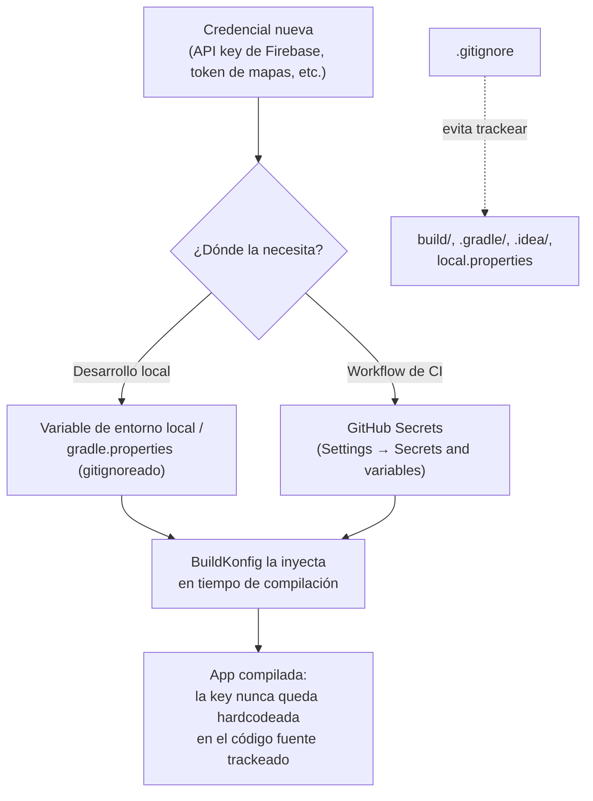

# secretos_gitignore

## 1. Mapa del flujo



El diagrama separa dos preocupaciones que conviven en el mismo archivo pero resuelven problemas distintos: `.gitignore` evita que basura regenerable (o archivos con credenciales locales) entre al repo; el manejo de secretos evita que una credencial real llegue a estar hardcodeada en cualquier archivo trackeado, gitignoreado o no.

## 2. Qué es y cómo funciona

**`.gitignore`** es un archivo que le dice a Git qué **no** trackear: carpetas de build, configuración local del IDE, archivos de credenciales. En KMP típicamente ignora `build/`, `.gradle/`, `.idea/`, `*.xcuserstate`, `local.properties`.

**Manejo de secretos** es la práctica de nunca commitear API keys ni credenciales al repo — ni siquiera en un archivo gitignoreado que alguien podría subir por error — y en cambio manejarlas vía:

- **GitHub Secrets** — variables encriptadas inyectadas al workflow en runtime, para CI (ver `github_actions_cicd.md`).
- **BuildKonfig** o variables de entorno locales — para desarrollo, donde la key se inyecta en tiempo de compilación desde algo que sí está gitignoreado.

Son dos mecanismos distintos con el mismo objetivo: que la credencial nunca exista como texto plano dentro de un archivo que Git trackea, sin importar si ese archivo es público o privado — porque el historial de Git recuerda todo, incluso lo que después se borra de la versión actual del archivo.

## 3. Cómo se ve en distintos contextos

En una **app de fitness** que integra un SDK de mapas para trackear rutas de corrida, la API key del proveedor de mapas nunca aparece en el código fuente: vive en `local.properties` (gitignoreado) para desarrollo local, y en un GitHub Secret para que el workflow de CI pueda compilar una build de prueba sin exponerla.

En una **app de e-commerce** que procesa pagos, el caso es más sensible todavía: la key de la pasarela de pagos en ambiente de test vive en GitHub Secrets del repo, mientras que la key de producción típicamente vive en un **GitHub Environment** separado con reglas de aprobación manual — para que ni siquiera un workflow automatizado pueda usarla sin que alguien apruebe ese deploy puntual.

## 4. Implementación real

**Contexto:** el PO pidió integrar la API key del proveedor de notificaciones push para avisar cuando cambia el estado de un pedido (`Order`). La key nunca debe quedar en el código fuente.

```bash
# .gitignore típico de un proyecto KMP
build/
.gradle/
.idea/
*.xcuserstate
local.properties
```

```kotlin
// BuildKonfig: la key se inyecta en tiempo de compilación desde una
// variable de entorno o gradle.properties local (que SÍ está en .gitignore),
// nunca hardcodeada en el código fuente
buildkonfig {
    packageName = "com.example.orderapp"
    defaultConfigs {
        buildConfigField(STRING, "PUSH_NOTIFICATIONS_API_KEY", System.getenv("PUSH_API_KEY") ?: "")
    }
}
```

```yaml
# uso de un GitHub Secret dentro de un workflow — la key nunca aparece
# en el código ni en los logs del workflow (GitHub la enmascara automáticamente)
- name: Build with API key
  env:
    PUSH_API_KEY: ${{ secrets.PUSH_NOTIFICATIONS_API_KEY }}
  run: ./gradlew assembleRelease
```

## 5. Buenas prácticas y errores comunes

Checklist para auditar el manejo de `.gitignore` y secretos en código o configuración que entregó una IA:

- [ ] **¿`.gitignore` está configurado desde el primer commit del proyecto?** No hay escenario donde convenga trackear `build/` o `.idea/` — el costo de no ignorarlos crece con cada commit que ensucia el historial, y limpiarlo después (`git rm -r --cached`) es más trabajo que prevenirlo.
- [ ] **¿Alguna key aparece hardcodeada directamente en un archivo `.kt`, `.gradle.kts` o YAML, aunque sea "para probar rápido"?** Ni siquiera temporalmente — el momento en que ese commit se pushea, hay que asumir que la key puede haber sido vista o indexada.
- [ ] **¿La key para CI viene de `secrets.*`, y la de desarrollo local de una variable de entorno o `local.properties` gitignoreado?** Mezclar los dos casos (por ejemplo, poner la key de producción directo en un `gradle.properties` trackeado "porque es más simple") rompe el patrón completo.
- [ ] **Si se detecta una key commiteada por error, ¿el plan de acción es "rotarla", no solo "borrarla del historial"?** Borrar el commit del historial (`git filter-repo` o similar) es limpieza de higiene; no revierte que cualquiera que haya clonado el repo antes de la limpieza ya tiene esa key. Solo rotar (invalidar y generar una nueva) resuelve el riesgo real.
- [ ] **¿Se asume que "no llegué a pushear" y "está resuelto" son lo mismo?** Un `git reset --soft` local alcanza únicamente si el commit nunca salió de la máquina. Si hubo push — aunque haya sido corregido con un force-push 30 segundos después — la key ya viajó al remoto y hay que rotarla igual.