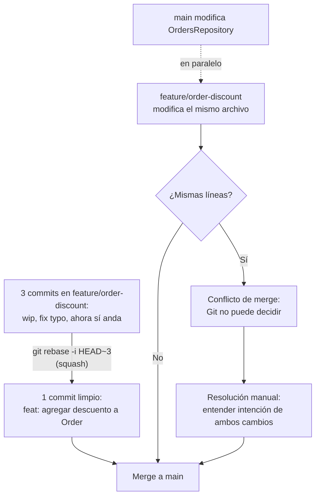

# squash_y_conflictos

## 1. Mapa del flujo



El diagrama separa dos mecánicas distintas que conviven en el mismo momento del flujo (integrar una rama a `main`): el squash colapsa el ruido *interno* de una rama antes o durante el merge; el conflicto surge cuando dos ramas tocaron las mismas líneas de forma incompatible, sin importar si después se integra con squash, merge o rebase.

## 2. Qué es y cómo funciona

**Squash** es una operación que toma todos los commits de una rama y los combina en uno solo antes de mergearlos a la rama principal. Es la tercera opción además de merge y rebase directos, y en GitHub aparece típicamente como "Squash and merge" al cerrar un Pull Request.

**Conflicto de merge** es lo que ocurre cuando dos ramas modificaron las mismas líneas de un archivo de forma distinta, y Git no puede decidir automáticamente cuál versión es la correcta — pasa tanto al usar `merge` como al usar `rebase` (ver `merge_vs_rebase.md`).

Son mecánicas independientes que suelen aparecer juntas: durante el desarrollo de una feature se acumulan commits intermedios (`wip`, `fix typo`, `arreglo real`) que no aportan nada al historial de `main` — el squash los colapsa en uno solo, limpio y descriptivo. Los conflictos, en cambio, no son un "error" de Git: son la consecuencia inevitable de que dos personas (o vos mismo en dos ramas) toquen la misma línea de forma distinta. Git no tiene forma de saber cuál versión es la "correcta" en términos de intención de negocio, así que te lo devuelve para que decidas vos.

## 3. Cómo se ve en distintos contextos

En una **app de fitness** donde un dev trabaja tres días en una feature de "plan de entrenamiento semanal" y acumula quince commits (`wip`, `ahora sí compila`, `arreglo test`), el squash al mergear el PR deja en `main` un único commit `feat: agregar plan de entrenamiento semanal` — nadie necesita ver los quince pasos intermedios para entender qué cambió.

En una **app de e-commerce** con dos devs trabajando en paralelo, uno ajustando el cálculo de envío gratis y otro el cálculo de descuentos por cupón, ambos sobre el mismo archivo de `PriceCalculator`, es esperable un conflicto de merge al integrar la segunda rama: Git marca las líneas en disputa y alguien tiene que decidir cómo conviven ambas reglas de negocio, no simplemente "pegar las dos".

## 4. Implementación real

**Contexto:** el PO pidió agregar un descuento por primera compra a `Order`. Mientras desarrollás `feature/order-discount`, alguien más mergeó a `main` un cambio que también toca el cálculo de `totalAmount` en `OrdersRepository.kt` (para redondear a dos decimales).

Primero, limpiás tu propia rama antes de abrir el PR:

```bash
# squash manual: combina los últimos 3 commits en uno solo,
# antes de abrir el PR (alternativa a dejar que GitHub lo haga al mergear)
git rebase -i HEAD~3
# se abre un editor con los 3 commits listados como "pick";
# cambiás "pick" por "squash" (o "s") en los que querés combinar
# con el commit anterior
```

Al traer los cambios de `main`, aparece el conflicto:

```kotlin
<<<<<<< HEAD
val totalAmount = items.sumOf { it.price * it.quantity }.roundToTwoDecimals()
=======
val totalAmount = items.sumOf { it.price * it.quantity } * (1 - firstOrderDiscount)
>>>>>>> feature/order-discount
```

```bash
# resolución: editar el archivo a mano, decidiendo qué código queda
# (combinando si hace falta), y borrar los marcadores
# <<<<<<<, =======, >>>>>>>

git add OrdersRepository.kt

# si el conflicto surgió durante un rebase:
git rebase --continue

# si el conflicto surgió durante un merge:
git commit
```

La resolución correcta acá no es dejar ambas líneas — es entender que ambos cambios deben convivir: aplicar el descuento y **después** redondear, no una u otra por separado.

```kotlin
// resolución real: ambas reglas de negocio combinadas con sentido,
// no las dos líneas originales pegadas una debajo de la otra
val totalAmount = (items.sumOf { it.price * it.quantity } * (1 - firstOrderDiscount))
    .roundToTwoDecimals()
```

## 5. Buenas prácticas y errores comunes

Checklist para auditar un squash o una resolución de conflicto que entregó una IA:

- [ ] **¿El commit final del squash describe la feature completa, no el último commit intermedio?** Un squash mal hecho puede terminar dejando como mensaje final algo como `fix typo` en vez de `feat: agregar descuento a Order` — hay que reescribir el mensaje al momento de squashear, no heredar el último al azar.
- [ ] **¿La resolución de un conflicto combina la intención de ambos cambios, o solo "pegó" las dos versiones?** Dejar ambas líneas de un conflicto sin entender qué hace cada una casi nunca compila bien, y si compila, probablemente ejecute dos operaciones donde el negocio esperaba una sola.
- [ ] **¿Se leyó el contexto de por qué cada rama hizo ese cambio?** (commit message, descripción del PR) antes de decidir qué código queda. Resolver un conflicto sin ese contexto es adivinar, no decidir.
- [ ] **¿Quedaron marcadores de conflicto (`<<<<<<<`, `=======`, `>>>>>>>`) sin borrar en el archivo final?** Es un error común al resolver a las apuradas — el código puede llegar a compilar igual si los marcadores caen en un comentario o string, pero deja basura en el archivo.
- [ ] **¿Se eligió squash para una feature con commits intermedios ruidosos, y merge/rebase normal para una donde cada commit documenta una decisión útil?** Squashear una serie de commits que sí valía la pena revisar por separado (ej. un refactor grande en pasos) pierde esa granularidad para siempre.