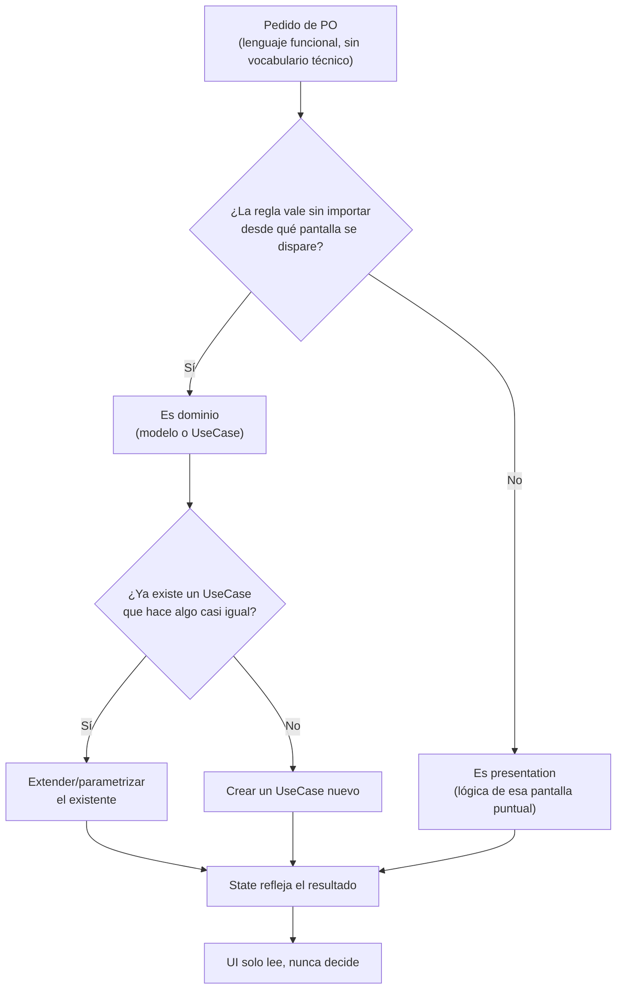

# Cómo traducir un pedido de PO

## 1. Mapa del flujo



El recorrido tiene un solo objetivo: nunca escribir código antes de haber contestado las dos preguntas del diagrama. La primera pregunta decide la capa (dominio vs. presentation); la segunda evita duplicar lógica que ya existe. Recién ahí el resultado baja a `State`, y la UI se limita a leerlo.

## 2. Qué es y cómo funciona

Traducir un pedido de PO es el paso intermedio entre "escuchar un requisito" y "escribir código" — convertir una frase en lenguaje funcional ("que el pedido se cancele solo si tarda demasiado") en una decisión concreta de arquitectura: qué capa la resuelve, qué modelo o `UseCase` cambia, y qué impacto tiene en el `State` de la pantalla que lo muestra. No es un paso opcional para juniors — es el paso que un senior hace casi automático, y que un dev apurado se salta porque "ya sabe programarlo".

Un PO no habla en términos de `UseCase`, `Repository` o `State` — habla en comportamiento visible. Si esa frase se traduce directo a código sin pasar por el análisis de capas, aparecen dos fallas típicas:

- **Se resuelve en la capa equivocada.** Una invariante de dominio ("no permitir un total negativo") se termina validando en el Composable o el ViewModel, porque ahí es donde "se nota" el problema — cuando en realidad debería vivir en el modelo o en un `UseCase`, para que valga sin importar desde dónde se dispare.
- **Se sobre-construye o se sub-construye.** Sin traducir el alcance real del pedido, es fácil crear un `UseCase` nuevo para algo que ya cubre uno existente, o forzar uno existente a hacer algo que no le corresponde, mezclando responsabilidades.

Como muestra el diagrama, el criterio para decidir la capa es siempre el mismo: si la regla se cumple sin importar la pantalla que la dispare, es dominio; si depende de esa pantalla puntual, es presentation.

## 3. Cómo se ve en distintos contextos

**App de fitness:** el PO pide *"que la rutina se marque como completada sola cuando el usuario termina el último set."* La pregunta clave es si "completada" es un estado que importa fuera de la pantalla de entrenamiento — por ejemplo, si el historial de rutinas o un contador de racha semanal también necesitan saberlo. Si la respuesta es sí, la condición vive en domain (una función pura que evalúa la lista de sets) y un `UseCase` la orquesta; el `ViewModel` solo reacciona al resultado y actualiza el `State`. Tratar esto como "un `if` en el Composable que oculta el botón de completar" funciona hasta que otra pantalla necesita la misma información y no tiene forma de acceder a ella sin duplicar la lógica.

**App de e-commerce:** el PO pide *"que se aplique automáticamente un cupón de envío gratis si el carrito supera cierto monto."* Acá la traducción tiene una capa extra de cuidado: no alcanza con "es dominio", hay que decidir si ya existe un `UseCase` de cálculo de totales que se puede extender con esta regla, o si conviene uno nuevo (`ApplyFreeShippingUseCase`) que se compone con el existente. Resolverlo mal en la dirección contraria — meter el cálculo del cupón directo en el `Repository` que trae el carrito — mezcla una regla de negocio de pricing con una responsabilidad de acceso a datos que no le corresponde.

## 4. Implementación real

El PO pide: *"Si un pedido queda en estado Pendiente por más de 30 minutos sin que el restaurante lo confirme, tiene que cancelarse solo y el usuario tiene que enterarse."*

Traducción antes de programar: "queda pendiente por más de 30 minutos" es una condición sobre el dominio (`Order`, `OrderStatus`, `date`) — no depende de qué pantalla la dispare, así que es domain. "El usuario se entera" es una consecuencia visible — presentation reacciona al cambio de estado, no lo decide.

```kotlin
// domain/model — la regla vive como función pura sobre el propio Order,
// no como un nuevo modelo: no hace falta más que evaluar lo que ya existe.
fun Order.isStaleAndShouldCancel(now: Instant, timeoutMinutes: Int = 30): Boolean =
    status == OrderStatus.PENDING &&
        now.minus(date).inWholeMinutes >= timeoutMinutes
```

```kotlin
// domain/usecases/CancelStaleOrdersUseCase.kt
// UseCase de acción puntual: se ejecuta una vez, puede fallar (red, disco),
// devuelve Result<T> — no es reactivo porque no expone un Flow continuo.
class CancelStaleOrdersUseCase(
    private val repository: OrderRepository,
    private val clock: Clock
) {
    suspend operator fun invoke(): Result<List<Order>> = try {
        val now = clock.now()
        val staleOrders = repository.getOrderHistory()
            .first()
            .filter { it.isStaleAndShouldCancel(now) }

        staleOrders.forEach { order ->
            repository.updateOrderStatus(order.id, OrderStatus.CANCELLED)
        }
        Result.Success(staleOrders)
    } catch (e: CancellationException) {
        throw e // nunca capturar la cancelación de la propia coroutine
    } catch (e: Exception) {
        Result.Error(e)
    }
}
```

```kotlin
// presentation — el State se entera del resultado, no decide la regla
data class OrdersState(
    val orders: List<Order> = emptyList(),
    val autoCancelledIds: Set<String> = emptySet() // para el aviso puntual en la UI
)

// el ViewModel dispara CancelStaleOrdersUseCase (ej: en cada refresh o vía WorkManager
// periódico, ver 05_platform/workmanager.md) y traduce el resultado a un Effect:
// si staleOrders no está vacío, emite OrdersEffect.ShowSnackbar("N pedidos se cancelaron
// por demora") — la UI solo lee ese Effect, nunca evalúa el timeout por su cuenta.
```

Notá que el pedido del PO ("se cancela solo y el usuario se entera") se partió en tres decisiones distintas — una función de dominio, un `UseCase` que orquesta y persiste, y un `Effect` de presentation — antes de escribir una sola línea de UI.

## 5. Buenas prácticas y errores comunes — qué auditar si te lo entrega la IA

- **¿La condición de negocio (el timeout de 30 minutos, o cualquier invariante similar) quedó hardcodeada dentro del `ViewModel` o del Composable, en vez de vivir en domain?** Si la misma regla tuviera que aplicarse también desde un `Worker` en background (como en este ejemplo) o desde otra pantalla, y hoy solo existe atada a un `ViewModel` puntual, es la señal de que la capa se resolvió mal.

- **¿Existe ya un `UseCase` parecido que se podría haber extendido, y la IA creó uno nuevo igual sin chequearlo (o al revés, forzó uno existente a hacer algo que no le corresponde)?** Pedile a la IA que liste los `UseCase` existentes en el dominio antes de generar uno nuevo — evita duplicación silenciosa.

- **¿Una acción que el usuario puede "deshacer" (por ejemplo, revertir el estado de un pedido cancelado por error) se guardó en un `remember` efímero de Compose en vez de en el `State`/dominio persistido?** Ese tipo de acción sobrevive a rotación y a que el proceso se recree — si vive solo en memoria de un Composable, se pierde en el peor momento. La pregunta que lo detecta: *si el usuario rota la pantalla ahora mismo, ¿la posibilidad de deshacer sigue estando?*

- **¿El código mezcla la traducción del pedido con la implementación en el mismo paso, sin un punto intermedio explícito?** Si la IA entrega directamente el código sin haber explicitado antes "esto es dominio porque X, esto es presentation porque Y", el resultado puede compilar perfecto y aun así estar en la capa equivocada — el checklist tiene que aplicarse *antes* de revisar el código, no reemplazarlo.

- **¿Se creó un modelo nuevo (`StaleOrderInfo`, por ejemplo) cuando alcanzaba con una función o propiedad sobre el modelo existente?** Ver si el pedido realmente necesita un tipo nuevo o si es una evaluación sobre datos que `Order` ya tiene — sobre-modelar es tan costoso como sub-modelar.