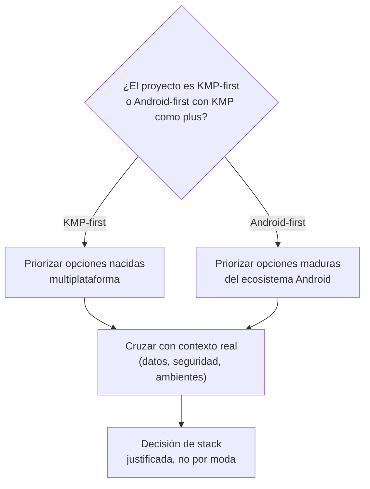

# Cuándo elegir cada opción de stack

## 1. Mapa del flujo



Una sola pregunta base resuelve la mayoría de las decisiones de stack de una: ¿este proyecto tiene, o va a tener, targets reales fuera de Android en un plazo corto/mediano? Todo lo demás — persistencia, navegación, DI, seguridad, ambientes — se cruza después contra esa respuesta y contra el contexto puntual del proyecto (qué datos maneja, qué riesgo tiene).

## 2. Qué es y cómo funciona

Es el criterio para decidir, entre las alternativas técnicas disponibles en KMP para un mismo problema, cuál conviene en función del contexto real del proyecto — no de cuál es "la más nueva" o "la que usa Google". En KMP casi todo problema tiene dos o tres soluciones válidas; la habilidad senior no es conocerlas todas, es saber justificar por qué una encaja mejor que otra en *este* proyecto puntual.

Sin un criterio explícito, las decisiones de stack se toman por dos caminos malos: "lo que ya sé" (cómodo, pero puede no encajar) o "lo que está de moda" (arriesgado, sin encaje probado). Ambos ignoran la pregunta base del diagrama — y no tenerla clara antes de elegir es lo que después obliga a migrar una librería entera a mitad de proyecto.

Un matiz que no siempre es obvio: elegir un stack no es solo elegir *entre* alternativas para el mismo problema — a veces la decisión hace que una pieza cambie de rol. Si la fuente remota principal es un SDK nativo (como Firestore) en vez de una API REST propia, un cliente HTTP como Ktor puede seguir formando parte del stack, pero con un rol mucho más acotado que "capa de red" — por ejemplo, únicamente como engine (OkHttp/Darwin) para la carga de imágenes de Coil3. Esa combinación es tan válida como cualquier fila de la matriz de abajo, aunque no aparezca como una opción binaria clásica.

## 3. Cómo se ve en distintos contextos

**App de fitness:** el equipo arranca 100% Android, sin plan de iOS a corto plazo, pero el PO menciona "algún día" querer una versión para Apple Watch. La pregunta base todavía se contesta "Android-first hoy" — Room y Navigation Compose son válidos — pero vale la pena documentar la decisión explícitamente como *revisitable*, no como definitiva, para no repetir la discusión desde cero si el roadmap cambia en unos meses.

**App de e-commerce:** el equipo arranca con Android e iOS desde el día uno del proyecto (KMP-first real, no aspiracional). Acá la matriz aplica directo: SQLDelight o DataStore según la complejidad de los datos locales, Koin para DI, y — si el catálogo de productos necesita queries locales complejas para funcionar offline (filtros, joins entre categorías) — SQLDelight por sobre DataStore, porque DataStore no está pensado para ese tipo de consulta.

## 4. Implementación real

El PO pide: *"Que el Historial de Pedidos se pueda ver aunque el celular esté sin conexión, y que se sincronice solo cuando vuelva la señal — sin que el usuario tenga que hacer nada."*

Aplicando el criterio antes de tocar código: el proyecto es KMP-first (Android + iOS desde el diseño). La pregunta siguiente no es "SQLDelight o Room" — es más específica: ¿el requisito necesita queries locales complejas (joins, filtros compuestos) sobre los pedidos guardados, o alcanza con tener la última versión conocida de cada uno disponible sin conexión?

En este caso alcanza con lo segundo — no hay ninguna consulta local que no sea "traer los pedidos del usuario". Eso descarta SQLDelight y Room por sobrearquitectura: ambos existen para resolver un problema (consultas relacionales locales) que este requisito no tiene.

```kotlin
// data/repository/OrderRepositoryImpl.kt
// Firestore ya trae persistencia offline nativa (cache local + sync automático
// al reconectar) — no hay que reconstruir esa lógica a mano.
class OrderRepositoryImpl(
    private val firestoreDataSource: OrderFirestoreDataSource,
    private val localCache: DataStore<OrdersCache>
) : OrderRepository {

    override fun getOrderHistory(): Flow<List<Order>> =
        firestoreDataSource.observeOrders() // offline persistence habilitada en el SDK nativo
            .onEach { orders -> localCache.updateData { it.copy(orders = orders) } }
            .catch { emitAll(localCache.data.map { it.orders }) } // sin red: último snapshot local
}
```

```kotlin
// DataStore acá no reemplaza a Firestore como fuente de verdad — cumple
// un rol más chico: garantizar que la UI tenga algo que mostrar en el
// instante exacto en que la app arranca sin conexión y Firestore todavía
// no restauró su propio cache interno. No hay consultas sobre localCache
// más allá de "traer todo" — si mañana aparece un filtro local complejo
// (ej: "buscar pedidos por rango de fecha sin conexión"), ahí sí se
// reabre la conversación sobre sumar SQLDelight.
```

La decisión completa quedó documentada en tres pasos: (1) confirmar que el proyecto es KMP-first, (2) confirmar que el requisito no necesita queries locales complejas, (3) elegir DataStore + la persistencia offline nativa de Firestore por sobre SQLDelight/Room, no porque sean "peores" sino porque resuelven un problema que este pedido no tiene.

## 5. Buenas prácticas y errores comunes — qué auditar si te lo entrega la IA

- **¿La IA sumó una librería (SQLDelight, Room, Voyager) sin que el requisito la necesite, "por si acaso"?** Cada fila de la matriz tiene un costo de mantenimiento que se paga siempre, no solo cuando el caso avanzado aparece. Preguntar explícitamente: *¿qué problema puntual de este pedido resuelve esta librería que la alternativa más simple no resuelve?*

- **¿Se justificó la elección con "es lo que usa [otro proyecto/empresa]" en vez de con el contexto real de este proyecto?** La pregunta base (KMP-first vs. Android-first) y el perfil de riesgo real (¿hay pagos? ¿PII regulada? ¿economía competitiva server-validada?) son los únicos criterios válidos — la fama de una librería no lo es.

- **¿Se eligió Voyager/Decompose asumiendo que Navigation Compose "no sirve para KMP", sin verificar la versión de Compose Multiplatform del proyecto?** Desde Compose Multiplatform 1.10 (JetBrains, 2026), Navigation 3 tiene soporte multiplataforma oficial — la razón histórica para preferir Voyager/Decompose por sobre la librería de Google dejó de aplicar por defecto (ver `09_ui_compose/navegacion.md`, Sección 6). Siguen siendo una opción válida (mayor madurez de ecosistema, o proyectos en versiones anteriores a 1.10), pero ya no son la respuesta automática.

- **¿Se asumió que "hay un cliente HTTP en el stack" significa automáticamente "hay una capa de API REST"?** Si la fuente remota real es un SDK nativo (Firestore, u otro backend-as-a-service), confirmar para qué se está usando Ktor realmente antes de diseñar una capa de red completa que puede no hacer falta — ver el matiz de la Sección 2.

- **¿Se sumó una capa de seguridad (pinning, RASP, attestation) sin que el perfil de riesgo real del proyecto la pida?** El error simétrico a no proteger lo suficiente es sobre-invertir por reflejo — cada fila de seguridad de la matriz tiene "no implementarla" como opción legítima, no como un descuido a corregir.

## Matriz de criterio

| Decisión | Elegí esto si... | Elegí la alternativa si... |
|---|---|---|
| **Persistencia local — estado simple / cache** | DataStore (Preferences/Proto) — el dato local es una preferencia, una config, o un cache que refleja lo que una fuente remota (Firestore u otra) ya sincroniza, sin necesidad de consultas locales complejas | Room o SQLDelight — el requisito necesita queries relacionales reales sobre los datos locales (joins, filtros compuestos), no solo "traer todo lo último" |
| **Persistencia local — datos relacionales complejos** | SQLDelight — proyecto KMP-first, o ya tenés iOS/Desktop en el roadmap y necesitás consultas locales avanzadas | Room — proyecto Android-only hoy, equipo ya domina Room, iOS no está planeado a corto plazo |
| **Navegación** | Navigation 3 (Nav3) — por defecto en proyectos nuevos sobre Compose Multiplatform 1.10+; back stack como estado explícito y testeable, destinos tipados | Voyager/Decompose — el proyecto sigue en una versión de Compose Multiplatform anterior a 1.10, o el equipo prioriza la madurez de un ecosistema community más probado. Navigation Compose 2.x (sin Nav3) solo si el proyecto es Android-only sin intención real de compartirse |
| **DI** | Koin, casi siempre en KMP | Dagger/Hilt solo si el módulo es 100% Android sin intención real de compartirse |
| **Cliente HTTP / rol de Ktor** | Ktor como capa de red completa (engines OkHttp/Darwin) — el backend expone una API REST propia que la app consume directo | Ktor con un rol acotado (ej. solo como engine de Coil3 para carga de imágenes) — la fuente remota principal es un SDK nativo (Firestore u otro) y no hay una capa REST propia que atender |
| **Branching (equipo)** | Trunk-based — equipo chico, releases frecuentes, CI/CD real | Git Flow — ciclos de release muy espaciados y controlados |
| **Variantes de ambiente (dev/staging/prod)** | Product Flavors (Android) + Schemes (iOS) + BuildKonfig — necesitás distinto backend, ícono o Bundle ID por ambiente | Solo una property de Gradle inyectada — el módulo compartido usa el plugin KMP puro (single-variant, sin soporte de flavors), o la diferencia es solo un valor de config |
| **Seguridad runtime (RASP / app shielding)** | Appdome, Talsec o equivalente — la app maneja datos regulados o de alto valor (fintech, salud) | Nada — app de consumo sin economía server-validada ni PII sensible en juego |
| **Certificate pinning** | Sumarlo sobre TLS estándar — datos sensibles en tránsito y el equipo puede sostener la rotación de pines coordinada con cada release | TLS estándar solo — sin proceso de rotación sostenible |
| **Attestation de integridad (Play Integrity / App Check)** | Implementarlo — hay acciones server-side abusables: pagos, canje de premios, promociones | No implementarlo — no hay economía ni acción crítica que proteger contra fraude/bots |
| **Deploy a stores (CI/CD)** | Automatizar tracks de bajo riesgo siempre; producción con gate manual según apetito de riesgo | Deploy manual — proyecto muy temprano, sin ritmo de releases que lo amerite |

**Trade-off real:** elegir la opción "más portable" (SQLDelight, Voyager/Decompose) cuando el proyecto es 100% Android hoy agrega complejidad que no se paga todavía. Elegir la opción "más cómoda hoy" cuando ya se sabe que va a haber iOS en unos meses paga esa comodidad con una migración cara después. El criterio no es "cuál es mejor en abstracto" — es cuál es mejor dado el horizonte real de *este* proyecto.

Un patrón que se repite en seguridad, ambientes y observabilidad: cada capa extra tiene "no implementarla" como opción legítima de la matriz, no como una omisión a corregir. El error simétrico al de sub-invertir es sobre-invertir por reflejo — sumar cada herramienta disponible sin que el perfil de riesgo real del proyecto la pida.