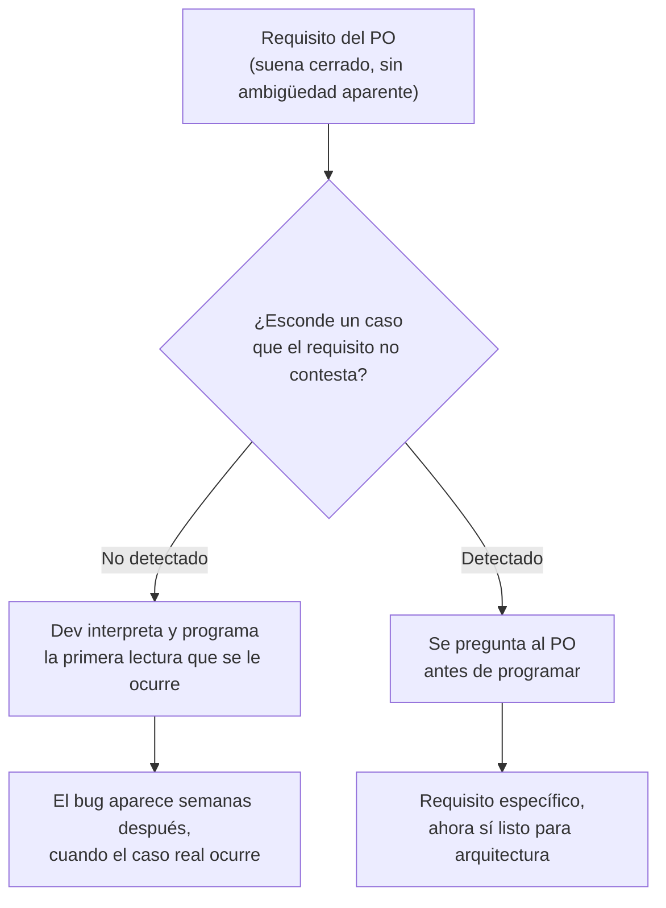

# Red flags en requisitos ambiguos

## 1. Mapa del flujo



El punto del diagrama no es el requisito en sí — es el momento en que se detecta la ambigüedad. Si se detecta antes de programar (`ASK`), cuesta una interrupción de minutos. Si no se detecta (`GUESS`), el costo aparece después, disfrazado de bug.

## 2. Qué es y cómo funciona

Es el conjunto de señales que indican que un requisito, tal como llegó del PO, todavía no está listo para convertirse en arquitectura — porque esconde una ambigüedad que, si no se resuelve antes de programar, se termina resolviendo *por accidente* en el código, con la primera interpretación que se le ocurrió al dev en el momento. Detectar estas señales es tan parte del trabajo técnico como escribir el código en sí.

Un requisito ambiguo no explota en el momento en que se escribe — explota semanas después, cuando el comportamiento "obvio" que se implementó no era el que el PO tenía en mente, o cuando aparece un caso borde que el requisito original nunca contempló porque nadie lo preguntó. La causa raíz casi siempre es la misma: el dev interpretó el requisito en vez de chequear la ambigüedad con el PO *antes* de programar.

Como muestra el diagrama, tener un catálogo de red flags conocidas convierte esto de "me doy cuenta cuando ya es tarde" a "lo detecto en el momento en que leo el pedido" — el checklist de la Sección 5 de este archivo es justamente ese catálogo, aplicado además al código que entrega una IA (que hereda la misma ambigüedad si nadie la resolvió antes del prompt).

## 3. Cómo se ve en distintos contextos

**App de fitness:** el PO pide *"que se pueda cambiar el nombre de un ejercicio en una rutina ya guardada."* Suena trivial — es un campo de texto que se actualiza. La red flag es que el requisito no dice qué pasa con las rutinas ya completadas en el historial que referencian ese ejercicio por nombre: ¿el historial debe mostrar el nombre viejo (foto del momento en que se hizo la rutina) o el nuevo (siempre el actual)? Son dos diseños de modelo distintos — snapshot del nombre en el momento del registro, o resolución en tiempo de lectura contra el ejercicio actual — y el requisito, tal como está escrito, no elige entre los dos.

**App de e-commerce:** el PO pide *"que el usuario pueda cancelar un pedido."* Acá la ambigüedad no está en el modelo sino en el estado: "cancelar" puede significar reembolso automático inmediato, o solo marcar el pedido como cancelado y dejar el reembolso como un proceso manual aparte que corre después. Programar la primera lectura ("cancelar = reembolsar ya") sin preguntar puede disparar dinero real antes de que el equipo de soporte confirme que corresponde.

## 4. Implementación real

Pedido real: *"Que se pueda editar el nombre de un producto dentro de un pedido ya hecho, por si el restaurante lo cambió."*

```kotlin
// Red flag: el requisito no dice qué pasa con pedidos que ya
// referencian ese producto por nombre, ya hechos antes del cambio.

// Interpretación A (la que un dev — o una IA sin este contexto —
// suele asumir sin preguntar): el nombre es solo un campo más.
data class OrderItem(
    val productName: String,
    val quantity: Int,
    val unitPrice: Double
)

fun renameProduct(item: OrderItem, newName: String): OrderItem =
    item.copy(productName = newName)
```

```kotlin
// Pregunta que el requisito NO contesta, y que domain/model.md ya resolvió
// para este repo (ver Sección 2 de ese archivo): OrderItem vive anidado
// dentro de Order como snapshot — no se resuelve por id en tiempo de lectura.
// Eso significa que renombrar el producto "maestro" en el catálogo NO debería
// tocar los OrderItem de pedidos ya hechos — el pedido histórico muestra el
// nombre que tenía en el momento de la compra, como un ticket real.
//
// Si el pedido del PO en realidad quería lo contrario (que TODO pedido,
// pasado o futuro, refleje siempre el nombre actual del producto), eso
// implica cambiar OrderItem de snapshot a referencia por id — un cambio
// de modelo de dominio, no un rename de campo. La ambigüedad decide
// cuál de los dos diseños es correcto, y el requisito tal como llegó
// no lo dice.
```

La red flag acá no es el código — es que "editar el nombre" suena a un campo de texto, pero esconde una decisión ya tomada en otro archivo del propio dominio (`OrderItem` como snapshot) que el requisito podría estar pidiendo revertir sin saberlo.

## 5. Buenas prácticas y errores comunes — qué auditar si te lo entrega la IA

- **¿El requisito usa "y/o" sin aclarar cuál de los dos casos aplica?** El comportamiento real depende de una condición que nadie definió — preguntar: *"¿es un Y o un O? ¿qué pasa si se cumplen ambas condiciones a la vez?"*

- **¿Describe el resultado pero no el caso borde (lista vacía, error de red, cancelación a mitad de camino)?** Si el código que entrega una IA no tiene un `when` exhaustivo o un estado explícito para esos casos, es porque el requisito tampoco los tenía — el hueco se heredó, no se inventó en el código.

- **¿Usa una palabra "obvia" que en realidad tiene más de un significado razonable — "eliminar", "cancelar", "reiniciar"?** Cada significado implica un diseño distinto (soft delete con `status = CANCELLED` que conserva el historial, vs. hard delete que borra el registro de Firestore/DataStore para siempre). Si la IA implementó uno de los dos sin que el requisito lo especificara, hay que confirmar cuál era el pedido real antes de aprobar el PR — revertir un hard delete después no es posible.

- **¿No aclara si el cambio afecta datos ya existentes o solo los nuevos?** Ver el ejemplo de Sección 4: renombrar algo "hacia adelante" y renombrarlo "retroactivamente" son dos migraciones de datos completamente distintas, y el requisito rara vez distingue cuál de las dos pide.

- **¿El requisito asume que existe un único resultado posible (`el jugador con más puntos`, `el pedido más antiguo`) sin contemplar un empate?** Si el código usa `minBy`/`maxBy`/`first()` sobre una condición que puede tener múltiples resultados válidos, el desempate lo está decidiendo el orden interno de una lista — no una regla de negocio real. Confirmar explícitamente qué pasa en ese caso antes de aprobar.