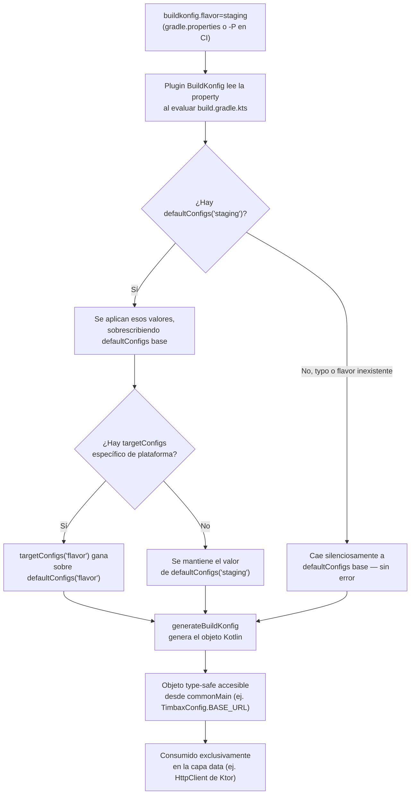

# BuildKonfig Multi-Ambiente

## 1. Mapa del flujo



**Punto clave del diagrama:** la prioridad de merge es `targetConfigs("flavor")` > `targetConfigs` (sin flavor) > `defaultConfigs("flavor")` > `defaultConfigs` (base) — lo más específico por plataforma+flavor siempre gana. Y si el nombre del flavor no matchea ningún `defaultConfigs("nombre")` declarado, **no hay error de compilación**: silenciosamente se usa la base.

---

## 2. Qué es y cómo funciona

BuildKonfig es la librería que ya vimos en `todosobreKMP` (sección Gradle) para manejar variables de entorno de forma type-safe en KMP. Este archivo profundiza específicamente en su uso para **múltiples ambientes** (dev/staging/prod): genera un objeto Kotlin (equivalente al `BuildConfig` de Android, pero multiplataforma) con los valores correspondientes al ambiente activo, accesible desde `commonMain`.

La selección de ambiente se hace con una property de Gradle: `buildkonfig.flavor`, seteada en `gradle.properties` o pasada por línea de comando (`-Pbuildkonfig.flavor=staging`) — **es independiente del flavor de Android Gradle Plugin**, aunque en la práctica se sincronizan a propósito (ver `flavors_y_schemes_por_plataforma.md`).

**El problema que resuelve:** sin esto, la única forma de que el código compartido (`domain`/`data`) sepa contra qué URL pegarle es hardcodear la URL y cambiarla a mano antes de cada build (frágil, propenso a error humano), o duplicar lógica de configuración por plataforma (un `BuildConfig` en Android, un `.xcconfig`/`Info.plist` en iOS) sin fuente única de verdad. BuildKonfig centraliza la definición en un solo lugar (`build.gradle.kts` del módulo compartido) y genera el objeto correspondiente para cada plataforma automáticamente.

**Vigencia en 2026:** BuildKonfig sigue activamente mantenida (última release en junio 2026) y no es solo una opción de la comunidad — la documentación oficial de Android para el nuevo plugin `com.android.kotlin.multiplatform.library` la recomienda explícitamente como alternativa, precisamente porque ese plugin (single-variant) no genera `BuildConfig` propio para KMP.

---

## 3. Cómo se ve en distintos contextos

**App de fitness con feature flags por ambiente:** además de la URL del backend, BuildKonfig es el lugar natural para exponer flags booleanos (`ENABLE_BETA_WORKOUTS = true` en dev, `false` en prod) que no ameritan un sistema de feature flags remoto completo. Es configuración fija en compile-time, no algo que un PO vaya a togglear en producción sin recompilar.

**App de e-commerce con distintas API keys de analítica por ambiente:** un caso típico de `targetConfigs` combinado con `defaultConfigs("flavor")` — el mismo ambiente `staging` puede necesitar una API key de Android distinta de la de iOS (dos proyectos separados en la consola del proveedor de analítica), mientras que la URL del backend de staging es la misma para ambas plataformas. Ahí es donde la jerarquía de prioridad de merge (plataforma+flavor por sobre solo flavor) deja de ser un detalle técnico y se vuelve necesaria.

---

## 4. Implementación real

**Pedido del PO:** *"Quiero que el backend de pedidos apunte a un servidor de pruebas cuando compilamos staging, y al backend real en producción — sin que nadie tenga que acordarse de cambiar una URL a mano antes de cada build."*

```kotlin
// shared/build.gradle.kts
import com.codingfeline.buildkonfig.compiler.FieldSpec.Type.STRING

buildkonfig {
    packageName = "com.example.orders.shared"
    objectName = "OrdersConfig"

    // defaultConfigs es obligatorio: valores base si no hay flavor activo
    defaultConfigs {
        buildConfigField(STRING, "BASE_URL", "https://dev.orders-api.com")
    }

    // defaultConfigs("nombre") sobrescribe los valores base cuando
    // buildkonfig.flavor coincide con "nombre"
    defaultConfigs("staging") {
        buildConfigField(STRING, "BASE_URL", "https://staging.orders-api.com")
    }

    defaultConfigs("prod") {
        buildConfigField(STRING, "BASE_URL", "https://api.orders-app.com")
    }
}
```

```properties
# gradle.properties (o pasado por -P en CI)
buildkonfig.flavor=staging
```

```kotlin
// uso desde código compartido, ya type-safe — capa data exclusivamente
class OrdersHttpClientProvider {
    fun baseUrl(): String = OrdersConfig.BASE_URL
}
```

El `GetOrderHistoryUseCase` y el `OrdersViewModel` nunca ven `OrdersConfig` directamente — reciben datos ya resueltos a través del `OrderRepository`. Es el `RepositoryImpl`/factory de Ktor, en la capa `data`, el único punto que necesita saber si `BASE_URL` es de staging o de prod.

---

## 5. Buenas prácticas y errores comunes — checklist de auditoría

Si una IA (o un compañero) escribió o modificó la configuración de BuildKonfig, revisar:

- **¿`defaultConfigs` (base, sin nombre) está declarado?** Es obligatorio — si falta, el plugin no genera código.
- **¿El nombre del flavor en `defaultConfigs("staging")` matchea exactamente** el valor de `buildkonfig.flavor` que se usa en CI/local? Un typo (`"stagin"`) no tira error — cae silenciosamente al `defaultConfigs` base. Vale la pena revisar el archivo generado (`generateBuildKonfig` lo deja inspeccionable) después de cambiar el flavor activo.
- **¿`buildkonfig.flavor` se fija *antes* de que Gradle evalúe el bloque `buildkonfig { }`?** Si se setea con lógica condicional ubicada después de ese bloque en el mismo `build.gradle.kts`, el plugin ya leyó el valor por default — la property tiene que existir en `gradle.properties`, pasarse por `-P`, o setearse vía `project.extra.set("buildkonfig.flavor", ...)` antes de la evaluación del bloque.
- **¿Hay algún valor sensible (API key real, no solo config) commiteado directamente en el `build.gradle.kts`?** BuildKonfig es transporte type-safe, no gestión de secretos — el valor real nunca debería estar en el repo; se inyecta desde `gradle.properties` local (gitignored) o secrets de CI (ver `secretos_gitignore.md`).
- **¿Se está usando BuildKonfig para algo que necesita cambiar en runtime sin recompilar?** Eso es un error de diseño — BuildKonfig genera valores fijos en compile-time; para eso existe Remote Config o un endpoint de configuración remota, no este mecanismo.
- **¿El objeto generado se consume solo desde la capa `data`?** Si aparece una referencia a `OrdersConfig` (o el nombre de objeto que se use) dentro de un `UseCase` o un `ViewModel`, es una violación de la Dependency Rule — domain y presentation no deberían saber en qué ambiente están corriendo.