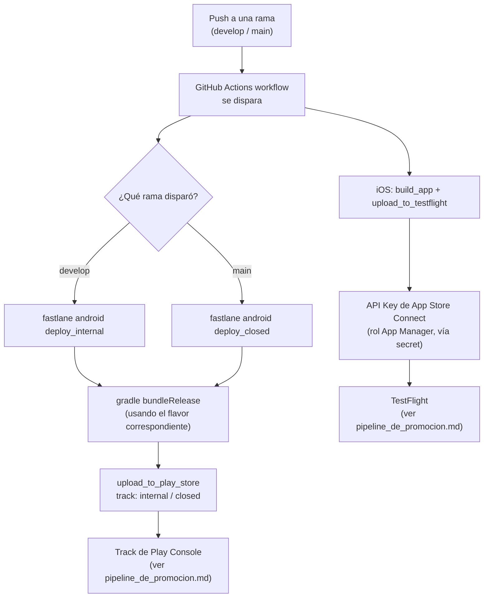

# CI/CD Multi-Ambiente

## 1. Mapa del flujo



**Punto clave del diagrama:** el CI/CD no reemplaza al pipeline de promoción — lo alimenta. Lo que automatiza es el primer salto (compilar + firmar + subir al track/grupo inicial); promover de ahí en adelante entre tracks es una decisión que puede quedar manual o semi-automática, según el apetito de riesgo del equipo.

---

## 2. Qué es y cómo funciona

Es extender el CI básico que ya vimos en `github_actions_cicd.md` (compilar, testear, lint en cada PR) para que, además, **automatice el deploy** hacia los distintos ambientes/tracks (internal, closed, TestFlight, producción) según qué rama o evento disparó el workflow — cerrando el círculo entre `flavors_y_schemes_por_plataforma.md`, `buildkonfig_multi_ambiente.md` y `pipeline_de_promocion.md`.

La herramienta estándar de la industria para orquestar el build+firma+upload en ambas plataformas es **Fastlane** (Ruby), invocada desde GitHub Actions. Fastlane abstrae comandos específicos de cada store (`upload_to_play_store`, `upload_to_testflight`) detrás de "lanes" reutilizables.

**El problema que resuelve:** sin esto, cada release depende de que una persona, a mano, en su máquina, compile con la configuración correcta, firme con el keystore/certificado correcto, y suba manualmente a Play Console/App Store Connect — un proceso lento, propenso a error humano (subir el flavor equivocado, olvidar incrementar el `versionCode`), y que no queda documentado como código versionado.

---

## 3. Cómo se ve en distintos contextos

**App de fitness con releases semanales predecibles:** el equipo mergea a `develop` varias veces por semana y a `main` solo los viernes — el workflow dispara `deploy_internal` en cada merge a `develop` (feedback rápido, bajo riesgo, sin revisión de la store) y `deploy_closed` solo en el merge semanal a `main`, dándole al equipo una cadencia predecible de qué build está en qué track sin necesidad de coordinarlo manualmente.

**App de e-commerce con hotfixes frecuentes:** acá el workflow necesita una rama adicional (`hotfix/*`) con su propio lane de Fastlane que salta directo a `deploy_closed` sin pasar por `internal`, porque el equipo ya tiene un grupo de testers de confianza validando cambios urgentes — una variación del mismo patrón base, adaptada a un ritmo de release distinto.

---

## 4. Implementación real

**Pedido del PO:** *"Cuando mergeamos a develop quiero que la build llegue sola al grupo de testing interno, y cuando mergeamos a main quiero que llegue automáticamente al grupo de testers reales que están validando pedidos, sin que nadie tenga que subir nada a mano."*

**Workflow que dispara distinto ambiente según la rama** (`.github/workflows/release.yml`):

```yaml
name: Release

on:
  push:
    branches: [develop, main]

jobs:
  deploy-android:
    runs-on: ubuntu-latest
    steps:
      - uses: actions/checkout@v7
      - uses: actions/setup-java@v4
        with:
          distribution: 'temurin'
          java-version: '17'

      # develop -> sube a internal testing; main -> sube a closed testing
      - name: Build y deploy Android
        env:
          KEYSTORE_PASSWORD: ${{ secrets.KEYSTORE_PASSWORD }}
          PLAY_SERVICE_ACCOUNT_JSON: ${{ secrets.PLAY_SERVICE_ACCOUNT_JSON }}
        run: |
          if [ "${{ github.ref_name }}" = "develop" ]; then
            bundle exec fastlane android deploy_internal
          else
            bundle exec fastlane android deploy_closed
          fi
```

**Fastlane lane (`android/fastlane/Fastfile`)** que sube el `.aab` a un track específico:

```ruby
platform :android do
  desc "Deploy a internal testing"
  lane :deploy_internal do
    gradle(task: "bundleRelease")
    upload_to_play_store(
      track: "internal", # también puede ser: closed, open, production
      aab: "app/build/outputs/bundle/release/app-release.aab",
      release_status: "completed"
    )
  end

  desc "Deploy a closed testing (testers reales de Orders)"
  lane :deploy_closed do
    gradle(task: "bundleRelease")
    upload_to_play_store(
      track: "closed",
      aab: "app/build/outputs/bundle/release/app-release.aab",
      release_status: "completed"
    )
  end
end
```

Para iOS, el equivalente sube a TestFlight vía `upload_to_testflight`, usando una API Key de App Store Connect (rol *App Manager*) almacenada como secret, no un usuario/contraseña.

---

## 5. Buenas prácticas y errores comunes — checklist de auditoría

Si una IA (o un compañero) escribió o modificó el workflow de CI/CD, revisar:

- **¿El `versionCode`/build number se incrementa automáticamente?** Si cada corrida de CI usa el mismo valor hardcodeado (o el que quedó del último commit), la segunda subida falla porque Play Console exige un `versionCode` estrictamente mayor al anterior. Debe derivarse de algo que cambie solo — `${{ github.run_number }}` de GitHub Actions, o un contador gestionado por Fastlane — nunca de un valor fijo en `build.gradle.kts` que alguien tiene que acordarse de subir a mano.
- **¿Los secretos (keystore, certificados, API keys de las stores) están commiteados en algún lado**, aunque sea en el propio workflow YAML? Siempre deben inyectarse vía GitHub Secrets en runtime (ver `secretos_gitignore.md`), nunca versionados.
- **¿El flavor/scheme que compila el CI es el correcto para el track de destino?** Si `develop` dispara `deploy_internal` pero el `gradle(task:)` no especifica el flavor `staging`, se podría estar subiendo una build con configuración de `dev` a un track pensado para testers reales.
- **¿Se está automatizando la promoción de `closed` a `production` sin un humano en el loop?** Es una decisión de apetito de riesgo del equipo, no un default correcto o incorrecto — pero si el workflow lo hace sin un trigger manual (`workflow_dispatch`) explícito, vale la pena confirmar que fue una decisión consciente y no un descuido.
- **¿El proyecto realmente necesita deploy automatizado ya, o el CI básico (test+lint) todavía alcanza?** Para un proyecto chico en etapa muy temprana, forzar todo el pipeline de deploy automatizado antes de tener un ritmo de releases que lo justifique agrega complejidad de mantenimiento sin beneficio real todavía.