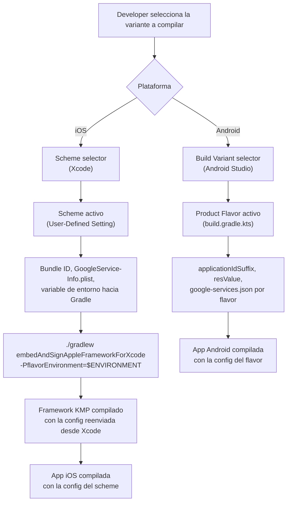

# Flavors y Schemes por Plataforma

## 1. Mapa del flujo



**Punto clave del diagrama:** son dos caminos independientes que no se sincronizan solos. Gradle no sabe qué scheme eligió Xcode, y Xcode no sabe qué flavor existe en Gradle — el único punto de contacto es la variable de entorno que Xcode reenvía manualmente como property de Gradle.

---

## 2. Qué es y cómo funciona

Son los mecanismos nativos de cada plataforma para manejar **múltiples variantes de la misma app** (dev/staging/prod, free/premium, etc.) sin duplicar el proyecto entero.

- **Android → Product Flavors** (Gradle): se declaran en el `build.gradle.kts` del módulo `application`, agrupados en `flavorDimensions`. Cada flavor puede tener su propio `applicationIdSuffix`, recursos, y hasta código fuente propio (`src/dev/kotlin/...`).
- **iOS → Xcode Schemes**: un scheme define qué target, qué configuración de build (Debug/Release) y qué variables de entorno se usan al compilar/correr. No son lo mismo que los *Build Configurations* de Xcode, aunque suelen ir de la mano (un scheme "Staging" típicamente apunta a una configuración "Staging").

**El problema que resuelven:** sin esto, tener una versión "dev" (backend de pruebas) y una "prod" (backend real) obliga a comentar/descomentar URLs a mano antes de cada build —con el riesgo real de subir a producción apuntando a staging— o a mantener dos proyectos separados. Flavors y schemes permiten declarar esas variantes una sola vez y elegir cuál compilar desde un selector, sin tocar código a mano.

**Límite importante en 2026:** si tu módulo `shared`/`composeApp` usa el plugin dedicado `com.android.kotlin.multiplatform.library` (el oficial para librerías KMP puras, distinto de `com.android.application`), ese plugin usa una **arquitectura single-variant** y confirmadamente **no soporta build types ni product flavors** — es una limitación intencional de diseño, no un bug ni algo que vaya a cambiar en el corto plazo. La documentación oficial de Android para este plugin recomienda usar BuildKonfig (u otra solución de la comunidad) precisamente porque el plugin no cubre este caso.

---

## 3. Cómo se ve en distintos contextos

**App de fitness con planes free/premium:** acá el eje de los flavors no es el ambiente sino el modelo de negocio. Un flavor `free` y uno `premium` pueden compartir el 95% del código, pero el premium habilita módulos de código real (analítica avanzada, exportación de datos) que el free ni siquiera compila. Cuando la diferencia deja de ser solo configuración (una URL, un ícono) y pasa a ser lógica de negocio completa, los flavors empiezan a mostrar sus límites — cada flavor nuevo multiplica la matriz de builds a testear, y conviene evaluar separar en módulos Gradle con interfaces compartidas en vez de forzarlo todo dentro de flavors.

**App de e-commerce con múltiples marcas white-label:** un caso distinto donde sí conviene explotar flavors a fondo — cada flavor representa una marca del mismo negocio (mismo backend, mismo flujo de compra, distinto branding: ícono, paleta de colores, nombre). Acá el `resValue` y el `applicationIdSuffix` hacen exactamente lo que están pensados para hacer: parametrizar apariencia y distribución sin tocar una línea de lógica de negocio compartida.

---

## 4. Implementación real

**Pedido del PO:** *"Necesito poder compilar una versión de staging de la app que apunte a un backend de pruebas de pedidos, separada de producción, y poder tener las dos instaladas en el mismo dispositivo para comparar comportamiento antes de un release."*

**Android — declarando los flavors en el módulo de la app:**

```kotlin
// composeApp/build.gradle.kts (módulo con target application, no el módulo shared puro)
android {
    flavorDimensions += "environment"
    productFlavors {
        create("dev") {
            dimension = "environment"
            applicationIdSuffix = ".dev"
            resValue("string", "app_name", "Orders Dev")
        }
        create("staging") {
            dimension = "environment"
            applicationIdSuffix = ".staging"
            resValue("string", "app_name", "Orders Staging")
        }
        create("prod") {
            dimension = "environment"
            resValue("string", "app_name", "Orders")
        }
    }
}
```

Con `applicationIdSuffix` distinto por flavor, `dev`, `staging` y `prod` generan tres `applicationId` diferentes — eso es lo que permite tener las tres instaladas a la vez en el mismo dispositivo, cada una como una app separada a nivel del sistema operativo.

**iOS — reenviando el scheme elegido hacia Gradle:**

```bash
# Build Phase "Compile Kotlin Framework" del proyecto Xcode.
# $ENVIRONMENT viene de un User-Defined Setting del scheme activo (dev/staging/prod).
./gradlew :composeApp:embedAndSignAppleFrameworkForXcode -PflavorEnvironment=$ENVIRONMENT
```

`-PflavorEnvironment` es una property de Gradle que el `build.gradle.kts` compartido puede leer al momento de configurar el build — típicamente para decidir qué valor de BuildKonfig usar (ver `buildkonfig_multi_ambiente.md`). En Xcode, esto implica crear tres schemes (`Orders Dev`, `Orders Staging`, `Orders Prod`), cada uno con su propio Bundle ID y su propio `GoogleService-Info.plist`, del mismo modo que el flavor `staging` de Android apuntaría a un proyecto Firebase de pruebas distinto (vía su propio `google-services.json`).

**Capa compartida:** ni `domain` ni `presentation` necesitan saber nada de esto. El `OrdersViewModel` o el `GetOrderHistoryUseCase` siguen recibiendo la `baseUrl` ya resuelta — no les importa si viene del flavor `staging` o `prod`, solo la capa `data` (al construir el cliente HTTP) necesita esa información. Esto respeta la Dependency Rule intacta.

---

## 5. Buenas prácticas y errores comunes — checklist de auditoría

Si una IA (o un compañero) escribió la configuración de flavors/schemes, revisar:

- **¿El módulo correcto tiene el flavor?** Product flavors solo aplican al plugin `com.android.application` (o `com.android.library` clásico). Si aparece un bloque `productFlavors` dentro de un módulo que usa `com.android.kotlin.multiplatform.library`, no va a compilar — la corrección no es "forzar" el flavor ahí, sino inyectar la variante como property de Gradle leída en tiempo de configuración.
- **¿Cada flavor tiene un `applicationIdSuffix` distinto** si el objetivo es coexistencia en el mismo dispositivo? Sin esto, instalar `staging` sobre `dev` simplemente sobrescribe la app anterior — un error silencioso y fácil de pasar por alto en review.
- **¿Hay alguna URL o config hardcodeada que bypasea el sistema de flavors?** Si el `RepositoryImpl` o el cliente HTTP tienen una URL fija en vez de leerla de la config inyectada por ambiente, todo el mecanismo de flavors se vuelve cosmético.
- **¿El nombre del flavor de Android y el nombre del scheme de iOS están documentados como correspondientes** (aunque Gradle y Xcode no los sincronicen automáticamente)? Un typo en uno de los dos lados no tira error de compilación, simplemente ese ambiente nunca hace match.
- **¿Se está intentando resolver con flavors algo que en realidad es lógica de negocio distinta** (no solo configuración)? Si un "flavor" termina condicionando ramas enteras de código de dominio, es señal de que el diseño correcto es modularización, no flavors.
- **¿El `google-services.json`/`GoogleService-Info.plist` corresponde al flavor/scheme correcto?** Un archivo de Firebase de producción copiado por error al flavor de staging es un error de seguridad y de datos, no solo de configuración.