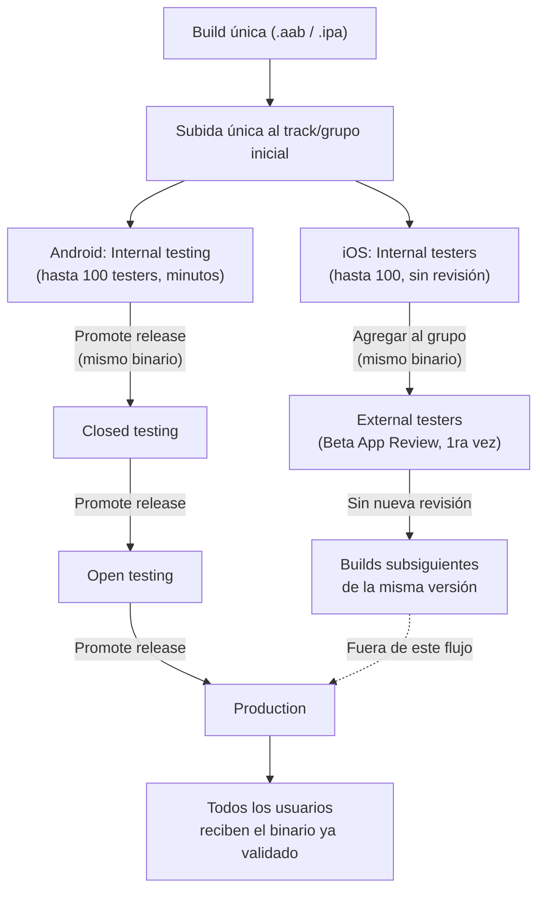

# Pipeline de Promoción

## 1. Mapa del flujo



**Punto clave del diagrama:** en ningún punto de este flujo se vuelve a compilar ni a resubir el artefacto. Lo único que cambia entre pasos es el público que lo recibe — el binario que llega a producción es bit-a-bit el mismo que ya pasó por las etapas previas.

---

## 2. Qué es y cómo funciona

Es el proceso mediante el cual **una misma build** avanza de forma progresiva por distintos ambientes de distribución (internal → closed/alpha → open/beta → producción) sin recompilar ni resubir un nuevo artefacto en cada etapa. La idea central: el binario que finalmente llega a producción es *exactamente* el mismo que ya fue probado en las etapas previas — solo cambia el público que lo recibe.

En **Android (Google Play Console)**, esto se llama literalmente "**Promote release**": tomás un release que ya está en un track (ej: internal testing) y lo promovés a otro track (closed testing, open testing, production) sin volver a subir el `.aab`. En **iOS (TestFlight)**, el equivalente es agregar el mismo build ya subido a un nuevo grupo de testers (internal → external), en vez de generar un nuevo build.

**El problema que resuelve:** sin un pipeline de promoción explícito, es común caer en *"probamos la build X en staging, pero para producción compilamos de nuevo con otra configuración"* — lo cual reintroduce exactamente el riesgo que se quería evitar: una build de producción que nadie probó realmente, porque el binario que se testeó no es el mismo que se publicó. El pipeline de promoción garantiza trazabilidad: el artefacto que están usando los testers de closed testing es el mismo que, si se aprueba, van a recibir todos los usuarios de producción.

**Diferencia de mecánica entre plataformas:** en Android, la promoción es un botón que mueve el release entre tracks. En iOS, no hay un botón que "mueva" el binario — la build ya subida simplemente se agrega a un nuevo grupo de testers, y Apple revisa esa build una sola vez por versión (Beta App Review); builds subsiguientes de la misma versión no vuelven a pasar por revisión completa.

---

## 3. Cómo se ve en distintos contextos

**App de fitness con lanzamiento de una feature de nutrición:** el equipo sube el `.aab` con la nueva pantalla de tracking de comidas al track `internal`, lo valida con el equipo de QA interno durante un día, y recién ahí lo promueve a `closed testing` con un grupo de 15 usuarios reales que ya usan la app — sin recompilar nada entre esos dos pasos, aunque haya pasado una semana entre uno y otro.

**App de e-commerce con un cambio de checkout de alto riesgo:** acá el pipeline de promoción se vuelve más conservador — el equipo decide no saltear ninguna etapa (ni siquiera `open testing`) porque un bug en el flujo de pago tiene impacto financiero directo. La build pasa varios días en cada track, con métricas de conversión monitoreadas activamente antes de promover al siguiente escalón.

---

## 4. Implementación real

**Pedido del PO:** *"Quiero lanzar la nueva pantalla de historial de pedidos primero a un grupo chico de usuarios reales antes de que la vea todo el mundo, y necesito estar seguro de que lo que prueben esos usuarios es exactamente lo que después va a llegar a producción."*

**Google Play Console — tracks disponibles y su propósito:**

```text
Internal testing   → hasta 100 testers, sin revisión de Google, disponible en minutos
Closed testing      → grupo elegido por vos (listas de email), revisión de Google la primera vez
Open testing         → testers ilimitados o con tope, cualquiera puede sumarse desde la store
Production          → todos los usuarios de Play Store, en los países configurados
```

Flujo concreto para este pedido: subir el `.aab` con la nueva pantalla de historial una sola vez al track `internal`. Una vez validado internamente, usar el botón **"Promote release"** para moverlo a `closed`, con la lista de emails del grupo chico de usuarios reales que pidió el PO — sin volver a subir el archivo ni cambiar el `versionCode`. Recién después de esa validación, promoción a `open` o directo a `production`, según el apetito de riesgo del equipo.

**TestFlight (iOS) — grupos de testers:**

```text
Internal testers  → hasta 100, con cuenta en App Store Connect del equipo, sin revisión
External testers  → hasta 10.000, requieren Beta App Review (solo la primera build de cada versión)
```

Acá la "promoción" es distinta en mecánica: no hay un botón que mueva el binario, sino que se **agrega el mismo build ya subido** a un nuevo grupo (de Internal a un grupo External que representa a esos mismos usuarios reales) — Apple revisa esa build una sola vez por versión.

---

## 5. Buenas prácticas y errores comunes — checklist de auditoría

Si una IA (o un compañero) definió o modificó el proceso de promoción, revisar:

- **¿Se está compilando de nuevo entre etapas?** Si el proceso descrito incluye "recompilar para producción" en algún punto, ya se rompió la garantía central del pipeline de promoción — el binario que llegue a producción dejó de ser el mismo que se testeó.
- **¿Cambia algún valor de BuildKonfig entre ambientes de testing y producción?** Si `BASE_URL` u otro valor cambia entre `closed` y `production`, en sentido estricto ya no es "la misma build" — evaluar si ese cambio realmente necesita variar por ambiente, o si conviene testear contra el mismo backend en todas las etapas de este pipeline.
- **¿El plan de lanzamiento contempla el tiempo de revisión de las stores?** La promoción entre tracks no es instantánea — la revisión de Google (la primera vez que un release entra a un track de testing) y la Beta App Review de Apple (la primera build de cada versión nueva, que en 2026 puede tardar de horas a varios días según la cola) son tiempo real de calendario, no un paso automático.
- **¿Se está asumiendo que "promover" en Play Console reemplaza instantáneamente el track de destino?** Si el track de producción ya tenía un rollout activo con un `versionCode` mayor, Google puede marcar la relación entre tracks como "shadowed" — hay reglas de fallback entre tracks que determinan qué build recibe cada usuario, no es un simple "reemplazar y listo". Ante un reporte de "algunos usuarios siguen viendo la versión vieja", revisar el estado de fallback antes de asumir que algo está roto.
- **¿El grupo de testers de `closed testing`/`External testers` corresponde realmente a los usuarios que el PO pidió validar**, o es un grupo genérico sin relación con el público objetivo de la feature?