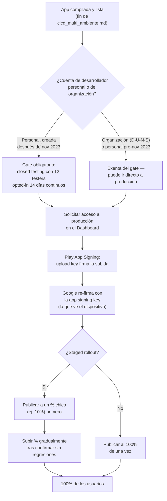

# Publicación en Play Console

## 1. Mapa del flujo



**Punto clave del diagrama:** hay dos verificaciones independientes antes de que la app llegue a un usuario real — el gate de testers (si aplica a tu tipo de cuenta) y la firma (que siempre aplica, sin excepción). Son mecanismos distintos que resuelven problemas distintos: uno es sobre validación humana, el otro es sobre identidad criptográfica del binario.

---

## 2. Qué es y cómo funciona

Este archivo cubre la mecánica concreta de publicar en Google Play que todavía no está en `pipeline_de_promocion.md` (que documenta los tracks y la promoción entre ellos) ni en `cicd_multi_ambiente.md` (que documenta automatizar el upload). Entran tres piezas:

- **Play App Signing** — el sistema obligatorio hoy para apps nuevas, donde Google gestiona la clave final que firma lo que llega a cada dispositivo (`app signing key`), mientras el desarrollador gestiona una clave propia (`upload key`) que solo sirve para autenticar sus subidas.
- **Staged rollout** — la posibilidad de publicar una release a producción para un porcentaje chico de usuarios primero, y subirlo gradualmente en vez de a todos de una.
- **El gate de testers para cuentas personales nuevas** — desde noviembre de 2023, las cuentas de desarrollador **personales** creadas después de esa fecha necesitan completar un test cerrado con un mínimo de testers activos durante un período continuo antes de poder siquiera solicitar acceso a producción. El número exacto es **12 testers opted-in durante 14 días continuos** (bajó de 20 a 12 en diciembre de 2024) — no es opcional, es un gate real de la plataforma, verificado vigente en 2026.

**El problema que resuelve:** sin entender esta mecánica, un desarrollador que ya tiene la app funcionando y compilada se encuentra con bloqueos que no tienen que ver con su código: Play Console rechaza la solicitud de acceso a producción sin explicar bien por qué, se pierde una `upload key` sin saber que es recuperable, o se publica una versión con un bug crítico al 100% de los usuarios de una sola vez cuando había una opción de mitigar ese riesgo con un rollout gradual. Este archivo cierra la brecha entre "tengo el `.aab` listo" (donde termina `cicd_multi_ambiente.md`) y "la app está de verdad disponible y llegando de forma segura a usuarios reales".

---

## 3. Cómo se ve en distintos contextos

**App de fitness publicada por un desarrollador independiente con cuenta personal nueva:** este es el caso donde el gate de los 12 testers golpea de lleno — antes de poder pedir acceso a producción, hace falta reclutar un grupo real (compañeros de gimnasio, comunidad de beta testers) que mantenga la app instalada y activa 14 días corridos en `closed testing`, no alcanza con `internal`. Es un paso de calendario que conviene planificar con semanas de anticipación, no algo que se resuelve el día antes del lanzamiento.

**App de e-commerce publicada por una empresa con cuenta de organización verificada (D-U-N-S):** acá el gate de testers no aplica — el equipo puede ir de `internal testing` directo a solicitar producción sin el paso obligatorio de `closed testing` con mínimo de testers. La verificación D-U-N-S es más pesada de tramitar (2-4 semanas, documentación de la empresa), pero una vez hecha, el resto del ciclo de publicación es más corto.

---

## 4. Implementación real

**Pedido del PO:** *"Quiero publicar la actualización del historial de pedidos, pero no de golpe a todos los usuarios — arrancá con una porción chica y si no hay problemas la vamos subiendo."*

```text
Play App Signing — dos claves, dos responsabilidades distintas:

Upload key (la generás y guardás vos):
  - Firma el .aab ANTES de subirlo a Play Console
  - Le prueba a Google que la subida viene de tu cuenta
  - Si se pierde/compromete: se puede resetear desde Play Console SIN
    romper las actualizaciones existentes de la app (justamente porque
    no es la clave que ven los dispositivos finales)

App signing key (la genera y gestiona Google):
  - Firma el APK final que efectivamente llega a cada dispositivo
  - Es la identidad real y permanente de la app ante Android
  - Nunca la ves ni la manejás vos directamente
```

```ruby
# Fastlane — publicar con rollout gradual en vez de al 100% de una vez
lane :deploy_production_gradual do
  gradle(task: "bundleRelease")
  upload_to_play_store(
    track: "production",
    aab: "app/build/outputs/bundle/release/app-release.aab",
    rollout: "0.10" # 10% de los usuarios reciben esta versión primero
  )
end
```

Subir el porcentaje (`0.10` → `0.50` → `1.0`) es un paso deliberado posterior, típicamente disparado a mano una vez confirmado que no hay regresiones en las métricas de la nueva pantalla de historial — no es algo que conviene automatizar sin un humano mirando esas métricas primero.

---

## 5. Buenas prácticas y errores comunes — checklist de auditoría

Si una IA (o un compañero) definió el proceso de publicación, revisar:

- **¿Se verificó el tipo de cuenta de desarrollador antes de planificar el calendario de lanzamiento?** Asumir que "subo a internal, pruebo un par de días, y promuevo a producción" sin chequear si la cuenta está sujeta al gate de los 12 testers es el error más común — el resultado es enterarse del requisito recién cuando Play Console rechaza la solicitud, perdiendo semanas de calendario evitables.
- **¿El `internal testing` se está contando como parte del requisito de 14 días?** No cuenta — el gate exige específicamente `closed testing`, sin excepción, independientemente de cuántos testers pasaron por `internal`.
- **¿Un release con cambios de código reales se está publicando al 100% directo?** Para cualquier release con riesgo real de romper algo, el staged rollout (empezar en 1-10%) permite detectar una regresión afectando a una fracción mínima de usuarios en vez de a todos a la vez. Publicar al 100% directo solo tiene sentido para cambios de contenido/configuración ya validados en testing, sin riesgo real.
- **¿Se está tratando la pérdida de la `upload key` como una catástrofe?** No lo es — es un trámite de reseteo dentro de Play Console, justamente porque no es la clave que firma lo que ven los usuarios finales. Confundir upload key con app signing key en la documentación interna del equipo puede generar pánico innecesario ante un evento manejable.
- **¿El requisito de testers se está tratando como algo que se hereda entre apps?** Es un requisito por **app**, no por cuenta — testers que ya validaron una app anterior no heredan el progreso en una app nueva del mismo desarrollador.

---

## 6. Profundización: Play App Signing, las dos claves

El punto que más confusión genera es asumir que "perder la clave de firma" siempre es una catástrofe irrecuperable — eso era cierto en el modelo viejo (autofirmar todo vos), pero Play App Signing lo cambió estructuralmente al separar las dos responsabilidades:

**Antes de Play App Signing (modelo legacy):** una sola clave hacía las dos cosas — autenticaba tus subidas y firmaba lo que llegaba a los dispositivos. Perder esa clave significaba, literalmente, no poder publicar más actualizaciones de esa app nunca más, porque no había forma de que un nuevo APK firmado con otra clave pasara la validación de "es la misma app" en los dispositivos ya instalados.

**Con Play App Signing (el modelo actual, obligatorio para apps nuevas):**

1. Generás y guardás una **upload key**. Esta clave solo prueba, ante Google, que la subida viene de tu cuenta — es el equivalente a una firma de "remitente verificado" en un sobre.
2. Google, al recibir el `.aab` firmado con tu upload key, lo **re-firma internamente con la app signing key** — la clave que sí ven los dispositivos finales, y que Google custodia sin que vos la manejes directamente.
3. Si tu upload key se pierde o se compromete, el flujo de recuperación es: pedís un reset desde Play Console, Google verifica tu identidad como dueño de la cuenta, y te emite (o generás) una upload key nueva. Las actualizaciones futuras, firmadas con la key nueva, siguen re-firmándose con la misma app signing key de siempre — los dispositivos de tus usuarios no notan la diferencia, porque la identidad real de la app ante Android nunca cambió.

El trade-off real no es "seguridad vs. comodidad" — es que le das a Google la custodia de la clave que de verdad importa (la que no podés recuperar si la perdés vos mismo), a cambio de que la clave que sí manejás vos (la upload key) deje de ser un punto único de fallo catastrófico. Es, en términos de auditoría, la razón concreta por la que hoy "perdí mi keystore de firma" dejó de ser una historia de terror para desarrolladores Android — siempre que la app se haya publicado bajo este modelo desde el principio.