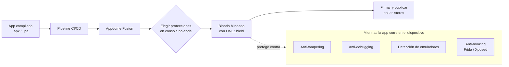

# Appdome y app shielding (RASP)

## 1. Mapa del flujo



## 2. Qué es y cómo funciona

**RASP (Runtime Application Self-Protection)** es la categoría de seguridad que protege una app *mientras corre*, detectando y reaccionando a ataques en tiempo real — a diferencia de defensas "estáticas" (revisar el código antes de publicar). **Appdome** es una plataforma **no-code** que se engancha al pipeline de CI/CD y le inyecta estas protecciones al binario ya compilado, sin que el equipo escriba código de seguridad ni integre un SDK propio: usa tecnología propia (Fusion) para inyectar capas de seguridad directamente en los binarios compilados a través del pipeline.

Su producto RASP se llama **ONEShield**: defiende contra reversing dinámico, tampering, debugging, uso de emuladores, y hooking frameworks como Frida y Xposed — opera sin integración de código ni SDK. Un dato técnico concreto que se mantiene vigente en 2026: **ONEShield solo soporta arquitecturas ARM de 64 bits**, no x86 — esto es intencional, porque x86 es la arquitectura típica de emuladores/simuladores, y bloquearla es parte de la defensa contra ese vector de ataque.

**El problema que resuelve:** Play Integrity (archivo anterior) da un **veredicto puntual** — "en este momento, este dispositivo/binario parece genuino". Pero no hace nada activo si un atacante engancha un debugger a la app corriendo, o usa Frida para hookear funciones en runtime y modificar el comportamiento *mientras el usuario la usa*. RASP cubre esa brecha: agrega defensas activas como anti-tampering, anti-reversing, anti-debugging, ofuscación de código, y prevención de jailbreak/root, corriendo en el dispositivo mismo. El problema de fondo que resuelve Appdome específicamente es de **costo de ingeniería**: implementar estas protecciones a mano es trabajo especializado y constante, porque cada nueva técnica de ataque requiere actualizar la defensa.

## 3. Cómo se ve en distintos contextos

En una **app de fitness** con datos de salud del usuario pero sin economía competitiva ni pagos in-app, RASP suele quedar fuera de alcance en una primera etapa: el "peor caso" de un binario tampereado (alguien viendo sus propios datos de entrenamiento modificados localmente) no representa un riesgo de negocio que justifique el costo de una herramienta enterprise sin tier gratuito.

En una **app de e-commerce** con pagos integrados y programas de fidelidad canjeables, el cálculo cambia: ahí el shielding runtime protege contra que un atacante hookee la lógica de checkout en memoria para alterar precios o montos antes de que el request salga al backend — un escenario de fraude con impacto económico directo que sí justifica evaluar RASP.

## 4. Implementación real

**Pedido del PO:** *"Antes de publicar el release a producción, quiero que el binario pase por una capa de shielding automática dentro del pipeline, sin que el equipo tenga que mantener código de ofuscación a mano."*

Esto **no es código Kotlin** — es configuración de pipeline. El punto central del "no-code" es que no hay snippet de Kotlin/Swift que mostrar: se sube el `.apk`/`.ipa` ya compilado a Appdome (o se integra como paso de CI/CD), se eligen las protecciones desde una consola, y Appdome devuelve el binario ya blindado.

```yaml
# .github/workflows/release.yml — paso conceptual, no oficial
# se integra DESPUÉS del build normal, ANTES de publicar a las stores
- name: Build release APK
  run: ./gradlew assembleRelease

- name: Shield with Appdome
  uses: appdome/appdome-github-action@v1  # acción ilustrativa
  with:
    app_path: app/build/outputs/apk/release/app-release.apk
    fusion_set: ${{ secrets.APPDOME_FUSION_SET_ID }}
    api_key: ${{ secrets.APPDOME_API_KEY }}
  # output: app-release-shielded.apk, listo para firmar y publicar
```

La app que se construye para Appdome puede armarse con cualquier herramienta nativa — Xcode, Android Studio, u otros frameworks cross-platform (Maui, Xamarin, Cordova, React Native, Flutter). Compose Multiplatform genera un binario nativo estándar (APK/AAB para Android, framework para iOS embebido en un proyecto Xcode), así que encaja en esa misma categoría de "cualquier binario nativo" sin requerir soporte explícito de KMP.

## 5. Buenas prácticas y errores comunes

Checklist para auditar si esta decisión (usar o no RASP) la tomó una IA o un compañero apurado:

- **¿El dominio de la app justifica el costo enterprise de Appdome?** Es pricing custom sin tier gratuito ni plan self-serve — tiene sentido en banca, fintech, salud, o cualquier contexto con requisito de compliance/auditoría explícito. Para una app de consumo sin datos sensibles ni economía en juego, el "peor caso" de un binario tampereado no representa un riesgo de negocio real, y el costo/beneficio rara vez cierra.
- **¿Se evaluaron alternativas de menor footprint antes de ir directo a una herramienta enterprise?** Talsec ofrece un tier gratuito (freeRASP) con un SDK pago (AppiCrypt) para protecciones avanzadas — footprint más chico, enfocado en RASP puro en vez del stack completo de fraude/bots. Guardsquare (DexGuard + iXGuard) da ofuscación y hardening a nivel de compilador con más control de código, pero exige integración manual en el pipeline de build en vez de no-code. Promon SHIELD es una alternativa RASP-only con fuerte adopción en fintech/banca.
- **¿Se testeó el binario shielded, no solo el build normal?** Blindar un binario después del build puede generar falsos positivos de anti-debugging en dispositivos legítimos, o incompatibilidades de arquitectura (ONEShield es ARM64-only, no corre en x86). No es un paso transparente sin efectos secundarios — hay que agregarlo al checklist de QA de release.
- **¿Se está tratando "ya tenemos Play Integrity" como sustituto de RASP?** Ver Caso trampa: son capas complementarias, no intercambiables.

**Caso trampa:** "ya usamos Play Integrity, no necesitamos RASP" — son capas distintas que resuelven momentos distintos del ataque. Play Integrity dice si se puede confiar en el dispositivo/binario **en el momento del request**; RASP protege la app **mientras corre**, incluso si el dispositivo pasó el chequeo de integridad inicial. Un atacante podría pasar la verificación al arrancar la app y luego, ya con la app corriendo, engancharle un debugger o un framework de hooking para interceptar lógica de negocio en memoria — eso Play Integrity no lo detecta, porque ya emitió su veredicto antes de que empezara el ataque.

Otro caso trampa, distinto del anterior: pensar que "no-code" significa "sin riesgo de romper la app" — cubierto arriba en el primer punto del checklist (testear el binario shielded).