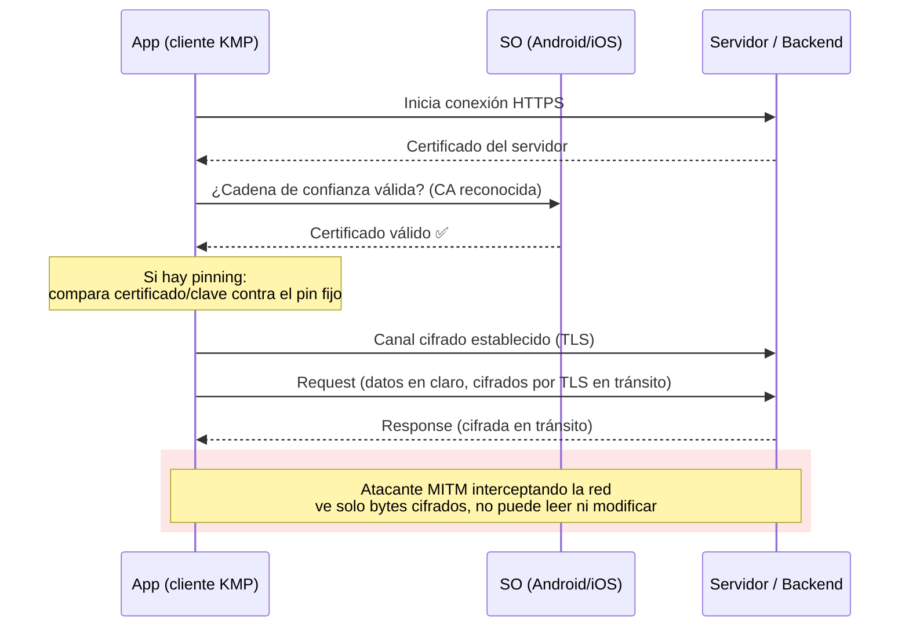

# Cifrado de datos en tránsito

## 1. Mapa del flujo



## 2. Qué es y cómo funciona

**Cifrado en tránsito** protege los datos mientras viajan por la red entre el cliente (tu app) y el servidor — distinto del cifrado "en reposo" (datos guardados en disco, DB, DataStore), que es un problema aparte con sus propias herramientas. El mecanismo estándar es **TLS** (Transport Layer Security, sucesor de SSL): cifra el canal completo para que nadie que intercepte el tráfico pueda leer ni modificar los datos.

**HTTPS es HTTP corriendo sobre TLS.** Cuando el `HttpClient` de Ktor apunta a una URL `https://`, ya hay cifrado en tránsito por default — no es algo que se active a mano, es el comportamiento estándar de cualquier engine (OkHttp, Darwin, CIO) contra un endpoint bien configurado.

**El problema que resuelve:** sin TLS, cualquiera con acceso a la red por la que viaja el tráfico — Wi-Fi público, router comprometido, proxy corporativo mal configurado — puede leer el contenido crudo de cada request/response: tokens de sesión, contraseñas, datos personales. Esto es un ataque **man-in-the-middle (MITM)**: un tercero se posiciona entre cliente y servidor, interceptando (y potencialmente modificando) el tráfico sin que ninguna de las dos partes lo note.

TLS resuelve esto con cifrado + verificación de identidad: el cliente valida que el certificado del servidor fue emitido por una autoridad certificadora (CA) confiable y corresponde al dominio al que se conecta, antes de establecer el canal cifrado. Lo que TLS estándar **no** resuelve por sí solo: ¿qué pasa si el atacante logra que el dispositivo confíe en un certificado falso? Ahí entra **certificate pinning** — en vez de confiar en "cualquier certificado válido según el sistema operativo", el cliente valida contra un certificado o clave pública específica que vos definiste. Así, aunque el dispositivo tenga un certificado raíz comprometido instalado (típico en ataques dirigidos, o perfiles de configuración maliciosos), la app rechaza la conexión si no coincide con el pin esperado.

## 3. Cómo se ve en distintos contextos

En una **app de fitness** que sincroniza entrenamientos con un backend propio, TLS estándar alcanza: los datos son sensibles pero no hay un escenario de fraude financiero directo, y el equipo no tiene proceso de rotación de certificados coordinado con releases — sumar pinning ahí significaría asumir un riesgo operativo (romper la app en producción si un pin queda desactualizado) sin un beneficio proporcional.

En una **app de e-commerce** que procesa pagos y guarda datos de tarjetas tokenizados, el cálculo cambia: el costo de un MITM exitoso es alto (robo de datos de pago), así que justifica certificate pinning explícito sobre los endpoints de checkout — asumiendo que el equipo tiene un proceso maduro de rotación de certificados coordinado con el ciclo de releases de la app.

## 4. Implementación real

**Pedido del PO:** *"Las llamadas que traen el historial de pedidos (`Orders`) del backend van a mostrar datos del usuario — quiero que esa conexión esté protegida con certificate pinning, no solo con HTTPS estándar."*

TLS estándar no requiere código extra — ya está cubierto por usar `https://`. El trabajo real es configurar el pinning por engine, porque cada plataforma expone su propia API nativa:

```kotlin
// commonMain — el HttpClient se usa igual en todo el código de red,
// el pinning se configura solo en la construcción del engine por plataforma
expect fun createHttpClient(): HttpClient

class OrdersRemoteDataSource(
    private val client: HttpClient
) {
    suspend fun getOrderHistory(): List<OrderDto> =
        client.get("https://api.example.com/orders").body()
}
```

```kotlin
// androidMain — engine OkHttp
actual fun createHttpClient(): HttpClient = HttpClient(OkHttp) {
    engine {
        config {
            certificatePinner(
                CertificatePinner.Builder()
                    .add(
                        "api.example.com",
                        "sha256/AAAAAAAAAAAAAAAAAAAAAAAAAAAAAAAAAAAAAAAAAAA=" // pin primario
                    )
                    .add(
                        "api.example.com",
                        "sha256/BBBBBBBBBBBBBBBBBBBBBBBBBBBBBBBBBBBBBBBBBBB=" // pin de backup
                    )
                    .build()
            )
        }
    }
}
```

```kotlin
// iosMain — engine Darwin, API propia inspirada en OkHttp
actual fun createHttpClient(): HttpClient = HttpClient(Darwin) {
    engine {
        val builder = CertificatePinner.Builder()
            .add(pattern = "api.example.com", pins = pinnedHashesForApi)
        handleChallenge(builder.build())
    }
}
```

El **pin de backup** en el ejemplo de Android no es decorativo: es la mitigación directa del riesgo operativo central de pinning (ver Sección 5) — si el certificado primario rota, el backup evita que la app quede bloqueada en producción hasta el próximo release.

## 5. Buenas prácticas y errores comunes

Checklist para auditar si esto lo escribió una IA (o un compañero apurado):

- **¿El pinning tiene un pin de backup, no solo uno?** Un solo pin sin respaldo convierte cualquier rotación de certificado en un evento de riesgo — si el cert rota antes de que salga una nueva versión con el pin actualizado, la app queda **rota en producción para todos los usuarios de esa versión**, sin fix server-side posible.
- **¿Hay un proceso de rotación de certificados/pines coordinado con el calendario de releases?** Si la respuesta es "no lo pensamos", pinning no debería estar en producción todavía — es una responsabilidad operativa permanente, no un flag que se prende y se olvida.
- **¿Se está pineando el dominio correcto y con el algoritmo de hash correcto (`sha256/`)?** Un pin mal calculado o apuntando al dominio equivocado falla en silencio o bloquea todo el tráfico.
- **¿Justifica el dominio de la app el costo de mantenimiento del pinning?** Si no hay datos financieros, PII regulada, ni un escenario de MITM de alto impacto, agregar pinning es sobre-ingeniería que solo suma riesgo de romper la app sin beneficio proporcional — TLS estándar ya cubre la gran mayoría de los casos.
- **¿El código asume que "HTTPS ya es suficiente" en un contexto donde el dato es sensible?** Ver Caso trampa: TLS estándar no protege contra un dispositivo con una cadena de confianza ya comprometida (certificado raíz malicioso instalado). Si el dominio de la app maneja pagos o PII regulada, esa suposición es un gap de seguridad real, no un detalle menor.