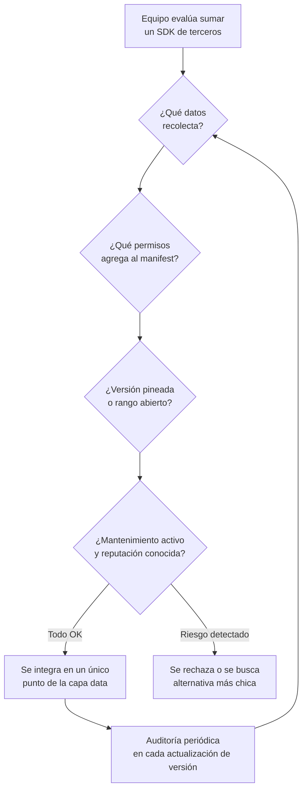

# Gestión de SDKs de terceros

## 1. Mapa del flujo



## 2. Qué es y cómo funciona

Es la disciplina de tratar cada SDK/librería externa que se agrega a la app (Firebase, Ktor, un SDK de ads, un SDK de analytics, una librería de pagos) como una **superficie de riesgo**, no solo como una dependencia técnica más. Cada SDK de terceros trae su propio código, sus propios permisos, sus propias conexiones de red, y potencialmente sus propias vulnerabilidades — y todo eso corre con los mismos privilegios que el resto de la app.

Incluye: auditar qué datos recolecta cada SDK y hacia dónde los manda, mantener las versiones actualizadas (parches de seguridad), minimizar la cantidad de SDKs a los estrictamente necesarios, y revisar qué permisos agrega cada uno al manifest/Info.plist.

**El problema que resuelve:** al agregar un SDK de terceros no solo se importa su funcionalidad — se importa también su código, sus dependencias transitivas, y su comportamiento de red, sin control directo sobre ninguno de los tres. Esto es **riesgo de supply chain** (cadena de suministro): un SDK comprometido (por un ataque al proveedor, o una versión maliciosa publicada por error o intencionalmente) se ejecuta con los mismos permisos que el código propio — puede leer el mismo almacenamiento, hacer las mismas llamadas de red, acceder a los mismos permisos de cámara/ubicación si la app los tiene.

El problema práctico más común no es un ataque sofisticado, sino algo más simple: un SDK de analytics o ads que recolecta más datos de los que la política de privacidad declara, exponiendo a la app a problemas de compliance (GDPR, políticas de Google Play/App Store) sin que el equipo lo haya decidido conscientemente — simplemente vino por default en el SDK.

## 3. Cómo se ve en distintos contextos

En una **app de fitness**, un SDK de analytics de terceros pidiendo permiso de ubicación fina es una señal de alerta clara: la función declarada (medir uso de pantallas, retención) no necesita ese permiso, así que su presencia en el manifest amerita preguntar por qué está, aunque el proveedor sea reconocido.

En una **app de e-commerce** con pagos, un SDK de procesamiento de pagos (Stripe, Mercado Pago) entra automáticamente en la categoría de escrutinio alto — no porque sea sospechoso, sino porque cualquier SDK que toque credenciales o datos financieros necesita más revisión que uno puramente visual, sin importar cuán establecido esté el proveedor.

## 4. Implementación real

**Pedido del PO:** *"Antes de sumar el SDK de tracking de entregas en tiempo real para el módulo de pedidos (`Orders`), quiero que quede claro qué datos va a recolectar y que quede aislado en una sola capa, no desparramado por toda la app."*

No hay "código central" acá — es proceso y configuración, con un patrón concreto de arquitectura para minimizar el radio de exposición.

```kotlin
// build.gradle.kts (androidApp) — versión pineada explícita, no rango abierto
dependencies {
    implementation("com.deliverytracking.sdk:tracking-core:4.2.1") // versión fija
    // implementation("com.deliverytracking.sdk:tracking-core:4.+") // evitar: rango abierto
}
```

```xml
<!-- AndroidManifest.xml generado — revisar qué agregó el SDK -->
<!-- ./gradlew :app:processReleaseManifest y mirar el merged manifest -->
<uses-permission android:name="android.permission.ACCESS_FINE_LOCATION" />
<!-- este permiso lo pide el SDK de tracking para geolocalizar la entrega —
     esperado para su función declarada, a diferencia del ejemplo de fitness en la Sección 3 -->
```

```kotlin
// commonMain — el SDK queda detrás de la interfaz de domain,
// nunca expuesto directamente a presentation
interface DeliveryTrackingDataSource {
    suspend fun trackOrder(orderId: String): Flow<OrderLocationUpdate>
}
```

```kotlin
// androidMain (o data) — único punto de contacto con el SDK del proveedor.
// Si mañana hay que auditarlo, reemplazarlo o quitarlo, el cambio queda contenido acá.
class DeliverySdkTrackingDataSource(
    private val trackingClient: DeliveryTrackingSdkClient
) : DeliveryTrackingDataSource {
    override suspend fun trackOrder(orderId: String): Flow<OrderLocationUpdate> =
        trackingClient.observeShipment(orderId).map { it.toOrderLocationUpdate() }
}
```

```kotlin
// commonMain — Koin: instanciar el cliente del SDK en un solo punto,
// para poder auditar/reemplazar fácilmente sin tocar el resto del código
val deliveryTrackingModule = module {
    single<DeliveryTrackingDataSource> {
        DeliverySdkTrackingDataSource(
            trackingClient = DeliveryTrackingSdkClient.initialize(apiKey = BuildKonfig.TRACKING_SDK_KEY)
        )
    }
}
```

La `Flow<OrderLocationUpdate>` que expone `DeliveryTrackingDataSource` es un tipo propio del dominio, no un tipo del SDK — así, si el proveedor cambia mañana, el contrato hacia `domain`/`presentation` no se mueve, solo el `DataSource` que lo implementa.

## 5. Buenas prácticas y errores comunes

Checklist para auditar si esto lo escribió una IA:

- **¿El SDK queda detrás de una interfaz de domain, o se llama directamente desde `presentation`/`ViewModel`?** Si el SDK está desparramado por toda la codebase, auditar o reemplazarlo implica tocar código en múltiples capas — el patrón correcto lo concentra en un único `DataSource`/`RepositoryImpl`, como en el ejemplo de la Sección 4.
- **¿La versión está pineada (`4.2.1`) o es un rango abierto (`4.+`)?** Un rango abierto significa que un build en una fecha distinta puede traer una versión distinta sin que nadie lo haya decidido explícitamente — rompe reproducibilidad y abre la puerta a que una versión comprometida entre sin aviso.
- **¿Los permisos que el SDK agrega al manifest se revisaron explícitamente, o se asumió que "vienen con el SDK y ya"?** El merged manifest (`processReleaseManifest`) muestra qué agregó cada dependencia — un permiso no evidentemente necesario para la función declarada del SDK es una señal de alerta, sin importar qué tan grande o conocido sea el proveedor.
- **¿Se actualizó el SDK sin revisar el changelog?** Actualizar ciegamente a la última versión es tan riesgoso como no actualizar nunca — una nueva versión puede agregar telemetría nueva, cambiar permisos requeridos, o (en casos raros pero reales) haber sido comprometida en un ataque de supply chain. La práctica correcta es actualizar deliberadamente, revisando release notes, idealmente con una ventana de espera antes de adoptar una versión recién publicada.
- **¿Se asumió que "es un SDK de una empresa grande y conocida, así que no hace falta revisar permisos"?** Ver Caso trampa: el tamaño del proveedor no elimina el riesgo.

**Caso trampa:** pensar que "es un SDK de una empresa grande y conocida, así que no hace falta revisar permisos" — el tamaño de la empresa no elimina el riesgo. SDKs de proveedores grandes de ads/analytics son justamente los que más datos recolectan por diseño (es su modelo de negocio), no por descuido. La confianza en la reputación del proveedor no reemplaza la revisión de qué datos concretos se están enviando.