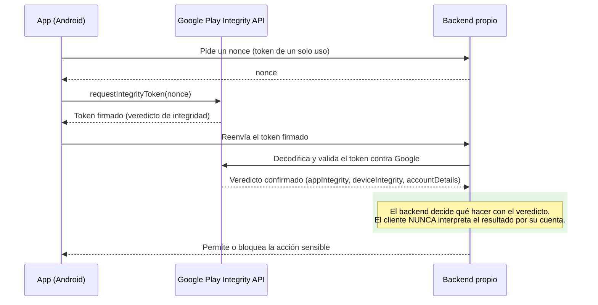

# Play Integrity API

## 1. Mapa del flujo



## 2. Qué es y cómo funciona

Es la API de Google que le permite a la app pedirle a los servidores de Google Play un **veredicto firmado** sobre tres preguntas: ¿este binario es el que Google Play reconoce sin modificar (no fue tampereado/repackageado)?, ¿este dispositivo es genuino y certificado (no es un emulador ni tiene root)?, y ¿esta cuenta instaló/pagó la app legítimamente en Google Play? La API ayuda a verificar que las acciones del usuario y los requests al servidor vienen de la app genuina, instalada por Google Play, corriendo en un dispositivo Android certificado.

Es **Android-only** — no hay equivalente directo en iOS vía Play Integrity (Apple tiene su propio mecanismo, App Attest). El flujo siempre involucra al backend: la app pide el veredicto, pero **quien lo valida es el servidor**, nunca el cliente solo.

**El problema que resuelve:** sin esto, el backend no tiene forma confiable de saber si un request viene realmente de la app corriendo en un dispositivo legítimo, o de una versión modificada del binario (código tampereado, lógica de negocio parcheada), un emulador o farm de emuladores automatizando abuso, o una cuenta que nunca instaló/pagó legítimamente la app. Cuando el usuario realiza una acción, la app pide una evaluación a la API; el servidor de Google Play devuelve una respuesta encriptada que la app reenvía al backend para verificación. El backend usa ese veredicto para decidir qué hacer a continuación. Antes existía SafetyNet Attestation para este mismo propósito, pero está **deprecado** — Play Integrity es su reemplazo oficial, confirmado vigente en 2026.

El sistema de veredictos tiene niveles de severidad crecientes: `deviceIntegrity` básico para acciones de bajo riesgo, y dentro de ese verdict, `MEETS_STRONG_INTEGRITY` (en dispositivos Android 13+) reserva la validación más estricta — con prueba criptográfica respaldada por hardware — para acciones de alto valor. No todo necesita el mismo rigor.

## 3. Cómo se ve en distintos contextos

En una **app de fitness** con retos comunitarios y un ranking semanal, Play Integrity tiene sentido si el ranking otorga premios reales (descuentos, productos) — ahí conviene reservar `MEETS_STRONG_INTEGRITY` para el momento de subir un puntaje al ranking, mientras que leer el ranking o el perfil propio no necesita ningún chequeo.

En una **app de e-commerce** con un programa de puntos canjeables por descuentos, la acción sensible es el canje: pedir el veredicto antes de procesar un canje evita que un cliente modificado falsifique el balance de puntos localmente y lo envíe como si fuera legítimo. Navegar el catálogo o agregar productos al carrito, en cambio, no amerita el costo de latencia de una verificación de integridad.

## 4. Implementación real

**Pedido del PO:** *"Detectamos pedidos (`Orders`) creados por bots automatizando promociones de descuento — antes de confirmar un pedido nuevo, quiero verificar que viene de la app real en un dispositivo genuino."*

El flujo real tiene tres partes: pedir el token en el cliente (Android-only, vía `expect/actual`), mandarlo al backend, y que el backend lo valide contra Google.

```kotlin
// commonMain
expect suspend fun requestIntegrityToken(nonce: String): String
```

```kotlin
// androidMain — usa el SDK de Play Integrity
actual suspend fun requestIntegrityToken(nonce: String): String {
    val integrityManager = IntegrityManagerFactory.create(context)
    val request = IntegrityTokenRequest.builder()
        .setNonce(nonce) // nonce generado por el backend, no por el cliente
        .build()
    return integrityManager.requestIntegrityToken(request).await().token()
}
```

```kotlin
// commonMain — UseCase que orquesta el chequeo antes de crear el pedido
class VerifyDeviceIntegrityUseCase(
    private val repository: IntegrityRepository
) {
    suspend operator fun invoke(): Result<Unit> {
        val nonce = repository.getNonceFromBackend()
        val token = requestIntegrityToken(nonce)
        return repository.verifyTokenWithBackend(token) // backend valida contra Google
    }
}
```

```kotlin
// commonMain — se orquesta ANTES de la creación del pedido, no reemplaza la validación real
class CreateOrderUseCase(
    private val verifyDeviceIntegrity: VerifyDeviceIntegrityUseCase,
    private val ordersRepository: OrdersRepository
) {
    suspend operator fun invoke(items: List<OrderItem>): Result<Order> {
        verifyDeviceIntegrity()
            .onFailure { return Result.failure(it) }
        return ordersRepository.createOrder(items) // el backend re-valida igual, esto es defensa en capas
    }
}
```

El backend nunca confía en lo que dice el cliente directamente — reenvía el token firmado a los servidores de Google para decodificarlo y confirmar el veredicto antes de confirmar el pedido.

## 5. Buenas prácticas y errores comunes

Checklist para auditar si esto lo escribió una IA:

- **¿La decisión de bloquear/permitir la acción se toma en el backend, no en el cliente?** Si el código bloquea la acción localmente apenas recibe el veredicto, es un error de diseño: un cliente ya comprometido (justo el escenario que se intenta detectar) puede saltearse esa lógica de bloqueo en el propio binario tampereado. El cliente **transporta** el token, nunca **interpreta** el resultado.
- **¿El nonce lo genera el backend, no el cliente?** Un nonce generado localmente rompe la garantía de que el veredicto corresponde a esta transacción específica — abre la puerta a replay attacks con un token válido pero viejo.
- **¿El nivel de veredicto exigido es proporcional a la acción?** Pedir `MEETS_STRONG_INTEGRITY` para leer datos es sobre-enforcement que expulsa usuarios legítimos con bootloader desbloqueado (devs, ROMs custom, dispositivos viejos); no pedir nada para canjear premios o crear pedidos con descuento es sub-enforcement que invita al abuso.
- **¿Hay un plan explícito de fail-open vs. fail-closed?** Qué hace la app si el veredicto tarda o falla la llamada a Google es una decisión de producto, no un detalle técnico — bloquear todo por un timeout de red castiga a usuarios legítimos.
- **¿Se está tratando "dispositivo rooteado" como sinónimo automático de "usuario malicioso"?** Ver Caso trampa: hay devs y power users legítimos con bootloader desbloqueado. Tratarlos igual que a un fraudster de leaderboard es sobre-enforcement que perjudica producto por una ganancia de seguridad marginal.

**Caso trampa:** "si el veredicto dice que el dispositivo no es íntegro, bloqueo la acción en el cliente" — ya cubierto arriba como el error de diseño central de esta API: la decisión siempre es del backend, después de validar contra Google.