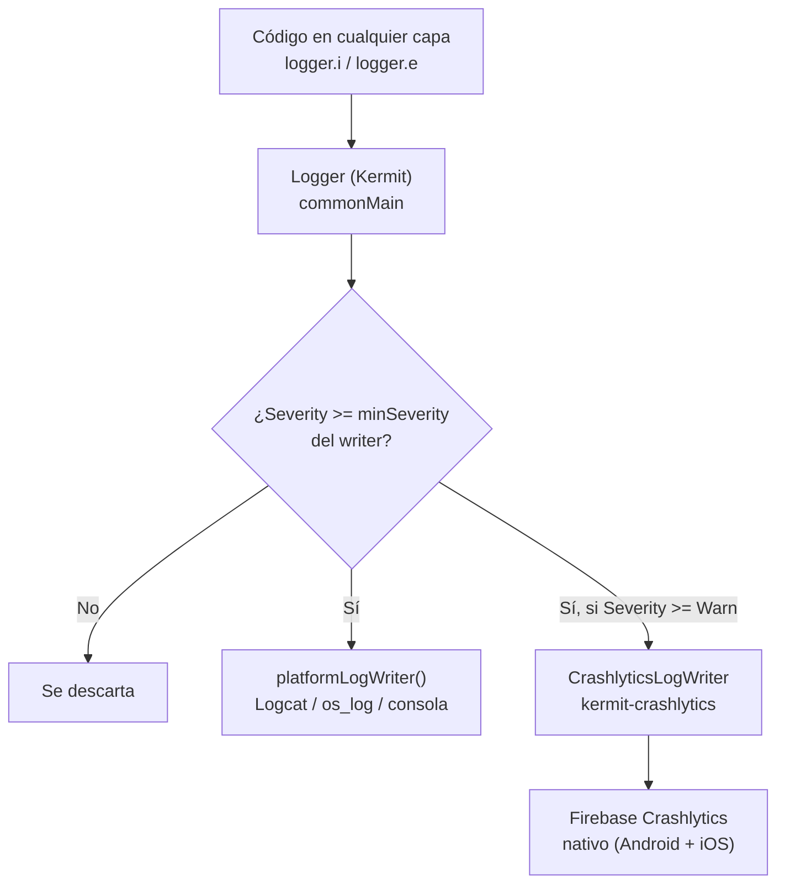

# Logging estructurado en producción

## 1. Mapa del flujo



## 2. Qué es y cómo funciona

Logging estructurado es registrar eventos de la app como **datos con forma** — nivel de severidad, mensaje, tags, pares clave-valor de contexto — en vez de strings sueltos concatenados a mano. En KMP el estándar de facto es **Kermit** (Touchlab): expone una API común de logging en `commonMain` que en runtime escribe a distintos **outputs por plataforma** a través de un sistema de **writers** (o *sinks*) configurables y componibles. Podés tener varios writers activos a la vez, cada uno con su propio nivel mínimo de severidad — eso es lo que te deja, por ejemplo, mandar todo a Logcat en local pero solo `Warn`+ a un backend de crash reporting en producción.

`println()` o el logger nativo de cada plataforma por separado tiene tres problemas en producción:

- **No es multiplataforma**: tenés que escribir y mantener lógica de logging distinta en cada `platformMain`.
- **No es estructurado**: un string tipo `"Error guardando pedido: $e"` es difícil de filtrar, buscar o correlacionar cuando después vive mezclado con miles de líneas en un backend de crash reporting.
- **No distingue dev de producción**: sin un mecanismo de niveles y writers, terminás con logs de debug ensuciando producción, o directamente sin ningún log llegando a ningún lado cuando el usuario real tiene un problema que vos no podés reproducir.

Un writer remoto (Crashlytics, Sentry, Bugsnag) no reemplaza al writer local — corren en paralelo. El local sirve para debuggear en desarrollo; el remoto es la única ventana que tenés al comportamiento real en producción, donde no hay debugger conectado.

## 3. Cómo se ve en distintos contextos

En una **app de fitness**, el logging estructurado suele centrarse en el flujo de sincronización con el dispositivo wearable: un `logger.e` con el modelo del dispositivo y el tipo de sensor como contexto, disparado en el catch de la sincronización, es lo que permite distinguir en producción si un fallo de sync es específico de una marca de reloj o un problema general de conectividad — sin eso, todos los reportes de "no sincroniza" llegan indistinguibles entre sí.

En una **app de e-commerce**, un caso típico es instrumentar el flujo de checkout: `logger.w` en cada paso que el usuario abandona sin completar el pago, con el método de pago intentado como tag. La diferencia con analytics (que también podría capturar esto) es el propósito — acá el log existe para debuggear un fallo técnico puntual (una excepción del SDK de pagos), no para medir comportamiento agregado de producto.

## 4. Implementación real

**Pedido del PO:** *"Cuando falla la sincronización de pedidos en producción, no tenemos forma de saber por qué — necesitamos que los errores reales lleguen a algún lado con el contexto mínimo para reproducirlos, sin inundar el backend con ruido de debug."*

```kotlin
// commonMain — configuración base del logger, expuesta vía Koin
import co.touchlab.kermit.Logger
import co.touchlab.kermit.Severity
import co.touchlab.kermit.StaticConfig
import co.touchlab.kermit.platformLogWriter

fun provideLogger(remoteWriter: LogWriter): Logger = Logger(
    config = StaticConfig(
        minSeverity = Severity.Debug, // en debug build, todo pasa por acá
        logWriterList = listOf(
            platformLogWriter(),       // siempre, para ver todo en local (Logcat/os_log)
            remoteWriter                // solo Warn+, ver actual/androidMain más abajo
        )
    ),
    tag = "OrdersSync"
)
```

```kotlin
// commonMain — uso real dentro de RefreshOrdersUseCase
class RefreshOrdersUseCase(
    private val repository: OrderRepository,
    private val logger: Logger
) {
    suspend operator fun invoke(): Result<Unit> = try {
        repository.refreshOrders()
        Result.success(Unit)
    } catch (e: CancellationException) {
        throw e // nunca se loguea ni se atrapa una cancelación normal de coroutine
    } catch (e: Exception) {
        logger.e(e) {
            "Fallo al refrescar pedidos"
        }
        Result.failure(e)
    }
}
```

```kotlin
// androidMain — writer remoto vía la extensión oficial kermit-crashlytics,
// que habla directo con el SDK nativo de Firebase Crashlytics (sin wrapper de terceros)
import co.touchlab.kermit.crashlytics.CrashlyticsLogWriter
import co.touchlab.kermit.Severity

actual fun provideRemoteLogWriter(): LogWriter =
    CrashlyticsLogWriter(minSeverity = Severity.Warn)
```

```swift
// iosApp — equivalente nativo del lado Swift para reportes no capturados
// por Kotlin/Native antes de llegar al runtime de iOS
FirebaseApp.configure()
Crashlytics.crashlytics().log("App inicializada")
```

Con `minSeverity = Warn` en el writer remoto, un `logger.d`/`logger.i` de debug nunca llega a Crashlytics — solo `logger.w`/`logger.e` viajan, que es exactamente el ruido que el PO no quiere pagar.

## 5. Buenas prácticas y errores comunes

Checklist para auditar código de logging generado por una IA antes de aprobar el PR:

- **¿El log de una excepción real incluye contexto estructurado, no solo el stack trace?** `logger.e(throwable) { "Fallo" }` sin datos asociados (qué pantalla, qué operación, qué estado tenía el ViewModel) da el *qué* pero no el *por qué* — en producción no hay debugger para completar la historia. El contexto tiene que ir *en* el log, no reconstruirse después adivinando.
- **¿El `minSeverity` del writer remoto es `Warn` o superior, nunca `Debug`/`Verbose`?** Mandar todo a un backend de crash reporting en release build satura el proveedor y encarece el plan sin agregar señal — el writer local (`platformLogWriter()`) ya cubre debug.
- **¿La excepción se loguea antes o después de decidir si es una `CancellationException`?** Si el catch loguea primero y relanza después (o peor, no relanza), una cancelación normal de coroutine (el usuario navegó fuera de la pantalla) va a aparecer como un error real en el dashboard de producción. Ver `07_-_supervisorjob_excepciones.md` para el detalle de por qué `CancellationException` nunca se trata como una excepción de negocio.
- **¿El writer remoto vive en el `platformMain` correcto, sin fugas de una dependencia que ya no aplica?** Verificar que el proyecto no arrastre un wrapper multiplatform de terceros para Crashlytics si el stack real usa el SDK nativo — la extensión oficial `kermit-crashlytics` habla directo contra Android/iOS sin esa capa intermedia.
- **¿Un log con contexto sensible (email, nombre real, datos de pago) llegó a un writer remoto?** Los backends de crash reporting no son un destino apto para PII — el contexto estructurado tiene que limitarse a identificadores técnicos (IDs, tipos, estados), nunca a datos personales.
- **Caso trampa a tener presente en iOS:** un crash **fatal** en iOS puede generar **dos reportes separados** en el backend (uno del sistema, uno no-fatal con el stack de Kotlin) — no es un bug de la configuración del writer, es una limitación conocida de cómo Kotlin/Native propaga excepciones no capturadas hacia el runtime de iOS.