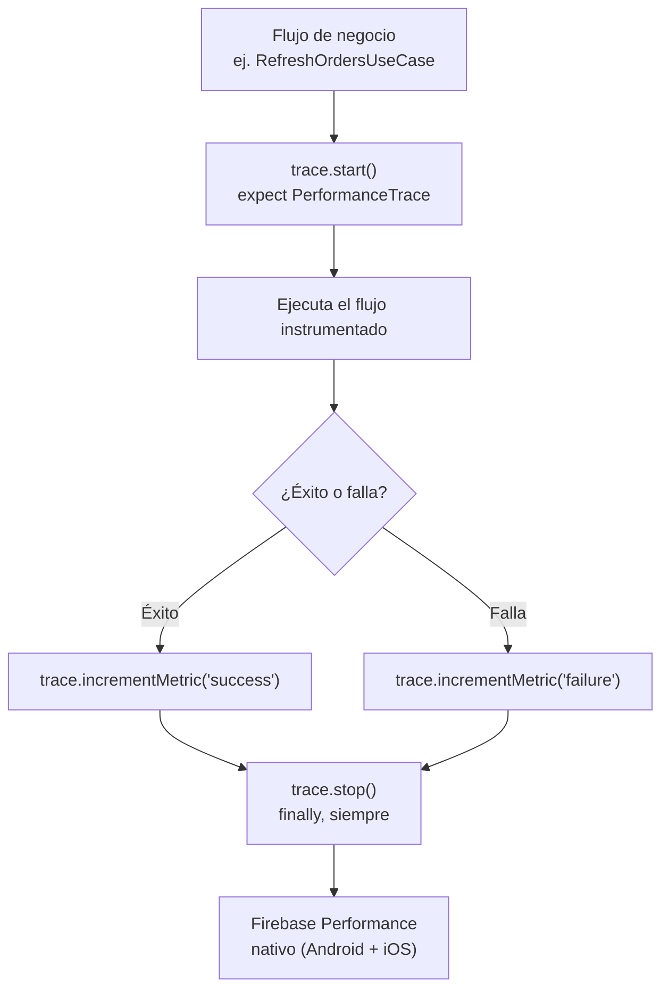

# Telemetry y performance monitoring

## 1. Mapa del flujo



## 2. Qué es y cómo funciona

Performance monitoring es medir cuánto tarda tu app en hacer cosas concretas (arrancar, cargar una pantalla, completar un flujo de negocio) y mandar esos números a un backend donde se agregan por versión de app, dispositivo, país, etc. — para detectar degradación de performance en producción antes de que se convierta en una mala review. Se instrumenta con **traces**: un trace tiene un punto de inicio, un punto de fin, y opcionalmente atributos (strings para filtrar) y métricas custom (números para graficar). A diferencia del logging (que registra eventos discretos), telemetry mide **duración** y **frecuencia** de procesos.

Firebase Performance Monitoring no tiene SDK oficial multiplatform — solo Android (Kotlin) e iOS (Swift/Obj-C) por separado. El patrón real en KMP es declarar una interfaz `expect` mínima en `commonMain` (`start()`, `stop()`, `putAttribute()`, `incrementMetric()`) e implementarla contra el SDK nativo de cada plataforma con `actual`, sin depender de un wrapper multiplatform de terceros.

Los traces **out-of-the-box** (arranque de app, tiempo en foreground/background) dan una primera foto automática sin instrumentar nada. Pero no cubren procesos específicos de tu dominio — eso requiere un trace custom, a propósito, en los puntos que vos identificás como críticos. Importante: el tracking automático de requests de red del SDK solo reconoce las librerías HTTP estándar de cada plataforma (`OkHttp` en Android, `NSURLSession` en iOS) — una fuente de datos que habla con el backend por un canal distinto (por ejemplo Firestore, que usa gRPC internamente) no aparece ahí solo por tener el SDK instalado.

## 3. Cómo se ve en distintos contextos

En una **app de fitness**, un trace custom típico envuelve el flujo completo de sincronización con el wearable — desde que arranca la conexión Bluetooth hasta que los datos del último entrenamiento quedan persistidos localmente. El atributo más útil ahí suele ser el modelo del dispositivo, para poder filtrar en el dashboard si la lentitud es específica de una marca de reloj.

En una **app de e-commerce**, el candidato natural es el flujo de checkout completo: desde que el usuario confirma la compra hasta que el backend confirma el cobro. Ahí `incrementMetric()` sirve para contar reintentos de pago dentro del mismo trace — un dato que un log individual por reintento no permite agregar ni graficar en el dashboard de la misma forma.

## 4. Implementación real

**Pedido del PO:** *"Algunos usuarios reportan que sincronizar sus pedidos tarda mucho, pero no sabemos si es un problema general o algo puntual de ciertos dispositivos — necesitamos datos, no intuición."*

```kotlin
// commonMain — contrato mínimo, sin depender de ningún SDK concreto
interface PerformanceTrace {
    fun start()
    fun stop()
    fun putAttribute(key: String, value: String)
    fun incrementMetric(name: String, by: Long = 1)
}

expect fun newTrace(name: String): PerformanceTrace
```

```kotlin
// commonMain — uso real dentro de RefreshOrdersUseCase
class RefreshOrdersUseCase(
    private val repository: OrderRepository
) {
    suspend operator fun invoke(): Result<Unit> {
        val trace = newTrace("refresh_orders_flow")
        trace.start()
        return try {
            repository.refreshOrders()
            trace.incrementMetric("success")
            Result.success(Unit)
        } catch (e: CancellationException) {
            throw e
        } catch (e: Exception) {
            trace.incrementMetric("failure")
            Result.failure(e)
        } finally {
            trace.stop() // siempre se cierra, haya fallado o no — ver checklist
        }
    }
}
```

```kotlin
// androidMain — actual contra el SDK nativo de Firebase Performance
import com.google.firebase.perf.FirebasePerformance
import com.google.firebase.perf.metrics.Trace

actual fun newTrace(name: String): PerformanceTrace =
    AndroidPerformanceTrace(FirebasePerformance.getInstance().newTrace(name))

class AndroidPerformanceTrace(private val trace: Trace) : PerformanceTrace {
    override fun start() = trace.start()
    override fun stop() = trace.stop()
    override fun putAttribute(key: String, value: String) = trace.putAttribute(key, value)
    override fun incrementMetric(name: String, by: Long) = trace.incrementMetric(name, by)
}
```

```kotlin
// iosMain — actual contra el SDK nativo de Firebase Performance para iOS
// (vía cinterop, con el pod FirebasePerformance ya configurado en el proyecto)
import cocoapods.FirebasePerformance.FIRPerformance
import cocoapods.FirebasePerformance.FIRTrace

actual fun newTrace(name: String): PerformanceTrace =
    IosPerformanceTrace(FIRPerformance.sharedInstance().traceWithName(name)!!)

class IosPerformanceTrace(private val trace: FIRTrace) : PerformanceTrace {
    override fun start() = trace.start()
    override fun stop() = trace.stop()
    override fun putAttribute(key: String, value: String) = trace.setValue(value, forAttribute = key)
    override fun incrementMetric(name: String, by: Long) = trace.incrementMetric(name, byInt = by)
}
```

Con este trace instrumentado, si en producción aparece que refrescar pedidos tarda de más en un segmento de dispositivos, el dato sale del dashboard de Firebase filtrado por atributos — no de una sospecha sin evidencia.

## 5. Buenas prácticas y errores comunes

Checklist para auditar código de telemetry generado por una IA antes de aprobar el PR:

- **¿El `stop()` está garantizado en un `finally` (o equivalente), no solo en el camino feliz?** Un trace que arranca con `start()` pero cuyo `stop()` vive solo si la operación tiene éxito queda "colgado" si el flujo lanza una excepción antes de llegar ahí — nunca se cierra, no aparece con datos útiles, y en el peor caso genera falsos negativos.
- **¿Se instrumentó un flujo de negocio real, o se está sobre-instrumentando todo el codebase?** No todo necesita medirse — sobre-instrumentar agrega overhead de mantenimiento sin ganancia real.
- **¿Se usaron `putAttribute()` para variantes del mismo flujo, en vez de crear un trace distinto por cada una?** Los atributos filtran en el dashboard sin explotar la cantidad de traces distintos a mantener.
- **¿El código asume que ver (o no ver) el dato en el dashboard de inmediato significa que la instrumentación funciona (o está rota)?** Firebase Performance Monitoring tiene una demora real de agregación, especialmente en builds de debug.
- **¿Se asumió que el tracking automático de red cubre una fuente de datos que en realidad no pasa por HTTP estándar?** Si el repositorio habla con Firestore (gRPC) en vez de un cliente HTTP reconocido por el SDK, esa parte del flujo no aparece en los traces de red automáticos.
- **¿El `expect`/`actual` de `PerformanceTrace` está implementado en ambas plataformas, o solo en Android?** Verificar que `iosMain` tenga la implementación real, no un no-op.