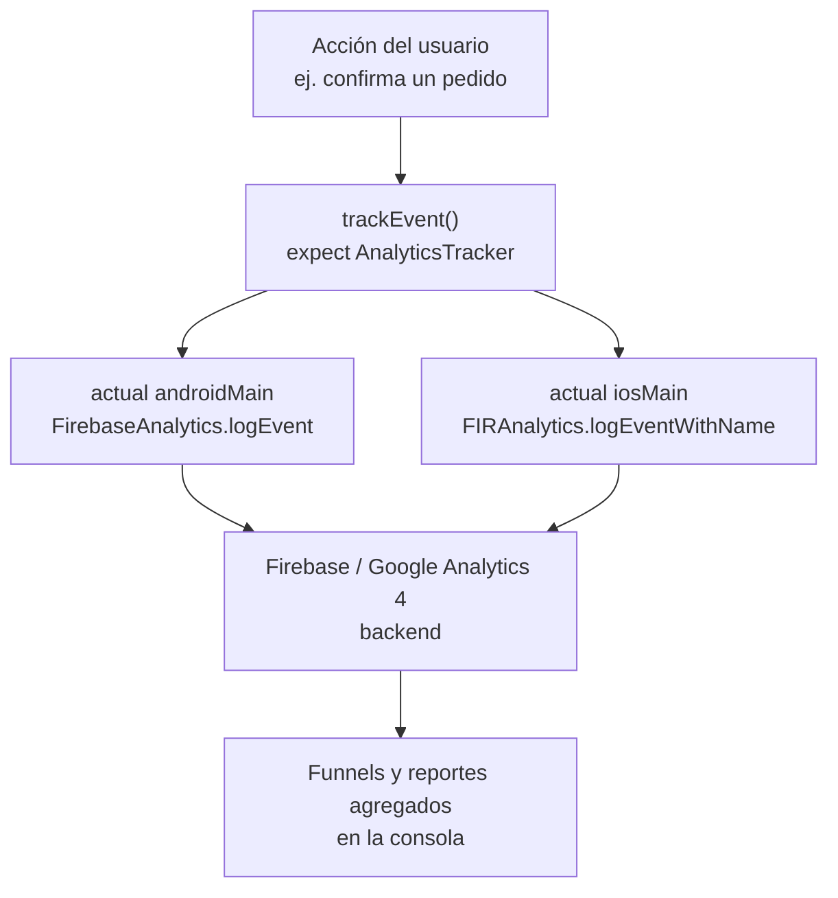

# Tracking de eventos y analytics

## 1. Mapa del flujo



## 2. Qué es y cómo funciona

Analytics es registrar **acciones del usuario** dentro de la app (qué pantalla vio, qué botón tocó, si completó un flujo) para entender comportamiento agregado — a diferencia de logging (eventos técnicos para debuggear) y telemetry (duración de procesos). Firebase Analytics tampoco tiene SDK oficial multiplatform: al igual que Performance Monitoring, el camino real en KMP es una interfaz `expect` mínima en `commonMain` (`trackEvent(name, params)`, `setUserProperty(key, value)`) implementada con `actual` contra `FirebaseAnalytics` nativo en Android y `FIRAnalytics` en iOS.

Sin analytics, las decisiones de producto se toman a ciego: "¿la gente usa la función de reordenar un pedido anterior?", "¿en qué paso del flujo de checkout abandonan?" son preguntas que sin datos agregados solo se responden con intuición. Analytics permite construir funnels (secuencias de eventos esperados) y ver dónde se cae el usuario real, además de segmentar comportamiento por versión de app, plataforma, o cualquier parámetro custom que definas.

Hay una distinción importante entre dos tipos de dato: un **evento** describe algo que pasó en un momento puntual (`order_completed`), mientras que una **user property** describe algo del usuario que persiste entre eventos (`preferred_payment_method`). Mandar un dato de usuario como parámetro repetido en cada evento en vez de como user property funciona, pero pierde la segmentación automática que Firebase aplica cuando el dato vive en el lugar correcto.

## 3. Cómo se ve en distintos contextos

En una **app de fitness**, un evento típico es `workout_completed` con `workout_type` y `duration_minutes` como parámetros — eso permite construir un funnel real de onboarding: cuántos usuarios completan su primer entrenamiento después de registrarse, y en qué punto exacto abandonan si no lo hacen.

En una **app de e-commerce**, el catálogo de eventos suele incluir tanto eventos predefinidos de Firebase (`screen_view`, `select_item`, `begin_checkout`) — que activan reportes ya armados en la consola sin config extra — como eventos custom propios del negocio, ej. `wishlist_item_added`, que no tiene equivalente en el catálogo estándar.

## 4. Implementación real

**Pedido del PO:** *"Queremos saber si la gente realmente termina de confirmar un pedido una vez que lo empieza, o si se cae en el medio — necesitamos poder armar un funnel de eso en la consola."*

```kotlin
// commonMain — contrato mínimo, sin depender de ningún SDK concreto
interface AnalyticsTracker {
    fun trackEvent(name: String, params: Map<String, Any> = emptyMap())
    fun setUserProperty(key: String, value: String)
}

expect fun analyticsTracker(): AnalyticsTracker
```

```kotlin
// commonMain — catálogo centralizado, evita strings sueltos en cada call site
object OrderAnalyticsEvents {
    const val ORDER_STARTED = "order_started"
    const val ORDER_COMPLETED = "order_completed"
    const val ORDER_ABANDONED = "order_abandoned"
}

// commonMain — uso real dentro del flujo de confirmación de pedido
class ConfirmOrderUseCase(
    private val repository: OrderRepository,
    private val analytics: AnalyticsTracker
) {
    suspend operator fun invoke(order: Order): Result<Order> {
        analytics.trackEvent(OrderAnalyticsEvents.ORDER_STARTED, mapOf(
            "item_count" to order.items.size
        ))
        return try {
            val confirmed = repository.confirmOrder(order)
            analytics.trackEvent(OrderAnalyticsEvents.ORDER_COMPLETED, mapOf(
                "item_count" to order.items.size,
                "total_value" to order.total
            ))
            Result.success(confirmed)
        } catch (e: CancellationException) {
            throw e
        } catch (e: Exception) {
            analytics.trackEvent(OrderAnalyticsEvents.ORDER_ABANDONED, mapOf(
                "item_count" to order.items.size
            ))
            Result.failure(e)
        }
    }
}
```

```kotlin
// androidMain — actual contra el SDK nativo de Firebase Analytics
import com.google.firebase.analytics.FirebaseAnalytics
import com.google.firebase.analytics.ktx.logEvent
import com.google.firebase.ktx.Firebase
import com.google.firebase.analytics.ktx.analytics

actual fun analyticsTracker(): AnalyticsTracker = object : AnalyticsTracker {
    private val firebaseAnalytics = Firebase.analytics

    override fun trackEvent(name: String, params: Map<String, Any>) {
        firebaseAnalytics.logEvent(name) {
            params.forEach { (key, value) ->
                when (value) {
                    is String -> param(key, value)
                    is Long -> param(key, value)
                    is Double -> param(key, value)
                    is Int -> param(key, value.toLong())
                    else -> param(key, value.toString())
                }
            }
        }
    }

    override fun setUserProperty(key: String, value: String) =
        firebaseAnalytics.setUserProperty(key, value)
}
```

```swift
// iosApp — equivalente nativo del lado Swift, vía FirebaseAnalytics
import FirebaseAnalytics

Analytics.logEvent("order_completed", parameters: [
    "item_count": order.items.count,
    "total_value": order.total
])
```

Con `ORDER_STARTED`/`ORDER_COMPLETED`/`ORDER_ABANDONED` como los tres puntos del funnel, la consola puede mostrar la tasa de abandono real del flujo de checkout — el dato que antes solo se podía adivinar.

## 5. Buenas prácticas y errores comunes

Checklist para auditar código de analytics generado por una IA antes de aprobar el PR:

- **¿Los nombres de evento están centralizados en un solo lugar (`object` de constantes), o hardcodeados en cada call site?** Sin eso es fácil terminar con variantes por typo (`orderCompleted` vs `order_completed`) que Firebase cuenta como dos eventos distintos — y consumen cupo del límite real de **500 tipos de evento únicos por proyecto** (el evento extra se descarta silenciosamente, no lanza un error visible en el código).
- **¿Algún parámetro o user property contiene datos personales identificables (email, nombre real, teléfono)?** Firebase Analytics no está pensado para PII, ni como parámetro de evento ni como user property — es una revisión obligatoria antes de aprobar cualquier evento nuevo.
- **¿Se usó un evento predefinido de Firebase cuando existía uno aplicable, en vez de reinventar un nombre custom?** Los predefinidos (`screen_view`, `select_item`, `begin_checkout`) activan reportes y funnels ya armados en la consola sin configuración extra — reinventar el nombre pierde ese beneficio sin ganar nada.
- **¿El dato es realmente una acción puntual, o describe al usuario de forma persistente?** Si es lo segundo, va como `setUserProperty`, no repetido como parámetro en cada evento — evita tener que mandarlo una y otra vez y habilita segmentación automática de reportes.
- **¿El código asume que un parámetro custom que no aparece en Firebase DebugView significa que el evento no se está mandando?** Es un bug conocido y documentado del lado de Firebase que algunos parámetros custom no se muestren en DebugView aunque sí lleguen y se guarden correctamente en el backend — antes de asumir que la instrumentación está rota, conviene verificar contra BigQuery o esperar el reporte agregado en vez de confiar solo en la vista de debug en caliente.
- **¿Se está cerca del límite de 25 user properties únicas por instancia de app, o de 25 parámetros por evento?** Superar esos límites no lanza una excepción visible — Firebase directamente ignora el dato extra (o lo trunca, en el caso de arrays) y registra un `firebase_error` interno que hay que ir a buscar a propósito.